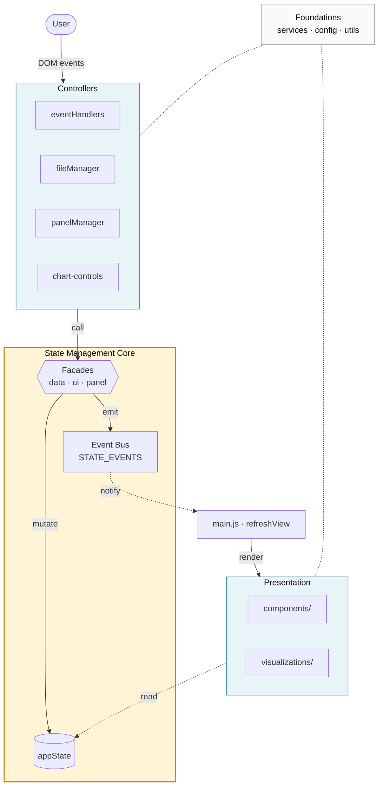

# CHIVE Architecture

This document is the canonical tour of how CHIVE is organized internally. Read it once before contributing — it is short by design.

## 1. Overview

CHIVE uses the **Observer pattern over a centralized mutable state singleton, mediated by a Facade layer that owns all writes.** The closest classical analogue is a Backbone-style Model + Events: one in-memory object holds all application state, three facades expose every legal mutation, and an event bus broadcasts every change to subscribers that re-render.

It is **not** Flux (no actions, no dispatcher, no reducers), and **not** MobX or signals (no auto-tracking — every subscription is manual and named). The pattern fits CHIVE because we deliberately keep the runtime surface small. The chart layer is D3, which mutates DOM imperatively and resists virtual-DOM abstractions. The contributor base is small enough that a pattern readable cold and debuggable with `console.log` beats one that demands learning a framework. And the async we will eventually need — IndexedDB persistence is on the roadmap — fits the existing facade boundary; it doesn't justify pulling in a framework today.

## 2. Why this pattern (and not the alternatives)

A new contributor's first question is usually "why didn't you use React / Redux / MobX?" — this section answers it once.

The constraints that drove the choice:

- Browser-only, no backend. The data layer is fully synchronous **today**; **IndexedDB persistence is on the roadmap**, so the architecture must remain async-friendly. Async machinery isn't in place yet for a simple reason — the team is small and time-constrained — not because we plan to stay synchronous forever. Features land when the team has bandwidth to build and test them.
- D3 owns chart rendering and is inherently imperative. Anything that hides DOM from us fights D3.
- **Minimum dependency footprint, on principle.** A framework or library lands only when clearly necessary. Two reasons: the project should stay readable end-to-end without chasing transitive dependencies, and CHIVE processes user-uploaded data — a small, auditable codebase is part of how we honor user privacy.
- Small contributor base (research project, students). The pattern must be readable cold, not require learning a framework.
- Stable, narrow data model: datasets, panel layout, UI mode. No collaborative editing, no time-travel, no SSR.

Against those constraints, here is how the obvious alternatives compare:

| Alternative | What it would buy us | What it would cost | Verdict |
|---|---|---|---|
| **No central state** (each module owns its slice; pass via DOM events) | Less ceremony for tiny features. | Datasets + panel + UI are shared across many renderers; we'd duplicate state or thread props through every call. Reactivity becomes ad-hoc. | Rejected — a shared data model demands a single source of truth. |
| **Plain singleton, direct mutation** (no facades) | Fewer files. | Every callsite must remember to emit a change event after writing. The first one that forgets silently breaks reactivity, and there's no static signal. | Rejected — facades buy us the "write ⇒ emit" invariant for free. |
| **Flux / Redux** (actions, reducers, immutable store) | Pure reducers, time-travel devtools, predictable updates. | Reducer + action ceremony for ~25 mutations is overkill. Immutability fights D3 — charts mutate DOM imperatively, so the store's snapshot purity buys nothing downstream. The async paths we have planned (IndexedDB) want a single facade method that emits when the write resolves, not a reducer pipeline plus middleware. | Rejected — ceremony cost outweighs benefit at this surface size. |
| **MobX / signals / proxies** (auto-tracking) | Zero subscription boilerplate; transparent reactivity. | Reactivity becomes opaque — a re-render fires because some property was read in some computed somewhere. Hard to debug, hard to onboard new contributors. We lose explicit control over re-render granularity. | Rejected — auto-magic is the wrong tradeoff for a research codebase that prizes readability. |
| **A framework (React / Vue / Svelte)** | Component model, virtual DOM diffing, ecosystem. | D3 + VDOM is a known friction point — escape hatches and refs everywhere, or a rewrite of the chart layer. Adds a heavy build dep and a deep tree of transitive dependencies to a project whose appeal is "open `index.html`, see the app" — and whose minimal footprint is part of its privacy story. | Rejected — vanilla JS + D3 is a deliberate stack choice; a framework would invert it. |
| **Just custom DOM events** (`window.dispatchEvent` everywhere) | No new code. | No registry of event names → typos silently kill subscriptions. No central store → every listener must read DOM or chase another listener's state. | Rejected — unstructured events scale poorly past a handful of types. |

The chosen pattern is the **minimum viable structure** that gives us a single source of truth, a static event registry, and a clean read/write boundary — without adopting a framework or inventing one. Keeping the dependency footprint small is a deliberate stance, not a temporary state: a codebase that fits in one head is also a codebase that can be audited end-to-end, which matters when users hand it their data. Async surfaces (IndexedDB, future workers) will be introduced through the same facade boundary as the team finds bandwidth to build them — the architecture is built to absorb them, not to forestall them.

## 3. Diagram



> Solid arrows: synchronous calls / writes. Dashed arrows: observer notifications and passive reads. The State Core is the only mutation path and the only source of change events.

## 4. Layers

| Layer | Owns | Key files |
|---|---|---|
| **Controllers** | DOM event capture and translation into facade calls. No state, no rendering. | `eventHandlers.js`, `fileManager.js`, `panelManager.js`, `chart-controls/` |
| **State Management Core** | The only place state mutates. Three facades wrap one singleton; an event bus broadcasts every mutation. | `appState.js`, `dataStateFacade.js`, `uiStateFacade.js`, `panelStateFacade.js`, `stateEvents.js`, `stateSync.js` |
| **Orchestrator** | Bootstrap plus `refreshView` — the single subscriber that turns "state changed" into "rerender". | `main.js` |
| **Presentation** | Stateless renderers. Read state via getters; never mutate. D3 visualizations live here. | `components/`, `modules/visualizations/` |
| **Foundations** | Pure helpers — parsing, formatting, color, result wrappers, i18n, constants. No state, no DOM. | `services/`, `config/`, `utils/` |

**Controllers** translate user intent into mutations. They listen to DOM events, validate input, and call a facade method. They never touch `appState` directly and never render — if a controller wants the UI to change, it mutates state and lets the event bus drive the render.

**State Management Core** is the heart of the application. It is the only layer permitted to mutate state, and the only producer of change events. Section 5 covers its internals.

**Orchestrator** is one file: [src/main.js](src/main.js). It bootstraps modules at load time, subscribes to the change events that warrant a full re-render, and exposes `refreshView` — the function every subscriber routes through.

**Presentation** is stateless. Renderers receive data, read state via getters, and produce DOM. They never call a facade. They never emit. If a renderer needs to react to user input, it accepts a callback from the controller layer instead.

**Foundations** are leaf utilities — pure functions and constants. No state imports, no DOM access. They are safe to call from any layer.

## 5. State Management Core — deep dive

### The singleton

`appState` is a single in-memory object with three domains, defined in [src/modules/appState.js](src/modules/appState.js):

```js
const appState = {
    data:  { datasets: [], activeIndex: -1 },
    panel: { charts: [], slots: {}, layout: 'layout-2col',
             blocks: [], nextBlockId: 1, nextChartId: 0 },
    ui:    { sidebarMode: 'dados', previewRows: 10,
             expandedCharts: { bar: false, scatter: false, /* … */ } },
};
```

The object is **never mutated directly outside this module**. Each facade is created with closure-injected access to it.

### The Facades

Three of them — [dataStateFacade.js](src/modules/dataStateFacade.js), [uiStateFacade.js](src/modules/uiStateFacade.js), [panelStateFacade.js](src/modules/panelStateFacade.js) — composed in [appState.js](src/modules/appState.js) and re-exported from there. Every public mutator follows the same shape: validate, write, emit. The emit step uses a `STATE_EVENTS.*` constant; never a string literal.

There is **one deliberate exception**: `normalizeActiveDatasetConfig(normalizer)` writes without emitting. It is used during render to apply chart-config defaults; routing it through the emitting `updateActiveDatasetConfig` would re-enter `refreshView` via the `CONFIG_UPDATED` subscription and loop. If you find yourself wanting another non-emitting write path, stop and reconsider — re-entrancy is the bug it exists to avoid.

### The Event Bus

[stateEvents.js](src/modules/stateEvents.js) holds the whole mechanism in one short file:

- `STATE_EVENTS` — a `Object.freeze`-d registry of every event name, grouped by domain (data, panel, ui, meta). Tests intentionally keep using string literals to exercise the wire format independently of the registry; production code in `src/` must always reference the constants.
- `onStateChange(eventType, callback)` — registers a listener and returns an unsubscribe function.
- `emitStateChange(eventType, data)` — fans out to typed listeners, then to wildcard (`'*'`) listeners, then dispatches a `chive-state-changed` `CustomEvent` on `window` for legacy hooks.
- A 100-entry ring-buffer logger toggleable at runtime via `window.chiveDebug.enableStateLog()`. When enabled, every emission is printed as `[chive:state] <type> <data>` and pushed into the buffer. When disabled, it is a single boolean check — zero overhead.

## 6. Reactive flow — concrete walkthrough

Trace one end-to-end cycle and the architecture clicks:

> A user toggles a column-visibility checkbox.
>
> 1. `eventHandlers.js` receives the DOM `change` event, computes the new column list, and calls `updateActiveDatasetColumns(columns)` (the facade).
> 2. The facade writes `dataset.colunasSelecionadas` and emits `STATE_EVENTS.COLUMNS_UPDATED`.
> 3. `main.js` is subscribed to that event and calls `refreshView()`.
> 4. `refreshView` reads the current state via getters (`getActiveDataset`, `getLoadedDatasets`, `getState`) and calls each renderer (`renderDataInterface`, `renderChartControlsSidebar`, `renderSidebarPanel`, `renderCanvasPanel`).
> 5. Renderers produce DOM; D3 charts redraw. None of them emit anything — the cycle ends.

The punchline: **mutations never originate in renderers, and renderers never run except in response to an event bus notification.** That single sentence is the whole architecture.

## 7. Invariants — do not break

Hard rules. Breaking any of them silently degrades reactivity, and the failure mode is "the UI looks fine until the day it doesn't."

- All writes to application state go through a facade. Never assign to `dataset.*`, `appState.*`, or anything returned from a getter (`getActiveDataset()`, `getAllDatasets()`, `getPanelCharts()`, …).
- Event names live in `STATE_EVENTS`. Never use string literals in `src/`. (Tests intentionally keep literals to exercise the wire format — leave them alone.)
- Subscribers must not synchronously emit a state event from inside their callback (re-entrancy loop). Defer with `queueMicrotask` if you need a follow-up mutation.
- For normalize-on-read paths (e.g. applying chart-config defaults during render), use `normalizeActiveDatasetConfig` — it writes without emitting, which is the only safe shape for that case.
- Renderers are stateless. They read via getters and never mutate.
- `STATE_EVENTS.WILDCARD === '*'` is reserved for `stateSync.js`. Do not subscribe to it from anywhere else.

## 8. Where do I put new code?

| If you're adding… | Put it in | Notes |
|---|---|---|
| A new chart type | `src/modules/visualizations/{name}.js` + `src/modules/chart-controls/{name}Controls.js` | Register in `chart-controls/index.js` and `config/chartDefaults.js`. |
| A new state field | The relevant domain in `appState.js` + a facade method that mutates and emits a new `STATE_EVENTS` constant | Add the constant to the domain group in `stateEvents.js`. |
| A new DOM event handler | `src/modules/eventHandlers.js` (or an existing controller) | Translate the event into a facade call. Never mutate state directly. |
| A new view / tab | `src/components/` + a `renderXxx` function called from `refreshView` in `main.js` | Read state via getters; pass callbacks for user actions. |
| A pure helper (formatting, parsing, color) | `src/utils/` | No DOM access. No state imports. |
| A new derived selector | The facade that owns the underlying domain | Keep getters thin; don't compute heavy aggregates inside them. |

## 9. Debugging

- `window.chiveDebug` exposes `getState`, `getActiveDataset`, `refreshView`, and four state-log helpers.
- `chiveDebug.enableStateLog()` prints every emit as `[chive:state] <type> <data>` and stores the last 100 entries; `getStateLog()` returns them, `clearStateLog()` resets the buffer, `disableStateLog()` turns it off.
- To diagnose a surprising re-render: enable the log, perform the action, then read `getStateLog()` to see the exact event chain that fired.
