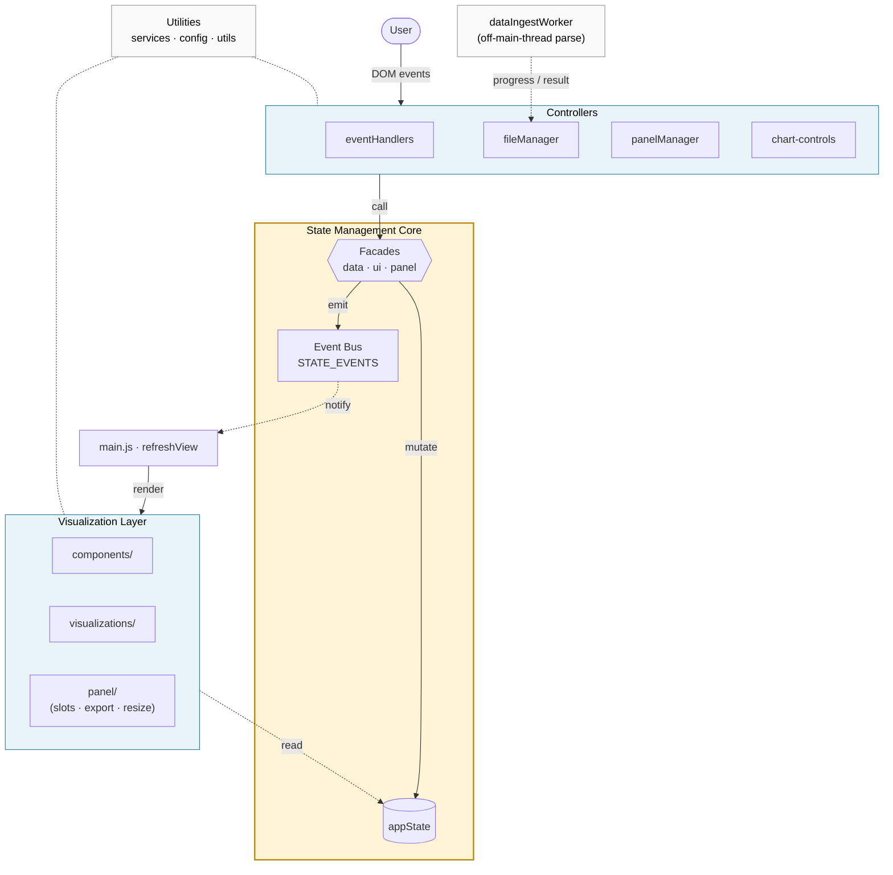

# CHIVE Architecture

This document is the canonical tour of how CHIVE is organized internally. Read it once before contributing — it is short by design.

## 1. Overview

CHIVE uses the **Observer pattern over a single, mutable state object held in module scope, with all writes mediated by a Facade layer.** The closest classical analogue is a Backbone-style Model + Events: one in-memory object holds all application state, three facades expose every legal mutation, and an event bus broadcasts every change to subscribers that re-render.

It is **not** Flux (no actions, no dispatcher, no reducers), and **not** MobX or signals (no auto-tracking — every subscription is manual and named). The pattern fits CHIVE because we deliberately keep the runtime surface small. The chart layer is D3, which mutates DOM imperatively and resists virtual-DOM abstractions. The contributor base is small enough that a pattern readable cold and debuggable with `console.log` beats one that demands learning a framework. And the async surfaces we have — IndexedDB persistence and a data-ingest Web Worker — landed through the existing facade and service boundaries (`replaceAllState` for hydration; debounced wildcard subscription for save; the worker behind a thin host-side service) without justifying a framework.

## 2. Why this pattern (and not the alternatives)

A new contributor's first question is usually "why didn't you use React / Redux / MobX?" — this section answers it once.

The constraints that drove the choice:

- Browser-only, no backend. The data layer is mostly synchronous, with two async surfaces today: **IndexedDB persistence** (hydrate on boot via `persistenceService.hydrateState`; debounced save on every state emission) and the **data-ingest Web Worker** ([src/workers/dataIngestWorker.js](src/workers/dataIngestWorker.js), driven by `dataIngestService`) which parses CSV/JSON, detects types, and computes stats off the main thread, emitting progress events and supporting abort. Both plug in at the facade/service boundary; new async surfaces absorb the same way.
- D3 owns chart rendering and is inherently imperative. Anything that hides DOM from us fights D3.
- **Minimum dependency footprint, on principle.** A framework or library lands only when clearly necessary. Two reasons: the project should stay readable end-to-end without chasing transitive dependencies, and CHIVE processes user-uploaded data — a small, auditable codebase is part of how we honor user privacy. (The ingest worker is in-tree, not an external dep, which is consistent with this stance.)
- Small contributor base (research project, students). The pattern must be readable cold, not require learning a framework.
- Stable, narrow data model: datasets, panel layout, UI mode. No collaborative editing, no time-travel, no SSR.

Against those constraints, here is how the obvious alternatives compare:

| Alternative | What it would buy us | What it would cost | Verdict |
|---|---|---|---|
| **No central state** (each module owns its slice; pass via DOM events) | Less ceremony for tiny features. | Datasets + panel + UI are shared across many renderers; we'd duplicate state or thread props through every call. Reactivity becomes ad-hoc. | Rejected — a shared data model demands a single source of truth. |
| **Plain shared state, direct mutation** (no facades) | Fewer files. | Every callsite must remember to emit a change event after writing. The first one that forgets silently breaks reactivity, and there's no static signal. | Rejected — facades buy us the "write ⇒ emit" invariant for free. |
| **Flux / Redux** (actions, reducers, immutable store) | Pure reducers, time-travel devtools, predictable updates. | Reducer + action ceremony for ~25 mutations is overkill. Immutability fights D3 — charts mutate DOM imperatively, so the store's snapshot purity buys nothing downstream. The async path we have (IndexedDB persistence) is a single wildcard subscriber that debounces saves — not a reducer pipeline plus middleware. | Rejected — ceremony cost outweighs benefit at this surface size. |
| **MobX / signals / proxies** (auto-tracking) | Zero subscription boilerplate; transparent reactivity. | Reactivity becomes opaque — a re-render fires because some property was read in some computed somewhere. Hard to debug, hard to onboard new contributors. We lose explicit control over re-render granularity. | Rejected — auto-magic is the wrong tradeoff for a research codebase that prizes readability. |
| **A framework (React / Vue / Svelte)** | Component model, virtual DOM diffing, ecosystem. | D3 + VDOM is a known friction point — escape hatches and refs everywhere, or a rewrite of the chart layer. Adds a heavy build dep and a deep tree of transitive dependencies to a project whose appeal is "open `index.html`, see the app" — and whose minimal footprint is part of its privacy story. | Rejected — vanilla JS + D3 is a deliberate stack choice; a framework would invert it. |
| **Just custom DOM events** (`window.dispatchEvent` everywhere) | No new code. | No registry of event names → typos silently kill subscriptions. No central store → every listener must read DOM or chase another listener's state. | Rejected — unstructured events scale poorly past a handful of types. |

The chosen pattern is the **minimum viable structure** that gives us a single source of truth, a static event registry, and a clean read/write boundary — without adopting a framework or inventing one. Keeping the dependency footprint small is a deliberate stance, not a temporary state: a codebase that fits in one head is also a codebase that can be audited end-to-end, which matters when users hand it their data. Async surfaces (IndexedDB persistence through `persistenceService`; the data-ingest Web Worker through `dataIngestService`) plug in through the same facade and service boundaries — the architecture absorbs them rather than forestalling them.

## 3. Diagram


```mermaid
flowchart TB
    U(["User"])
    subgraph CTRL["Controllers"]
        direction LR
        EH["eventHandlers"]
        FM["fileManager"]
        PM["panelManager"]
        CC["chart-controls"]
    end
    subgraph CORE["State Management Core"]
        FAC{{"Facades<br/>data · ui · panel"}}
        AS[("appState")]
        EB["Event Bus<br/>STATE_EVENTS"]
        FAC -- mutate --> AS
        FAC -- emit --> EB
    end
    MAIN["main.js · refreshView"]
    subgraph PRES["Visualization Layer"]
        direction LR
        COMP["components/"]
        VIZ["visualizations/"]
        PANEL["panel/<br/>(slots · export · resize)"]
    end
    WORKER["dataIngestWorker<br/>(off-main-thread parse)"]
    UTIL["Utilities<br/>services · config · utils"]
    U -- DOM events --> CTRL
    CTRL -- call --> FAC
    EB -. notify .-> MAIN
    MAIN -- render --> PRES
    PRES -. read .-> AS
    WORKER -. progress / result .-> FM
    UTIL -.- CTRL
    UTIL -.- PRES
    classDef core fill:#fff5d6,stroke:#b8860b,stroke-width:2px,color:#000
    classDef layer fill:#e8f4f8,stroke:#2c7da0,color:#000
    classDef plain fill:#fafafa,stroke:#999,color:#000
    class CORE core
    class CTRL,PRES layer
    class UTIL,WORKER plain
```

> Solid arrows: synchronous calls / writes. Dashed arrows: observer notifications and passive reads. The State Core is the only mutation path and the only source of change events.

The diagram is a faithful abstraction, not a literal call graph. Two simplifications worth knowing:

- **The "main.js · refreshView" node represents the broadest re-render path** — it rebuilds the largest UI surface, not the largest number of subscriptions. In practice **four** modules subscribe to the event bus: `main.js`, `panelManager.js`, `stateSync.js`, and `persistenceService.js`. `panelManager` actually subscribes to more events than `main.js` (10 vs. 3), but its responses are scoped to the panel UI. §5 lists which events each subscriber handles.
- **`panelManager` appears inside Controllers, but it also subscribes to events.** It wears two hats: translating user input into facade calls *and* re-rendering the panel UI in response to bus notifications. The diagram shows only the first hat to keep the picture readable.

## 4. Layers

| Layer | Owns | Key files |
|---|---|---|
| **Controllers** | DOM event capture and translation into facade calls. Never mutate state directly; never render as part of the input path. One of them (`panelManager`) also subscribes to the event bus and re-renders its own UI slice — see the dual-hat caveat in §3. | `eventHandlers.js`, `fileManager.js`, `panelManager.js`, `chart-controls/` |
| **State Management Core** | The only place state mutates. Three facades wrap one module-scoped state object; an event bus broadcasts every mutation. Persistence subscribes to the bus and writes a debounced snapshot to IndexedDB. | `appState.js`, `dataStateFacade.js`, `uiStateFacade.js`, `panelStateFacade.js`, `stateEvents.js`, `stateSync.js`, `services/persistenceService.js`, plus panel mutation helpers in `modules/panel/panelStateMutations.js` and `modules/panel/blockStateHelpers.js` |
| **Orchestrator** | Bootstrap plus `refreshView` — the broadest subscriber, handling dataset/columns/config events with a full view refresh. Other modules handle their own events independently. | `main.js` |
| **Visualization Layer** | Stateless renderers. Read state via getters; never mutate. D3 visualizations and the dashboard `panel/` subsystem (live-mounted slots, snapshot rendering, SVG export) live here. | `components/`, `modules/visualizations/`, `modules/panel/` *(except `panelStateMutations.js` and `blockStateHelpers.js`, which back the panel facade and belong to the State Management Core)* |
| **Utilities & side-effecting services** | `config/` and `utils/` are pure leaf helpers — no state, no DOM. `services/` sits at the utility layer but contains side-effecting modules: `persistenceService` subscribes to the bus and performs async IndexedDB I/O, `i18nService.setLocale` mutates `document.documentElement.lang` and `[data-i18n]` nodes, `dataIngestService` wraps the ingest worker. | `services/`, `config/`, `utils/` |

**Controllers** translate user intent into mutations. They listen to DOM events, validate input, and call a facade method. They never touch `appState` directly. If a controller wants the UI to change because of *user input*, it mutates state and lets the event bus drive the render — controllers do not render on the input path. Two controllers (`panelManager`, `chart-controls`) wear a second hat as event-bus subscribers and re-render their own UI slice in response to notifications; the input-path rule still holds.

**State Management Core** is the heart of the application. It is the only layer permitted to mutate state, and the only producer of change events. Section 5 covers its internals.

**Orchestrator** is one file: [src/main.js](src/main.js). It bootstraps modules at load time and subscribes to the three events that warrant rebuilding the dataset and chart-controls views (`ACTIVE_DATASET`, `COLUMNS_UPDATED`, `CONFIG_UPDATED`), routing each into `refreshView`. It is the broadest subscriber but not the only one — `panelManager`, `stateSync`, and `persistenceService` subscribe to their own slices independently (see §5).

**Visualization Layer** is stateless. Renderers receive data, read state via getters, and produce DOM. They never call a facade. They never emit. If a renderer needs to react to user input, it accepts a callback from the controller layer instead.

**Utilities & side-effecting services** — `config/` and `utils/` are pure leaf helpers — no state imports, no DOM access, safe to call from any layer. `services/` is shelved in the same row but is *not* pure: `persistenceService` is a wildcard subscriber that performs async IndexedDB and `localStorage` writes; `i18nService.setLocale` mutates DOM (`document.documentElement.lang`, `[data-i18n]` nodes) and dispatches a `chive-locale-changed` event; `dataIngestService` owns the worker handle. Treat `services/` callers as crossing a side-effect boundary even though the directory sits at the utility layer.

## 5. State Management Core — deep dive

### The state object

`appState` is a single in-memory object with three domains, declared at module scope in [src/modules/appState.js](src/modules/appState.js) and never exported:

```js
const appState = {
    data:  { datasets: [], activeIndex: -1 },
    panel: { charts: [], slots: {}, layout: 'layout-2col',
             blocks: [], nextBlockId: 1, nextChartId: 0 },
    ui:    { sidebarMode: 'dados', previewRows: 10,
             expandedCharts: { bar: false, scatter: false, network: false,
                               pie: false, bubble: false, line: false, tin: false } },
};
```

The object is **never mutated directly outside this module**. Each facade is created with closure-injected access to it. This is a *module-scoped state object*, not a GoF Singleton — there is no class, no `getInstance()`, and no instance-control mechanism. Uniqueness is provided by ES module semantics, and encapsulation by closure injection into the facades.

One small but load-bearing detail: every dataset gets a stable `id` (UUID, with a counter fallback when `crypto.randomUUID` is unavailable) stamped in `dataStateFacade.addDataset` ([src/modules/dataStateFacade.js:38-54](src/modules/dataStateFacade.js#L38-L54)). The id is what `persistenceService` uses to address datasets across reloads — without it, the snapshot couldn't round-trip.

### The Facades

Three of them — [dataStateFacade.js](src/modules/dataStateFacade.js), [uiStateFacade.js](src/modules/uiStateFacade.js), [panelStateFacade.js](src/modules/panelStateFacade.js) — composed in [appState.js](src/modules/appState.js) and re-exported from there. Every public mutator follows the same shape: validate, write, emit. The emit step uses a `STATE_EVENTS.*` constant; never a string literal.

There are **two deliberate exceptions** to the validate-write-emit shape:

1. `normalizeActiveDatasetConfig(normalizer)` writes without emitting. It is used during render to apply chart-config defaults; routing it through the emitting `updateActiveDatasetConfig` would re-enter `refreshView` via the `CONFIG_UPDATED` subscription and loop.
2. `replaceAllState({ data, panel, ui })` (in `appState.js`) bypasses the per-domain facades and rewrites all three slices in one shot, then emits a single `STATE_HYDRATED`. It exists for `persistenceService.hydrateState` — emitting one event per restored field would fan out into N `refreshView` calls and a redundant save burst. Hydration runs once at boot, before any subscriber is wired, so the consolidated emission is harmless.

If you find yourself wanting another non-emitting or bypass write path, stop and reconsider — re-entrancy and surprise emission are the bugs these exceptions exist to avoid.

### The Event Bus

[stateEvents.js](src/modules/stateEvents.js) holds the whole mechanism in one short file:

- `STATE_EVENTS` — a `Object.freeze`-d registry of every event name, grouped by domain (data, panel, ui, meta). Tests intentionally keep using string literals to exercise the wire format independently of the registry; production code in `src/` must always reference the constants.
- `onStateChange(eventType, callback)` — registers a listener and returns an unsubscribe function.
- `emitStateChange(eventType, data)` — fans out to typed listeners, then to wildcard (`'*'`) listeners, then dispatches a `chive-state-changed` `CustomEvent` on `window` for legacy hooks.
- A 100-entry ring-buffer logger toggleable at runtime via `window.chiveDebug.enableStateLog()`. When enabled, every emission is printed as `[chive:state] <type> <data>` and pushed into the buffer. When disabled, it is a single boolean check — zero overhead.

**The four production subscribers** (verified by grepping `onStateChange(` in `src/`):

- **`main.js`** → `ACTIVE_DATASET`, `COLUMNS_UPDATED`, `CONFIG_UPDATED`. Handler calls `refreshView` to rebuild the file list, dataset preview, stats, chart-controls sidebar, and panel UI. `refreshView` also has two non-bus drivers worth knowing: `fileManager` invokes a `handleDatasetsChanged` callback (passed at init) when datasets are added/removed, and a `chive-locale-changed` `window` event triggers a re-render after locale switches ([src/main.js:110, :130-132, :163-165](src/main.js#L110)). Same handler, different entry points.
- **`panelManager.js`** → `CHART_ADDED`, `CHART_REMOVED`, `PANEL_BLOCK_SLOT_ASSIGNED`, plus seven panel-block layout events (`PANEL_BLOCK_ADDED`/`REMOVED`/`MOVED`/`TEMPLATE_CHANGED`/`PROPORTIONS_UPDATED`/`HEIGHT_UPDATED`/`BORDER_UPDATED`) — ten subscriptions total. Re-renders the sidebar list and the panel canvas in place — does **not** route through `refreshView`.
- **`stateSync.js`** → `WILDCARD` (`'*'`). On every emission, calls `exposeGlobals` to mirror current state into `window.*` properties (`window.dadosCarregados`, `window.datasetAtivo`, etc.) for backwards-compatibility hooks.
- **`persistenceService.js`** → `WILDCARD` (`'*'`). On every emission (skipping its own `STATE_HYDRATED` echo), calls a debounced `persistState(getState())` that writes datasets and the panel singleton to IndexedDB and UI prefs to `localStorage`. Hydration runs once at boot via `replaceAllState` *before* any subscriber is wired, so the act of restoring does not schedule a redundant save.

### Panel lifecycle (live-mounted slots)

Panel charts are not stored as pre-rendered SVG. Each chart is a **snapshot spec** — `{ id, nome, type, config, dataSnapshot, columnsSnapshot, metadata, metaSummary, createdAt }` — kept in `appState.panel.charts` and persisted as-is. The four load-bearing fields for rendering are `type`, `config`, `dataSnapshot`, and `columnsSnapshot`; `id` is what `persistenceService` addresses across reloads, and `metaSummary` (truncated to 180 chars) plus `createdAt` are surfaced in the panel UI. Three pieces drive rendering from a spec:

- **`renderChartFromSpec.js`** ([src/modules/panel/renderChartFromSpec.js](src/modules/panel/renderChartFromSpec.js)) — a type→renderer dispatcher. Maps `spec.type` to the appropriate D3 renderer (bar / scatter / pie / bubble / network / treemap / line / tin) and produces SVG into the given container. The frozen list is exported as `SUPPORTED_PANEL_CHART_TYPES`.
- **`slotLifecycle.js`** ([src/modules/panel/slotLifecycle.js](src/modules/panel/slotLifecycle.js)) — `mountSlot(container, spec)` renders the chart and attaches a `ResizeObserver`; on each resize the next paint is scheduled via `requestAnimationFrame` and any pending frame is cancelled (RAF coalescing). `teardownSlot` disconnects the observer, cancels in-flight frames, stops network-graph simulations, and clears the DOM. `panelManager` uses this to mount/unmount slots when the layout changes.
- **`panelExporter.js`** ([src/modules/panel/panelExporter.js](src/modules/panel/panelExporter.js)) — clones the *live* SVG nodes out of the DOM at export time (deliberately not `DOMParser.parseFromString` over a serialized blob, which lost fidelity on D3-bound state).

The snapshot-spec design is what makes persistence and live re-render cheap: hydration writes specs into state, the layout mounts slots, slots render on-demand, and resize re-renders in place without touching state.

## 6. Reactive flow — concrete walkthrough

Trace one end-to-end cycle and the architecture clicks:

> A user toggles a column-visibility checkbox.
>
> 1. `eventHandlers.js` receives the DOM `change` event, computes the new column list, and calls `updateActiveDatasetColumns(columns)` (the facade).
> 2. The facade writes `dataset.colunasSelecionadas` and emits `STATE_EVENTS.COLUMNS_UPDATED`.
> 3. `main.js` is subscribed to that event and calls `refreshView()`.
> 4. `refreshView` reads the current state via getters (`getActiveDataset`, `getLoadedDatasets`, `getState`) and calls the renderers. There are two branches: the **empty-state** path (no datasets loaded) runs `renderFileList`, `renderEmptyState`, `renderSidebarPanel`, `renderCanvasPanel` and switches to the preview tab; the **active-dataset** path runs `renderFileList`, `renderDataInterface`, `renderChartControlsSidebar`, `renderSidebarPanel`, `renderCanvasPanel` (and applies chart-config defaults via the non-emitting `normalizeActiveDatasetConfig`).
> 5. Renderers produce DOM; D3 charts redraw. None of them emit anything — the cycle ends.

The punchline: **mutations never originate in renderers, and renderers never run except in response to an event bus notification.** That single sentence is the whole architecture.

Not every event takes the path above. A panel-layout change (e.g. `PANEL_BLOCK_PROPORTIONS_UPDATED`) does **not** route through `main.js` — `panelManager` is the subscriber and it redraws only the panel canvas. The shape is identical — facade emits, subscriber reacts — but the subscriber set varies per event, and the response varies from "rebuild the world" (`main.js`) to "redraw the panel" (`panelManager`) to "no subscriber at all" (some UI events are emitted for symmetry but every consumer mutates the DOM synchronously after the facade call).

> Hard rules for contributors — invariants, where new code goes, code conventions, debugging helpers — live in [CONTRIBUTING.md](CONTRIBUTING.md). Read those before opening a PR.
