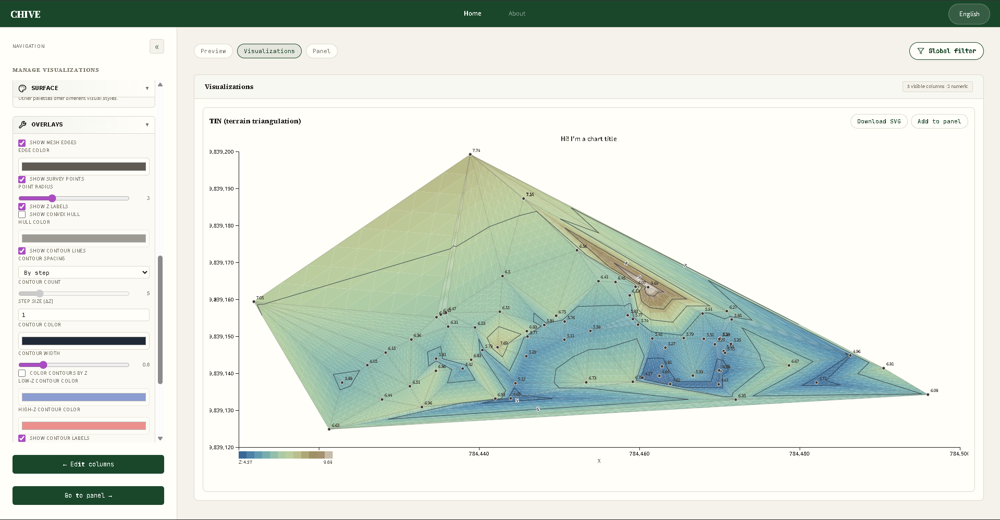

# CHIVE: Connected Hierarchical Interactive Visualization Engine

CHIVE is a client-side browser tool for exploring CSV/JSON data, building interactive D3 visualizations, and composing charts into dashboard panels. It runs as static files, with no CHIVE backend required.



## Live Deployments

| Environment | URL | Branch | Host |
|---|---|---|---|
| **Stable** | [apps.roberto.eti.br/chive](https://apps.roberto.eti.br/chive/) | `main` | Self-hosted server |
| **Preview** | [gabrielinada.github.io/CHIVE](https://gabrielinada.github.io/CHIVE/) | `develop` | GitHub Pages |

- **Stable** reflects the released state of the project and is the recommended version for normal use.
- **Preview** reflects `develop` and is intended for trying upcoming features before they are merged into `main`.

Both deployments serve the same source files unchanged: `index.html`, `about.html`, and `src/`. No production build step runs at deploy time.

## What You Can Do

- Load CSV-like text data (`.csv`, `.tsv`, `.dsv`, `.txt`) and JSON files.
- Use bundled sample datasets for quick experiments.
- Preview rows, inspect detected columns, and select which columns stay visible.
- Review numeric and categorical summaries.
- Build bar, scatter, pie/donut, bubble, network, treemap, line, and TIN charts.
- Apply global filters to focus the active dataset.
- Join datasets through the browser UI.
- Save chart snapshots into dashboard panel layouts.
- Export the dashboard panel as SVG.
- Switch the UI between English and Brazilian Portuguese.

## Quick Start

1. Open the [Stable deployment](https://apps.roberto.eti.br/chive/) or the [Preview deployment](https://gabrielinada.github.io/CHIVE/).
2. Load a sample dataset, or upload a CSV/JSON file from your machine.
3. Review the table preview and choose the columns you want to keep visible.
4. Open the visualization view and pick a chart type.
5. Configure the chart columns and options in the sidebar.
6. Add useful charts to the panel.
7. Arrange the panel layout and export it as SVG when needed.

## Local Development

Install Node.js LTS, then install dependencies once:

```powershell
npm install
```

Start the Vite dev server:

```powershell
npm run dev
```

Open <http://localhost:5173/>.

Run local checks:

```powershell
npm run lint
npm test
```

Useful commands:

```powershell
npm run dev          # Start Vite dev server
npm run build        # Optional Vite production build into dist/
npm run preview      # Preview the optional Vite build
npm run lint         # Run ESLint architecture/deployment guards
npm run lint:fix     # Apply safe automatic lint fixes
npm test             # Run all tests once
npm run test:watch   # Run tests in watch mode
```

## Static Deployment

CHIVE is designed to run from a static web server. The app runtime uses:

1. Native browser ES modules through `<script type="module">`.
2. External runtime dependencies loaded from `https://esm.sh` with full URLs in source files.
3. Google Fonts loaded from `fonts.googleapis.com` and `fonts.gstatic.com`.

### Requirements

1. Serve files over HTTP/HTTPS. Do not open the app with `file://`.
2. Serve these files and folders at minimum:
   - `index.html`
   - `about.html`
   - `src/`
3. Allow these external origins in the default setup:
   - `https://esm.sh`
   - `https://fonts.googleapis.com`
   - `https://fonts.gstatic.com`

### Deploy Steps

1. Upload the project files as static content.
2. Serve them with a static web server such as Nginx, Apache, Caddy, IIS, or GitHub Pages.
3. Open `index.html` through HTTP/HTTPS.

### Post-Deploy Smoke Test

1. Open the app URL.
2. Check that the browser console has no module, CORS, or CSP errors.
3. Load a bundled sample dataset or upload a small CSV/JSON file.
4. Verify the table preview renders.
5. Create at least one chart.

## Local Static Test

To test the production-style static runtime locally, run a static server from the project root:

```powershell
python -m http.server 8080
```

Then open <http://localhost:8080/>.

Checklist:

1. App shell loads successfully.
2. Browser console has no red errors.
3. File upload or sample dataset loading works.
4. At least one chart renders.

## Data And Privacy

CHIVE has no application backend in the default deployments. Uploaded datasets are parsed and visualized in the browser. The app uses browser storage so work can survive refreshes:

- IndexedDB stores dataset and dashboard panel state.
- `localStorage` stores small UI preferences.

The default runtime still trusts external origins for JavaScript modules and fonts. If you need stricter controls for sensitive data, self-host CHIVE and review the CDN/font trust boundary before use. See [Privacy and security](docs/PRIVACY_AND_SECURITY.md) for the detailed trust model.

## Documentation

- [Architecture overview](ARCHITECTURE.md): fast mental model for state, events, facades, and rendering boundaries.
- [Architecture reference](docs/ARCHITECTURE_REFERENCE.md): exact state schema, facade methods, event registry, and subscribers.
- [Privacy and security](docs/PRIVACY_AND_SECURITY.md): browser storage, runtime network dependencies, and trust boundaries.
- [Security policy](SECURITY.md): where to report security concerns.
- [Contributing](CONTRIBUTING.md): development workflow, code conventions, lint rules, and tests.
- [Stylesheet organization](src/styles/STYLES_ORGANIZATION.md): CSS layers, feature ownership, and responsive rules.
- Planned follow-ups: user guide and chart/data reference.

## Project Status

CHIVE is an open-source research project from UFRA (Federal Rural University of the Amazon). The codebase is plain JavaScript with browser ES modules, D3, Vite for local development, Vitest for tests, and no frontend framework.

## License

See [LICENSE](LICENSE).
