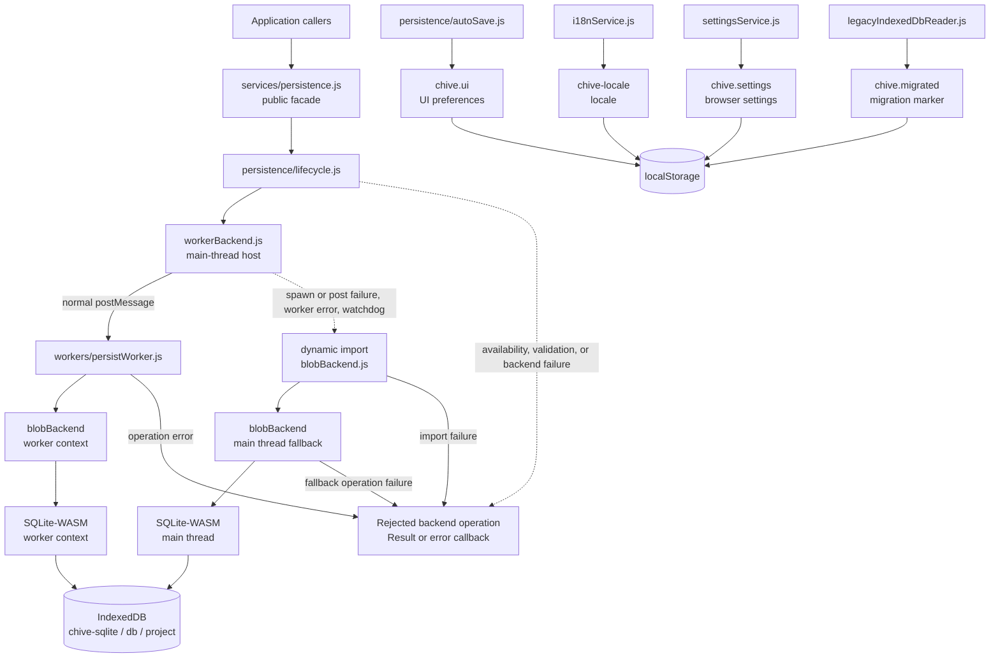

# CHIVE Architecture Reference

This is the implementation reference for the
[Architecture Overview](architecture.md). Use it for exact state, facade,
event, subscriber, persistence, and panel-lifecycle behavior. The current code
is authoritative; the machine-readable blocks and event table below are
checked by `tests/docs/architectureDocs.test.js`.

For chart-level rendering pipelines and algorithms, see the per-chart material
under [charts/](charts/README.md).

| Field | Value |
|---|---|
| Audience | Contributors changing state, facades, events, persistence, subscribers, or panel lifecycle code. |
| Source of truth | `src/state/`, production `emitStateChange` and `onStateChange` sites, persistence code, lint guards, and tests. |
| Update when | A state field, `appState.js` export, event, production subscription, persistence identifier/schema, mutable-getter guard, or supported panel chart changes. |

## Detailed Rationale

CHIVE uses an Observer-style state core around one module-private mutable
object. Domain facades expose ordinary writes and the state bus fans changes
out to explicit subscribers. This matches the current browser-only runtime,
imperative SVG/WebGL rendering, and preference for a small dependency surface.

The comparison below records project decisions, not universal properties of
the alternatives:

| Option | Potential benefit | CHIVE-specific reason it is not the current design |
|---|---|---|
| No central state | Minimal structure for isolated UI. | Datasets, chart configuration, panel snapshots, and UI preferences cross enough owners that a shared boundary is useful. |
| Shared state with direct mutation | Fewer facade functions. | Callers could change durable state without producing the event needed by current render and persistence owners. |
| Flux or Redux | Reducer/action conventions and ecosystem tooling. | CHIVE does not currently need that additional runtime/convention layer for its narrow state surface. This is independent of how D3 updates DOM. |
| Signals, proxies, or MobX-style tracking | Automatic dependency tracking. | CHIVE currently favors named events and explicit subscribers because their routing is easy to inspect in source and tests. |
| A component framework | Component lifecycle and ecosystem conventions. | Adopting one would be a product-wide migration; the current views and chart packages already have explicit ownership and disposal contracts. |
| Browser `CustomEvent` as the only bus | No in-process registry helper. | The state bus provides typed names, unsubscribe functions, wildcard fan-out, error isolation, and the optional debug log; it still dispatches a browser event for external observers. |

D3 is one visualization dependency, not the application architecture. It
provides selections, scales, axes, layouts, interpolation, and related
primitives. CHIVE's packages also implement their own aggregation, regression,
sampling/render-budget, and TIN computations. Three.js owns the 3D scene and
WebGL rendering path.

## State Schema

The following JSON is the exact state returned by a fresh `getState()` before a
panel getter synthesizes its default block:

```json architecture-default-state
{
    "data": {
        "datasets": [],
        "activeIndex": -1
    },
    "panel": {
        "charts": [],
        "slots": {},
        "layout": "template-2col",
        "blocks": [],
        "nextBlockId": 1,
        "nextChartId": 0
    },
    "ui": {
        "sidebarMode": "data",
        "previewRows": 10
    }
}
```

`data.datasets` contains `Dataset` records. `activeIndex === -1` represents no
selection. `panel.charts` contains chart snapshots. Per-block `block.slots` is
the authoritative assignment map; `panel.slots` is retained for legacy
single-block compatibility.

`panel.layout` is a persisted compatibility field and invariant mirror of
`panel.blocks[0].templateId`; the first block remains authoritative. Default
block creation, hydration, clear, removal, reorder, and first-block template
changes all resynchronize it.

`ui.sidebarMode` is intended to be `data`, `viz`, or `panel`.
`ui.previewRows` is an integer from 1 through 1000.

`getState()` performs a JSON round-trip clone. The focused object/array getters
return live references unless their row says otherwise and must be treated as
read-only.

## App State Exports

This is the complete named-export surface of `src/state/appState.js`:

```json architecture-app-state-exports
[
    "STATE_EVENTS",
    "addChartSnapshot",
    "addDataset",
    "addPanelBlock",
    "assignChartToPanelBlockSlot",
    "clearPanel",
    "getActiveDataset",
    "getActiveDatasetIndex",
    "getAllDatasets",
    "getChartSnapshot",
    "getPanelBlocks",
    "getPanelCharts",
    "getPersistenceSnapshot",
    "getPreviewRows",
    "getState",
    "movePanelBlock",
    "normalizeActiveDatasetConfig",
    "onStateChange",
    "removeChartSnapshot",
    "removeDataset",
    "removePanelBlock",
    "replaceAllState",
    "sanitizeChartName",
    "setActiveChartType",
    "setActiveDataset",
    "setPanelBlockTemplate",
    "setPreviewRows",
    "setSidebarMode",
    "updateActiveDatasetColumns",
    "updateActiveDatasetConfig",
    "updatePanelBlockBorder",
    "updatePanelBlockHeight",
    "updatePanelBlockProportions",
    "validatePanelSlots"
]
```

### Read And Utility Exports

| Method | Return or mutation | Exact edge behavior |
|---|---|---|
| `getState()` | Fresh JSON deep clone of all three slices. | Dates and other non-JSON values follow `JSON.stringify`/`JSON.parse` semantics. |
| `getPersistenceSnapshot()` | Fresh envelope containing live `datasets`, `panel`, and `ui` references. | Avoids cloning large payloads for autosave. Every nested value is read-only to callers. |
| `getActiveDataset()` | Live selected dataset or `null`. | Returns `null` for `activeIndex === -1` or when the indexed entry is falsy. |
| `getActiveDatasetIndex()` | Primitive index value. | Returns the stored value; it does not normalize a malformed value. |
| `getAllDatasets()` | Live datasets array. | No clone or validation. |
| `getPanelCharts()` | Live snapshot array. | No clone or validation. |
| `getChartSnapshot(chartId)` | Live snapshot or `null`. | Accepts a non-negative safe integer or decimal-integer string. It tolerantly returns `null` for malformed or missing ids; it does not throw like mutation entry points. |
| `getPanelBlocks()` | Live blocks array. | Ensures one block exists, using the compatibility layout when synthesis is needed, increments `nextBlockId`, synchronizes `panel.layout`, and emits no event. |
| `getPreviewRows()` | Primitive stored preview-row value. | No normalization on read. |
| `sanitizeChartName(name)` | String. | Applies `String(name).slice(0, 100).trim()`. |
| `validatePanelSlots()` | No return. | Ensures a default block, removes legacy and per-block assignments whose values are not current chart ids, and emits nothing. |
| `onStateChange`, `STATE_EVENTS` | Re-exports from `stateEvents.js`. | `onStateChange` returns an unsubscribe function. |

### Live-Reference Read Policy

The lint guards treat these object/array-returning calls as read-only targets:

```json architecture-mutable-getters
[
    "getActiveDataset",
    "getAllDatasets",
    "getPanelCharts",
    "getChartSnapshot",
    "getPanelBlocks",
    "getState",
    "getPersistenceSnapshot"
]
```

The list intentionally includes clone-returning `getState`: mutating that clone
does not damage state, but it is still not a legal state-write path. Keep this
block aligned with `FACADE_MUTABLE_GETTERS` in `eslint.config.js` and
`TRACKED_GETTERS` in `eslint-rules/no-facade-getter-mutation.js`. Add a new
renderer-safe read separately to `APP_STATE_READS`; persistence/debug-only reads
such as `getPersistenceSnapshot` do not belong there.

Prefer focused primitive selectors when a caller does not need a large live
object. Do not introduce broad clone getters for datasets, rows, panel charts,
or snapshots without a demonstrated need; worker payload deduplication also
relies on stable array references.

### Data Facade Methods

| Method | Mutation and event | Accepted values and no-ops |
|---|---|---|
| `setActiveDataset(index)` | Stores and emits `ACTIVE_DATASET` only when the index changes. | Accepts integer `-1` or an in-range dataset index; throws for every other value. |
| `addDataset(dataset)` | Mutates the caller by assigning a missing id and canonical `chartConfig`, pushes it, maybe selects it, emits `DATASET_ADDED`, returns the index. | Throws unless `dataset` is truthy and `dataset.rows` is an array. It does not validate the remaining record shape. |
| `removeDataset(index)` | Splices a dataset, adjusts selection, preserves detached panel captures and both assignment maps, then emits `DATASET_REMOVED`. | Accepts only an in-range integer; throws before mutation otherwise. |
| `updateActiveDatasetConfig(updates)` | Canonicalizes current config, shallow-merges a plain-object patch, canonicalizes again, stores it, and emits the raw `updates` argument. | No active dataset means no-op/no event. A non-plain patch is treated as `{}` for mutation but is still emitted verbatim. |
| `updateActiveDatasetColumns(columnNames)` | Stores a copied list and emits it as `COLUMNS_UPDATED` only when ordered contents change. | No active dataset means no-op/no event, without validating the argument. Otherwise requires an array of distinct strings declared by the active dataset; malformed, duplicate, and unknown names throw before mutation. |
| `normalizeActiveDatasetConfig(normalizer)` | Replaces config with `normalizer(currentConfig)` and emits nothing. | No active dataset means no-op. The callback and returned shape are not validated; exceptions propagate. Reserved for continuous preview writes. |
| `setActiveChartType(chartType, activatedOverrides)` | Enables exactly the selected canonical chart key, or disables every chart for `null`; canonicalizes and emits `{ activeChartType }`. | No active dataset or an unknown non-null key means no-op/no event. Plain-object overrides apply only to a non-null selected type. A valid call emits even if it reproduces the current state. |

### Panel Facade Methods

| Method | Mutation and event | Accepted values and no-ops |
|---|---|---|
| `addChartSnapshot(snapshot)` | Allocates `nextChartId`, normalizes snapshot fields, pushes, emits `CHART_ADDED`, and returns id. | Caller id is ignored. Name is stringified/sanitized; `metaSummary` is capped at 180; missing arrays become empty; missing type/config/metadata become `null`; missing `createdAt` gets the current ISO time. A missing snapshot object throws. The facade stores supplied config/data/column/metadata references; the production controller performs the structured clones before calling it. |
| `removeChartSnapshot(chartId)` | Removes the matching chart and legacy/per-block assignments, ensures a block, and emits the normalized id. | Accepts a non-negative safe integer or decimal-integer string. Malformed ids throw; a valid missing id is no-op/no event. |
| `clearPanel()` | Drops charts and legacy slots, resets both counters, creates one default block, sets `panel.layout`, and emits `PANEL_CLEARED`. | Always mutates and emits. |
| `addPanelBlock(templateId)` | Ensures a default block, appends one, increments id, emits `PANEL_BLOCK_ADDED`, and returns the block id. | Requires an exact registry template id. Returns `null` with no event at the four-block limit; invalid template ids throw. |
| `removePanelBlock(blockId)` | Removes the matching block; if empty, creates a default block; synchronizes `panel.layout`; and emits `PANEL_BLOCK_REMOVED`. | Missing block is no-op/no event. |
| `movePanelBlock(blockId, targetIndex)` | Moves the block, synchronizes `panel.layout`, and emits `{ blockId, targetIndex }` with the final bounded integer. | A missing block is no-op/no event without validating the target. For an existing block, the target must be an integer; out-of-range integers are clamped and an unchanged bounded target is no-op. All other targets throw. |
| `updatePanelBlockProportions(blockId, patch)` | Atomically validates and merges the patch, clamps supplied values to 20–80, and emits the resulting proportions only after a change. | A missing block is no-op/no event without validating the patch. For an existing block, an empty patch or unchanged result is no-op; otherwise the patch must be a plain object with finite values and only the current template's mutable keys: `split`, `splitMain`/`splitRight`, or `a`/`b`/`c`; `template-single` has none. Invalid input throws before mutation. |
| `updatePanelBlockHeight(blockId, heightPx)` | Rounds, clamps to 220–760, stores, and emits the stored height only after a change. | A missing block is no-op/no event without validating the height. For an existing block, unchanged rounded/clamped results are no-op; the value must be a finite number, while coercion-only and non-finite values throw. |
| `updatePanelBlockBorder(blockId, options)` | Atomically validates optional boolean `enabled` and valid trimmed hex `color`, applies them, and emits complete current border state only after a change. | A missing block is no-op/no event without validating the patch. For an existing block, empty/unchanged patches are no-op; non-plain patches, unknown keys, and invalid supplied fields throw before mutation. |
| `setPanelBlockTemplate(blockId, templateId)` | Prunes disallowed slots, resets proportions, synchronizes `panel.layout`, and emits the exact template id only after a change. | A missing block returns `false` with no event without validating the template. For an existing block, an exact registry id is required and invalid ids throw; same-template calls return `true` with no event. |
| `assignChartToPanelBlockSlot(blockId, slotId, chartId)` | Assigns an existing normalized chart id or deletes the key for `null`, then emits only after a change. | A missing block is no-op/no event without validating the slot or chart id. For an existing block, the slot must belong to its template; chart ids accept non-negative safe integers or decimal strings, and malformed/missing charts throw. Clearing an absent slot or assigning its current chart is no-op/no event. |

### UI And Hydration Methods

| Method | Mutation and event | Accepted values and no-ops |
|---|---|---|
| `setSidebarMode(mode)` | Stores and emits `SIDEBAR_MODE_CHANGED`. | Accepts exactly `data`, `viz`, or `panel`; throws otherwise; same value is no-op/no event. |
| `setPreviewRows(rows)` | Stores and emits `PREVIEW_ROWS_CHANGED` only when the value changes. | Requires an integer from 1 through 1000; every other value throws before mutation. |
| `replaceAllState({ data, panel, ui })` | Hydrates supplied fields and unconditionally emits one `STATE_HYDRATED`. | Omitted or non-object slices remain unchanged. A supplied data slice defaults invalid collections/indexes, canonicalizes config, and sanitizes selected columns. A supplied panel slice defaults fields, keeps object block entries, canonicalizes block templates, synthesizes from a valid legacy layout when needed, and mirrors `panel.layout`; chart records are not generally validated here. A supplied UI slice overwrites only valid individual fields, including preview rows from 1 through 1000. Calling with no arguments still emits. |

`replaceAllState` is therefore partial at the slice level, not a reset-to-default
operation. It is a hydration/import escape hatch rather than an ordinary
facade. Canonicalization changes hydrated memory only. Because autosave ignores
`STATE_HYDRATED`, restored bytes are not rewritten merely because
canonicalization changed them; a later project-dirty event and successful save
are required.

## Event Registry

State-bus callers reference `STATE_EVENTS.*`; the registry itself defines the
wire strings below. `emitStateChange` synchronously invokes typed listeners,
then wildcard listeners with `{ type, data }`, then dispatches
`chive-state-changed` on `window`. Each listener error is caught and reported as
`chive-internal-error`; one failing listener does not stop later fan-out.

Typed and wildcard `onStateChange` registrations share one membership boundary
per emission, which is fixed before the first listener runs. A registration
added during an emission, on either sink, is not invoked by that emission and
receives the next one. A registration detached before its turn is skipped; a
callback already executing completes. The unsubscribe function returned by
`onStateChange` is idempotent and detaches only its own registration, so
subscribing one function twice to an event yields two registrations that are
invoked and detached independently. The `chive-state-changed` window dispatch is
`EventTarget`'s own and sits outside this boundary: a bus listener that adds a
`window` handler for it during an emission can still be reached by that same
emission.

The `Emitters` and `Production subscriptions` cells use
`path#enclosingFunction` and are checked against AST-derived call sites.

| Constant | Value | Emitters | Production subscriptions | Payload |
|---|---|---|---|---|
| `ACTIVE_DATASET` | `activeDataset` | `src/state/dataStateFacade.js#setActiveDataset` | `src/app/renderCoordinator.js#setupStateSubscriptions` | Stored index argument. |
| `DATASET_ADDED` | `datasetAdded` | `src/state/dataStateFacade.js#addDataset` | `src/app/renderCoordinator.js#setupStateSubscriptions` | `{ index, dataset }`, where dataset is the stored live record. |
| `DATASET_REMOVED` | `datasetRemoved` | `src/state/dataStateFacade.js#removeDataset` | `src/app/renderCoordinator.js#setupStateSubscriptions` | Raw index argument. |
| `CONFIG_UPDATED` | `configUpdated` | `src/state/dataStateFacade.js#updateActiveDatasetConfig`<br>`src/state/dataStateFacade.js#setActiveChartType` | `src/app/renderCoordinator.js#setupStateSubscriptions` | Raw update argument, or `{ activeChartType }`. |
| `COLUMNS_UPDATED` | `columnsUpdated` | `src/state/dataStateFacade.js#updateActiveDatasetColumns` | `src/app/renderCoordinator.js#setupStateSubscriptions` | Copied, validated column-selection array. |
| `CHART_ADDED` | `chartAdded` | `src/state/panelStateFacade.js#addChartSnapshot` | `src/features/panel/panelController.js#initPanelController` | `{ id, snapshot }`. |
| `CHART_REMOVED` | `chartRemoved` | `src/state/panelStateFacade.js#removeChartSnapshot` | `src/features/panel/panelController.js#initPanelController` | Normalized non-negative safe-integer chart id. |
| `PANEL_CLEARED` | `panelCleared` | `src/state/panelStateFacade.js#clearPanel` | `src/features/panel/panelController.js#initPanelController` | `undefined`. |
| `PANEL_BLOCK_ADDED` | `panelBlockAdded` | `src/state/panelStateFacade.js#addPanelBlock` | `src/features/panel/panelController.js#initPanelController` | New live block. |
| `PANEL_BLOCK_REMOVED` | `panelBlockRemoved` | `src/state/panelStateFacade.js#removePanelBlock` | `src/features/panel/panelController.js#initPanelController` | Raw block id. |
| `PANEL_BLOCK_MOVED` | `panelBlockMoved` | `src/state/panelStateFacade.js#movePanelBlock` | `src/features/panel/panelController.js#initPanelController` | `{ blockId, targetIndex }` after bounding. |
| `PANEL_BLOCK_PROPORTIONS_UPDATED` | `panelBlockProportionsUpdated` | `src/state/panelStateFacade.js#updatePanelBlockProportions` | `src/features/panel/panelController.js#initPanelController` | `{ blockId, proportions }`. |
| `PANEL_BLOCK_HEIGHT_UPDATED` | `panelBlockHeightUpdated` | `src/state/panelStateFacade.js#updatePanelBlockHeight` | `src/features/panel/panelController.js#initPanelController` | `{ blockId, heightPx }` after round/clamp. |
| `PANEL_BLOCK_BORDER_UPDATED` | `panelBlockBorderUpdated` | `src/state/panelStateFacade.js#updatePanelBlockBorder` | `src/features/panel/panelController.js#initPanelController` | `{ blockId, enabled, color }` with current values. |
| `PANEL_BLOCK_TEMPLATE_CHANGED` | `panelBlockTemplateChanged` | `src/state/panelStateFacade.js#setPanelBlockTemplate` | `src/features/panel/panelController.js#initPanelController` | `{ blockId, templateId }` with the exact registered id. |
| `PANEL_BLOCK_SLOT_ASSIGNED` | `panelBlockSlotAssigned` | `src/state/panelStateFacade.js#assignChartToPanelBlockSlot` | `src/features/panel/panelController.js#initPanelController` | `{ blockId, slotId, chartId }`; id is numeric or `null`. |
| `SIDEBAR_MODE_CHANGED` | `sidebarModeChanged` | `src/state/uiStateFacade.js#setSidebarMode` | — | Stored mode. |
| `PREVIEW_ROWS_CHANGED` | `previewRowsChanged` | `src/state/uiStateFacade.js#setPreviewRows` | `src/app/renderCoordinator.js#setupStateSubscriptions` | Stored rows value. |
| `STATE_HYDRATED` | `stateHydrated` | `src/state/appState.js#replaceAllState` | `src/app/renderCoordinator.js#setupStateSubscriptions` | `undefined`. |
| `WILDCARD` | `*` | — | `src/services/persistence/autoSave.js#enablePersistenceAutoSave` | Directly emits nothing; callback receives every typed emission as `{ type, data }`. |

## Subscriber Map

Production subscriptions are installed in three places:

| Owner | Direct subscriptions | Timing | Render or side effect |
|---|---|---|---|
| `app/renderCoordinator.js` | `ACTIVE_DATASET`, `DATASET_ADDED`, `DATASET_REMOVED`, `COLUMNS_UPDATED`, `CONFIG_UPDATED`, `STATE_HYDRATED`, `PREVIEW_ROWS_CHANGED` | Schedules and coalesces work with `requestAnimationFrame`. | Full refresh for dataset selection/add/remove and hydration; workspace + controls for columns/config; panel region additionally when config payload has `activeTab === 'panel'`; workspace for preview rows. |
| `features/panel/panelController.js` | Eleven chart/block events listed in the event table. | Listener callbacks render synchronously in the emitter's call stack. | Chart add/remove/slot: sidebar + canvas. Layout events: canvas + layout selector. Clear: sidebar + canvas + selector. |
| `services/persistence/autoSave.js` | `WILDCARD` | UI prefs are attempted immediately; project writes are debounced and asynchronous. | Writes `chive.ui` for the two UI events. Ignores those UI events and `STATE_HYDRATED` for project dirtiness; every other nonempty event type marks the project dirty. |

The render coordinator also has non-bus entries:

- Boot and `chiveDebug.refreshView()` call `runFullRefreshNow()` synchronously.
- Locale changes and the supported TIN rendering-setting event call
  `scheduleFullRefresh()`.
- Continuous chart-control input reaches throttled `livePreviewRender()`, which
  renders active charts only.
- No production caller invokes private `refreshView()` directly.

Hydration ordering matters. On normal boot, `hydrateState` and its
`replaceAllState` call occur before all three subscription owners are installed,
then boot calls `runFullRefreshNow`. A later project import calls
`replaceAllState` after subscriptions exist, so the coordinator schedules a
full render; the import path has already persisted the imported bytes before
replacing memory.

## Persistence

The public entry is
[`src/services/persistence.js`](../../src/services/persistence.js). Its private
package owns lifecycle, normalization, autosave, dirty tracking, errors,
project-file naming, UI preferences, storage backends, and SQLite SQL.
`workers/persistWorker.js` is the one allowed importer of persistence internals
outside that package.

### Execution And Failure Paths



The normal path performs fingerprinting, SQLite work, and IndexedDB access in
the long-lived persistence worker. IndexedDB is available asynchronously in
workers through [`WorkerGlobalScope.indexedDB`](https://developer.mozilla.org/en-US/docs/Web/API/WorkerGlobalScope/indexedDB).
The host omits unchanged row/snapshot arrays by reference identity; the worker
reconstructs them from caches and can request one full resync.

The dotted branch is a recovery attempt, not a success guarantee. A worker
transport/lifecycle failure drains pending operations in order through a
dynamically imported main-thread `blobBackend`. A structured worker operation
error (for example quota), a repeated cache-resync error, dynamic-import
failure, SQLite failure, or fallback IndexedDB failure rejects the operation.
`persistState` converts that rejection to `{ ok: false, error }`; autosave keeps
the project dirty and calls its error callback. The main-thread fallback can
also block the UI while it performs SQLite work.

### Storage Contract

```json architecture-persistence-storage
{
    "indexedDB": {
        "database": "chive-sqlite",
        "version": 1,
        "objectStore": "db",
        "projectKey": "project",
        "value": "serialized SQLite byte image"
    },
    "sqlite": {
        "format": "chive-project",
        "schemaVersion": "1",
        "tables": [
            "meta",
            "datasets",
            "app_state",
            "dataset_payload",
            "panel_snapshot_payload"
        ]
    },
    "legacyIndexedDB": {
        "database": "chive-state",
        "stores": [
            "datasets",
            "panel"
        ],
        "panelKey": "singleton"
    },
    "localStorage": {
        "uiPreferences": "chive.ui",
        "locale": "chive-locale",
        "settings": "chive.settings",
        "migrationMarker": "chive.migrated"
    }
}
```

SQLite schema version `1` contains:

| Table | Columns | Purpose |
|---|---|---|
| `meta` | `key`, `value` | Stores `format = chive-project` and `schema_version = 1`. |
| `datasets` | `id`, `position`, `name`, `columns_json`, `selected_columns_json`, `chart_config_json`, `precomputed_stats_json`, `size_label`, `fingerprint`, `fingerprint_algorithm` | Dataset metadata/config and deterministic identity, excluding row payloads. |
| `app_state` | `key`, `doc` | JSON documents for `data_state` with `activeDatasetId`, and `panel` without chart payload arrays. |
| `dataset_payload` | `dataset_id`, `rows_json` | Dataset rows keyed by dataset id. |
| `panel_snapshot_payload` | `chart_id`, `rows_json`, `columns_json` | Captured panel chart rows and columns keyed by chart id. |

`blobBackend` serializes the complete SQLite database to one byte image and
stores it at the IndexedDB identifier above. Full exports retain both payload
tables. Work-only exports first write a normal image, then empty the payload
tables and run `VACUUM`; work-only imports are rejected because dataset
re-linking is not implemented.

### Hydration, Save, And Lifecycle Semantics

Normal boot hydration is:

1. If the initializer's `isPersistenceAvailable()` check is true, call
   `hydrateState` before installing state subscriptions.
2. Read the SQLite bytes through the worker path (or attempted fallback),
   deserialize, and read the five schema tables.
3. When there is no SQLite project and the migration marker is absent, attempt
   the one-time legacy raw-IndexedDB import.
4. Validate dataset records, sanitize selected columns, canonicalize chart
   config in memory, apply the injected panel-spec transform, and read
   `chive.ui`.
5. Call `replaceAllState` only when normalized project content or UI prefs are
   hydratable.

If the SQLite read throws, `hydrateState` reports the error and returns before
legacy migration or UI-pref hydration. If IndexedDB is unavailable, the
application initializer does not call `hydrateState`, so UI-pref hydration is
also skipped in that boot path. These are current behaviors, not storage
guarantees.

Autosave subscribes after hydration. Project events mark a revision dirty and
schedule a two-second debounced whole-image save. A call while a save is active
shares its promise. A successful save clears dirty only if no later revision
arrived; otherwise one follow-up save begins after settlement. A failure leaves
dirty set, but no automatic retry timer is added until another dirty event or
explicit/lifecycle `saveNow` call.

`runWithSavesSuspended` is the seam for an operation that must own the stored
project outright. It cancels the debounce, waits for every save already running,
including the follow-up a mid-save edit starts, and refuses to begin new ones
until the operation settles. Resuming reschedules a save when state turned dirty
during the window, so work created while the operation ran is not dropped.
Stored-data clearing is the only production caller.

Lifecycle handlers are a best-effort close net:

- [`visibilitychange`](https://developer.mozilla.org/en-US/docs/Web/API/Document/visibilitychange_event)
  with `document.visibilityState === 'hidden'` is the primary signal. MDN
  describes the hidden transition as the last event reliably observable by the
  page, but that does not make an asynchronous SQLite/IndexedDB operation
  completion-guaranteed.
- [`pagehide`](https://developer.mozilla.org/en-US/docs/Web/API/Window/pagehide_event)
  is a backstop compatible with the back/forward cache, but MDN notes that it is
  not reliably fired in all mobile shutdown scenarios.
- The Chromium-originated Page Lifecycle
  [`freeze` event](https://developer.chrome.com/docs/web-platform/page-lifecycle-api)
  is used where supported. The page may have little execution time before
  freezable task queues are suspended.

Each handler cancels the debounce and starts `saveNow` when dirty; none can
await completion before the page is discarded or terminated. CHIVE installs no
`unload`/`beforeunload` save path and no native unsaved-changes prompt. Edits
since the last successful write can therefore be lost on an interrupted close.

### Import, Clear, And Local Preferences

`exportProject` returns SQLite bytes and a generated filename. Full project
import requires both `format = chive-project` and `schema_version = 1`; either
missing key or any mismatched value rejects the file. Import then rejects
work-only content, normalizes the snapshot, persists it as the browser's
current project, and only afterward replaces in-memory data/panel state.
Locale and browser settings are not project data.

When a legacy project is successfully migrated, its old database is
best-effort deleted and `chive.migrated` is set. `clearPersistedState` removes
`chive.ui`, sets the marker, and deletes both project databases. It does not
remove `chive-locale` or `chive.settings`.

`clearPersistedState` never rejects, but it does report the project database's
outcome as `{ ok, reason }`. `blocked` means another connection, normally a
second tab, still holds the database; the delete request stays pending, so the
outcome is reported rather than waited on, and a caller must not tell the user
the data was removed. The legacy database stays best-effort and does not affect
the reported outcome, since the tombstone already prevents it from being read
again.

Project export, project import, and stored-data clearing hold one shared lock in
`app/bindings/projectOperationLock.js`. Each of them replaces or deletes the
whole project, so overlapping two produces a result neither asked for.

## Mutation Rules

- Ordinary application-state writes go through functions exported by
  `state/appState.js`; `replaceAllState` is the explicit hydration/import
  exception within that public surface.
- Treat all live-reference getter results as read-only.
- Callers of `emitStateChange` and `onStateChange` use `STATE_EVENTS` constants.
  The registry necessarily contains their literal wire values; tests may use
  literals deliberately.
- By policy, a subscriber must not synchronously produce another state event.
  A required follow-up is deferred by the owning module.
- Wildcard subscription is reserved for sink-style consumers; the only current
  production site is `services/persistence/autoSave.js`.
- `canonicalizeChartConfig` fills defaults, migrates known legacy shape, and
  removes stale global-filter column references. It is not comprehensive scalar
  or enum validation and does not remove every unknown top-level key.
- Persistence normalization, `addDataset`, emitting config writes, and
  `replaceAllState` canonicalize committed dataset config. Hydration does not
  rewrite stored bytes on its own.
- `normalizeActiveDatasetConfig` is the intentional non-emitting preview escape
  hatch. `getPanelBlocks` and `validatePanelSlots` also have non-emitting repair
  side effects.

## Panel Lifecycle

A chart snapshot has `{ id, name, type, config, dataSnapshot, columnsSnapshot,
metadata, metaSummary, createdAt }`. It is a render specification, not
pre-rendered SVG or canvas output. The production capture flow supplies detached
structured-cloned data/config, but the state objects are not `Object.freeze`d;
live getters still expose them under the read-only policy. Dataset removal
preserves these captures and their legacy/per-block slot assignments.

1. `panelController.addChartToPanel` verifies the type against the panel
   registry, reads the active dataset, merges chart defaults, resolves and
   applies the global filter, and structured-clones config/data/columns.
2. `addChartSnapshot` normalizes and stores the snapshot, then synchronously
   emits `CHART_ADDED`.
3. The panel controller's typed subscriber synchronously renders the sidebar
   and canvas.
4. `panelView.js` builds assigned slots and the slot lifecycle resolves the
   panel-only adapter through `charts/registries/panel.js`.
5. Mounting tears down any previous mount, renders from the snapshot, and adds a
   `ResizeObserver` when that API exists. Teardown disconnects it, cancels its
   scheduled resize callback, stops network simulation, hides the shared
   tooltip, and runs registered canvas/WebGL disposal before clearing the
   container.
6. SVG export clones current SVG nodes from the DOM. Canvas/WebGL slots are
   omitted and counted; a panel with assigned charts but no exportable SVG
   returns `no-exportable-charts`.

Supported panel chart types, in canonical chart-definition order:

```json architecture-panel-chart-types
[
    "bar",
    "line",
    "scatter",
    "scatter3d",
    "pie",
    "bubble",
    "network",
    "treemap",
    "tin"
]
```

## Adding A State Feature

1. Add the field to the correct state slice and update its typedef.
2. Add a public read only when callers need it; update the documented export
   list and applicable lint lists.
3. Put each ordinary write behind the owning domain facade.
4. Add a `STATE_EVENTS` member only when a downstream owner needs a signal.
5. Emit an explicit payload and add the production subscription in its owner.
6. Update the state JSON/table, facade contract, event table, and subscriber
   table in this reference.
7. Add behavior tests; the documentation drift suite checks the registries and
   call-site maps.

## Adding A Panel Feature

1. Decide whether the value belongs to chart snapshots, block layout state, or
   transient presentation state.
2. Keep durable writes behind `panelStateFacade.js` and pure transformations in
   `domain/panel/`.
3. Inject write callbacks from `panelController`; views, slots, layout helpers,
   and exporters do not import write facades.
4. Emit only when an owner needs to react and document no-op/error behavior.
5. For a new chart type, add the panel adapter to
   `charts/registries/panel.js`; the supported list derives from the canonical
   chart order. Update SVG-export behavior and tests when its rendering surface
   differs.

## Debugging State Events

`window.chiveDebug` exposes `enableStateLog`, `disableStateLog`, `getStateLog`,
and `clearStateLog`. When enabled, the bus prints each emission as
`[chive:state] <type> <data>` and retains at most 100 entries. Payloads in the
log are live references; the returned array is shallow-copied, so do not mutate
its entries.
