# CHIVE Architecture Overview

This is the short architecture tour for CHIVE. It describes runtime ownership,
the state boundary, and the rendering paths contributors need before changing
code. Exact facade behavior, event wiring, and persistence identifiers live in
the [Architecture Reference](architecture-reference.md).

## 1. Pattern In One Paragraph

CHIVE uses an Observer-style state core: one module-private mutable state object,
domain facades for ordinary writes, and an in-process event bus for notifying
explicit subscribers. Application and feature owners translate DOM intent into
calls on the public `state/appState.js` surface. The facades perform their
authorized mutations and emit typed state events; subscribers decide what to
render or save.

This is a CHIVE-specific design choice, not a claim that this pattern is
universally preferable to Redux, signals, or a component framework. It keeps the
project's small browser-only runtime and imperative visualization code directly
inspectable without adding another runtime abstraction.

## 2. Why This Shape

The design follows the current product constraints:

- CHIVE has no required remote application backend. Persistence-package
  "backends" are browser-local implementation adapters.
- Uploaded datasets remain in browser memory and browser storage.
- D3 supplies scales, axes, selections, hierarchy/layout utilities,
  interpolation, and other visualization primitives. CHIVE also owns custom
  aggregation, regression, sampling/budgeting, and TIN-related algorithms; D3
  is not the owner of every chart calculation.
- Most charts render SVG/DOM. Three.js renders the 3D scatter to WebGL after
  CHIVE and D3 prepare its data and scales.
- Explicit callbacks and subscriptions keep control flow visible to
  contributors and tests.

These are project tradeoffs. For the longer comparison, see
[Detailed Rationale](architecture-reference.md#detailed-rationale).

## 3. Runtime Ownership

```mermaid
flowchart LR
    DOM["DOM intent and injected callback owners<br/>app bindings and feature controllers"]
    API["Public state surface<br/>state/appState.js"]
    FACADES["Domain facades<br/>data, panel, UI"]
    STATE[("Module-private appState")]
    BUS["State event bus<br/>STATE_EVENTS"]
    COORD["Render coordinator<br/>animation-frame scheduled"]
    PANEL["Panel controller<br/>synchronous handlers"]
    AUTOSAVE["Persistence autosave<br/>persistence/autoSave.js"]
    VIEWS["Feature views and panel slot lifecycle"]
    REGISTRIES["Surface registries<br/>controls, workspace, panel"]
    CHARTS["Per-chart packages<br/>SVG or Three/WebGL"]
    PERSIST["Public persistence facade<br/>services/persistence.js"]
    HYDRATE["Boot persistence lifecycle"]

    DOM -->|"ordinary write"| API
    API -->|"delegate"| FACADES
    FACADES -->|"authorized mutation"| STATE
    FACADES -->|"typed emit"| BUS
    STATE -. "read through public getters" .-> API
    BUS -->|"typed; next animation frame"| COORD
    BUS -->|"typed; same call stack"| PANEL
    BUS -->|"wildcard"| AUTOSAVE
    COORD --> VIEWS
    PANEL --> VIEWS
    VIEWS --> REGISTRIES
    REGISTRIES --> CHARTS
    AUTOSAVE --> PERSIST
    HYDRATE -. "before subscriptions: replaceAllState" .-> API
    API -. "hydration escape: replace slices directly" .-> STATE
    API -. "STATE_HYDRATED" .-> BUS
```

The diagram shows ownership, not every import. Ordinary writes pass through a
domain facade. `replaceAllState` is the deliberate exception: during boot,
`applicationInitializer.js` hydrates before the render coordinator, panel
controller, and autosave subscriptions are installed. Its `STATE_HYDRATED`
emit therefore has no production subscriber during that boot call; the
initializer performs the first render synchronously afterward. The same method
can also be used later by project import, when subscriptions are already live.

The bus has three production routing styles:

- The render coordinator handles its typed events through a coalesced
  animation-frame scheduler.
- The panel controller handles its typed events synchronously.
- `services/persistence/autoSave.js` is the only production wildcard
  subscriber and reaches storage through the public persistence facade.

## 4. Ownership Layers

| Layer | Current owners | Boundary |
|---|---|---|
| Entrypoints and application composition | `entries/`, `app/applicationInitializer.js`, `app/domBindings.js`, `app/renderCoordinator.js` | Entrypoints stay structural; application modules order startup and compose feature owners. |
| Feature flow owners | Dataset controller and bindings, chart-controls controller, panel controller, settings controller, `uiManager.js` | Translate intent, call public facades/services, and own domain-specific render triggering. |
| State core | `state/appState.js`, domain facades, panel mutation internals, `stateEvents.js` | Ordinary durable writes enter through the public facade surface. |
| Presentation | Feature views/dialogs, panel views/slots/export, chart packages and registries | Render from explicit inputs or read-only getters; surface user actions through callbacks. |
| Browser services | Persistence, ingest worker host, i18n, settings, presets, storage and downloads | Own browser I/O and other effects; persistence internals stay behind `services/persistence.js`. |
| Pure leaves | `config/`, `utils/`, and `domain/` | Hold static configuration, ownership-neutral helpers, and product rules without DOM effects. |
| Ownerless UI mechanics | `ui/` | May touch the DOM but is a strict import leaf reusable by higher owners. |

The repository is not a model-view-controller stack with one thin controller
layer. A feature controller may own DOM intent, facade writes, subscriptions,
and rendering for its feature. The leaf views and chart renderers remain
read-only with respect to durable application state.

## 5. Maintained Invariants

The following are contributor policies, backed by lint or tests where noted:

- Route ordinary application-state writes through methods exported by
  `state/appState.js`; do not mutate a getter return.
- State-bus callers use `STATE_EVENTS.*`. `stateEvents.js` itself necessarily
  defines the string wire values, and tests may intentionally exercise those
  values as literals.
- Do not synchronously emit another state event from a state subscriber. Use a
  deferred owner-controlled follow-up when one is required.
- Renderers and DOM builders receive write callbacks; they do not import write
  facades.
- Reserve wildcard subscriptions for sink-style consumers. Autosave is the
  only current production example.
- Treat the import restrictions as composition and leaf-layer boundaries, not
  as proof that the complete module graph is a directed acyclic graph.

The exact lint coverage and its known aliasing gap are documented in
[Contributor Reference](contributor-reference.md#architecture-guard-details).

## 6. Reactive And Render Flow

For a committed column-selection change:

1. A workspace DOM handler invokes its injected callback.
2. `renderCoordinator.updateDatasetColumns` calls
   `updateActiveDatasetColumns` on the public state surface.
3. The data facade replaces `dataset.selectedColumns` and emits
   `STATE_EVENTS.COLUMNS_UPDATED`.
4. The render coordinator schedules the workspace and controls regions.
5. A single animation-frame flush reads current state and renders those
   regions; a synchronous burst is coalesced.

Other render paths are intentionally different:

| Trigger | Owner | Timing and scope |
|---|---|---|
| Dataset add/remove/select or hydration after subscriptions | Render coordinator | One animation-frame-scheduled full refresh. |
| Column/config/preview-row events | Render coordinator | Animation-frame-scheduled region refreshes. |
| Panel chart/block events | Panel controller | Synchronous sidebar/canvas/layout-selector renders, depending on the event. |
| Boot and `chiveDebug.refreshView()` | Render coordinator | Synchronous full refresh through `runFullRefreshNow`. |
| Locale or rendering-setting browser events | Application initializer + render coordinator | Animation-frame-scheduled full refresh. |
| Continuous color/height control input | Chart-controls preview bridge | Throttled, charts-only `livePreviewRender`; controls and panel snapshots are untouched. |

Committed chart configuration is canonicalized at state boundaries:
persistence normalization, `addDataset`, emitting config writes, and
defensively in `replaceAllState`. Rendering may derive display values but does
not write repairs back. A restored config is canonicalized in memory; the
existing persisted SQLite bytes are not rewritten until some later successful
project save.

## 7. Dependency Direction

Lint enforces specific boundaries rather than a universal layer DAG. In
particular, `entries/` composes `app/`, while `features/` and `ui/` may not
import those composition layers; `ui/`, `utils/`, `config/`, chart leaves, and
domain leaves each have narrower allowed imports. Services, state, workers,
features, and chart integration files still have legitimate cross-layer edges
described in [Source Map: Direction](source-map.md#direction).

## 8. Where To Look Next

- [Architecture Reference](architecture-reference.md): default state, complete
  public exports, exact facade edge behavior, events/subscribers, persistence,
  and the panel lifecycle.
- [Source Map](source-map.md): source layout, naming vocabulary, and placement
  rules.
- [CONTRIBUTING.md](../../CONTRIBUTING.md): development workflow and hard
  architecture rules.
- [Stylesheet Organization](styles.md): CSS layer and file ownership.
