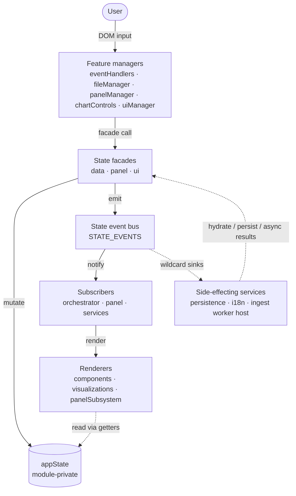

# CHIVE Architecture Overview

This document is the fast architecture tour for CHIVE. It describes the stable
mental model, layer boundaries, and invariants contributors need before
changing code.

It intentionally omits exhaustive implementation tables so it stays readable.
Those omissions are not shortcuts: the overview should remain accurate. For
exact state shape, facade methods, event payloads, emitters, subscribers, and
implementation checklists, see the
[Architecture Reference](architecture-reference.md).

## 1. Pattern In One Paragraph

CHIVE uses the **Observer pattern over a single mutable state object held in
module scope, with writes mediated by facade functions**. The state core owns
the application model, the facades expose legal mutations, and the event bus
broadcasts changes to explicit subscribers that decide what to re-render or
persist.

It is not Flux, Redux, MobX, signals, or a framework component model. There are
no actions, reducers, automatic dependency tracking, or virtual DOM. The shape
is deliberately plain JavaScript plus D3: easy to read cold, small enough to
audit, and compatible with charts that render imperatively.

## 2. Why This Shape

The architecture follows from CHIVE's constraints:

- CHIVE runs in the browser with no application backend.
- Uploaded datasets stay in browser memory and browser storage.
- D3 owns chart rendering and mutates SVG/DOM directly.
- The project keeps runtime dependencies small on purpose.
- The contributor base benefits from explicit, inspectable control flow.
- The state model is narrow: datasets, panel layout, and UI mode.

Async work still fits this structure. IndexedDB persistence subscribes to state
events, and the data-ingest Web Worker is wrapped behind a service boundary.
Neither requires a framework-level state model.

For the longer tradeoff analysis, see
[Architecture Reference: Detailed Rationale](architecture-reference.md#detailed-rationale).

## 3. System Map

The diagram is an abstraction, not a literal call graph. It shows ownership
boundaries: state writes enter through facades, state changes leave through the
bus, and renderers read state rather than owning it. The "feature managers" are
not a thin controller layer. Each one typically owns its domain end to end:
translating user intent into facade writes, subscribing to the resulting events,
and triggering its own renders (`panelManager` does all three for the panel).
The horizontal split below is about *roles*, not separate modules.

For exact subscribers and payloads, see
[Architecture Reference: Event Registry](architecture-reference.md#event-registry)
and
[Architecture Reference: Subscriber Map](architecture-reference.md#subscriber-map).

## 4. Layers

| Layer | Owns | Rule Of Thumb |
|---|---|---|
| Feature managers | A domain's DOM event capture and user-intent translation, plus its bus subscriptions and render-triggering (`eventHandlers`, `fileManager`, `panelManager`, `chartControls`, `uiManager`). | Validate input, call facades, and re-render that domain in response to the resulting events. |
| State Management Core | `appState`, facades, event registry, event bus. | The only normal path for application state mutation. |
| Orchestrator | Boot and broad UI refresh in `main.js`. | Wires services/modules, subscribes to broad data/config events, and schedules full-view renders. |
| Visualization Layer | Components, D3 charts, panel rendering (the leaf renderers). | Render from inputs and state reads; do not mutate application state. |
| Services And Utilities | Persistence, i18n, ingest worker host, config, pure helpers. | Services may cross side-effect boundaries; config/utils should stay leaf helpers. |

The important distinction is ownership, not file layout. A feature manager may
write facades, subscribe to the bus, and trigger renders for its own domain; what
it must not do is reach into another domain's state. `panelManager` is a clear
case (manager + subscriber + render-trigger); `chartControls` and `uiManager`
build UI *and* write facades, so they are managers, not leaf renderers. The leaf
renderers (components, D3 charts, `panelSubsystem` views) stay strictly read-only
with respect to application state: they receive callbacks from a manager and read
via getters, but never import write facades. A service may perform I/O, but state
changes still route through the state core boundary.

## 5. Invariants

These are the rules that keep the app reactive and debuggable:

- All application state writes go through facade methods exported by
  `appState.js`.
- Do not mutate objects or arrays returned from live-reference getters.
- Production code uses `STATE_EVENTS.*` constants, not string literals.
- Subscribers must not synchronously emit another state event from inside their
  callback.
- Renderers are stateless with respect to application state: they read and
  render, but they do not own writes.
- Wildcard subscriptions are reserved for sink-style state-bus consumers such
  as persistence.

Some facade methods intentionally do not emit, and hydration intentionally emits
only once after replacing slices. Those exceptions are documented in
[Architecture Reference: Mutation Rules](architecture-reference.md#mutation-rules).

Contributor-facing enforcement details live in
[CONTRIBUTING.md](../../CONTRIBUTING.md#architecture-invariants-do-not-break).

## 6. Reactive Flow

Example: a user toggles a column-visibility checkbox.

1. A renderer's DOM handler invokes `aoAlterarSelecaoColuna`, the callback
   propagated through `renderDataInterface`.
2. In this flow, that callback is `main.js`'s `updateDatasetColumns`, which
   calls `updateActiveDatasetColumns(columns)`.
3. The data facade writes `dataset.selectedColumns`.
4. The facade emits `STATE_EVENTS.COLUMNS_UPDATED`.
5. `main.js`'s `COLUMNS_UPDATED` subscription schedules the workspace and
   chart-controls regions via `scheduleRegion` (coalesced to one flush per
   microtask, so a synchronous burst of events paints once). Broad events
   (dataset add/remove/select, hydration, locale) schedule a full refresh via
   `scheduleFullRefresh` instead.
6. The region flush reads state via cheap getters and delegates rendering to
   the workspace and chart-controls renderers.

Panel changes follow the same ownership pattern but usually have a narrower
subscriber. For example, block layout events are handled by `panelManager`,
which redraws the panel canvas instead of routing through the broad
`refreshView()` path.

Dataset, committed-config, and panel renders are now uniformly bus-driven. Boot
and manual `chiveDebug` calls do a synchronous full render through
`runFullRefreshNow`; locale and the full-refresh bus events schedule one through
`scheduleFullRefresh`, and preview-row changes repaint only the workspace region.
Live color/height preview stays its own charts-only path. `refreshView()` is never
called bare. The invariant is not "every render comes from the bus"; the invariant
is that renderers do not mutate application state.

## 7. Where To Look Next

- [Architecture Reference](architecture-reference.md): exact state schema,
  facade method index, event registry, subscriber map, mutation rules, panel
  lifecycle, and implementation checklists.
- [CONTRIBUTING.md](../../CONTRIBUTING.md): development workflow, architecture
  invariants, lint rules, tests, and debugging helpers.
- [Stylesheet organization](styles.md): CSS
  layer order and stylesheet ownership.
