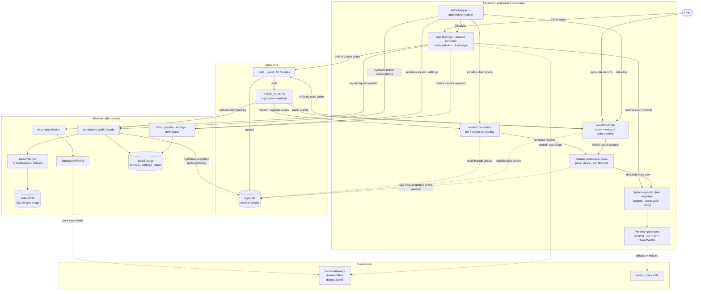

# CHIVE Architecture Overview

This document is the fast architecture tour for CHIVE. It describes the stable
mental model, layer boundaries, and invariants contributors need before
changing code.

It intentionally omits exhaustive implementation tables so it stays readable.
Those omissions are not shortcuts: the overview should remain accurate. For
exact state shape, facade methods, event payloads, emitters, subscribers, and
implementation checklists, see the
[Architecture Reference](architecture-reference.md).

## 1. Pattern In One Paragraph

CHIVE uses the **Observer pattern over a single mutable state object held in
module scope, with writes mediated by facade functions**. The state core owns
the application model, the facades expose legal mutations, and the event bus
broadcasts changes to explicit subscribers that decide what to re-render or
persist.

It is not Flux, Redux, MobX, signals, or a framework component model. There are
no actions, reducers, automatic dependency tracking, or virtual DOM. The shape
is deliberately plain JavaScript plus D3: easy to read cold, small enough to
audit, and compatible with charts that render imperatively.

## 2. Why This Shape

The architecture follows from CHIVE's constraints:

- CHIVE runs in the browser with no required remote or server-side application
  backend. Persistence-package "backends" are local implementation adapters,
  not remote services.
- Uploaded datasets stay in browser memory and browser storage.
- D3 owns the chart math everywhere (scales, extents, layout) and renders
  most charts to SVG/DOM directly. Three.js renders the 3D scatter to a
  WebGL canvas from D3-computed scales; the contract is rows/config ->
  chart model -> D3 math -> SVG or Three renderer.
- The project keeps runtime dependencies small on purpose.
- The contributor base benefits from explicit, inspectable control flow.
- The state model is narrow: datasets, panel layout, and UI mode.

Async work still fits this structure. IndexedDB persistence subscribes to state
events, and the data-ingest Web Worker is wrapped behind a service boundary.
Neither requires a framework-level state model.

For the longer tradeoff analysis, see
[Architecture Reference: Detailed Rationale](architecture-reference.md#detailed-rationale).

## 3. System Map

The diagram is an abstraction, not a literal call graph. It shows ownership
boundaries: ordinary state writes enter through facades, state changes leave
through the bus, and renderers read state rather than owning it. Hydration is
the documented exception: the persistence lifecycle calls `replaceAllState`
once and the state core emits `STATE_HYDRATED` after replacement. Browser-side
"backend" names in the persistence package are local storage implementations,
not a remote application server. The feature controllers and managers are
not a thin controller layer. Each one typically owns its domain end to end:
translating user intent into facade writes, subscribing to the resulting events,
and triggering its own renders (`panelController` does all three for the panel).
The horizontal split below is about *roles*, not separate modules.

For exact subscribers and payloads, see
[Architecture Reference: Event Registry](architecture-reference.md#event-registry)
and
[Architecture Reference: Subscriber Map](architecture-reference.md#subscriber-map).

## 4. Layers

| Layer | Owns | Rule Of Thumb |
|---|---|---|
| Feature controllers/managers | A domain's DOM event capture and user-intent translation, plus its bus subscriptions and render-triggering (app/feature bindings, `datasetController`, `panelController`, `chartControlsController`, `uiManager`). | Validate input, call facades, and re-render that domain in response to the resulting events. |
| State Management Core | `appState`, facades, event registry, event bus. | The only normal path for application state mutation. |
| Application orchestration | Browser startup in `entries/app.js` (and `entries/about.js` for the About page, which loads only shared i18n/settings and installs no debug surface), initialization order in `app/applicationInitializer.js`, and broad/narrow rendering in `app/renderCoordinator.js`. | Keep the entrypoints thin, order side effects in the initializer, and keep all scheduler state in the render coordinator. |
| Visualization Layer | Feature views and dialogs, D3/SVG chart renderers, per-chart packages under `src/charts/*`, and panel rendering (the leaf renderers). | Render from inputs and state reads; do not mutate application state. |
| Reusable UI mechanics | Ownerless browser UI behavior under `src/ui/` (feedback toasts, dialog focus trap). | A strict leaf with DOM access: import only config, utils, types, or vendor modules; never state, services, or features. |
| Services, domain, and utilities | Persistence, i18n, ingest worker host, browser downloads, pure product rules, config, and ownership-neutral helpers. | Browser effects belong in services, pure product rules in `domain/{owner}/`, and generic DOM-free helpers in `utils/`. |

The important distinction is ownership, not file layout. A feature controller or manager may
write facades, subscribe to the bus, and trigger renders for its own domain; what
it must not do is reach into another domain's state. `panelController` is a clear
case (controller + subscriber + render-trigger); `chartControlsController` and `uiManager`
build UI *and* write facades, so they are managers, not leaf renderers. The leaf
renderers (feature views and dialogs, chart packages under `src/charts/*`, and
`features/panel/views/`) stay strictly
read-only with respect to application state: they receive callbacks from a
manager and read via getters, but never import write facades. A service may
perform I/O, but state changes still route through the state core boundary.

## 5. Invariants

These are the rules that keep the app reactive and debuggable:

- All application state writes go through facade methods exported by
  `appState.js`.
- Do not mutate objects or arrays returned from live-reference getters.
- Production code uses `STATE_EVENTS.*` constants, not string literals.
- Subscribers must not synchronously emit another state event from inside their
  callback.
- Renderers are stateless with respect to application state: they read and
  render, but they do not own writes.
- Wildcard subscriptions are reserved for sink-style state-bus consumers such
  as persistence.

Some facade methods intentionally do not emit, and hydration intentionally emits
only once after replacing slices. Those exceptions are documented in
[Architecture Reference: Mutation Rules](architecture-reference.md#mutation-rules).

Contributor-facing enforcement details live in
[CONTRIBUTING.md](../../CONTRIBUTING.md#architecture-invariants-do-not-break).

## 6. Reactive Flow

Example: a user toggles a column-visibility checkbox.

1. A renderer's DOM handler invokes `onColumnSelectionChange`, the callback
   propagated through `renderDatasetWorkspace`.
2. In this flow, that callback is `app/renderCoordinator.js`'s
   `updateDatasetColumns`, which
   calls `updateActiveDatasetColumns(columns)`.
3. The data facade writes `dataset.selectedColumns`.
4. The facade emits `STATE_EVENTS.COLUMNS_UPDATED`.
5. The render coordinator's `COLUMNS_UPDATED` subscription schedules the
   workspace and chart-controls regions via `scheduleRegion` (coalesced to one
   flush per microtask, so a synchronous burst of events paints once). Broad events
   (dataset add/remove/select, hydration, locale) schedule a full refresh via
   `scheduleFullRefresh` instead.
6. The region flush reads state via cheap getters and delegates rendering to
   the workspace and chart-controls renderers.

Panel changes follow the same ownership pattern but usually have a narrower
subscriber. For example, block layout events are handled by `panelController`,
which redraws the panel canvas instead of routing through the render
coordinator's broad `refreshView()` path.

Dataset, committed-config, and panel renders are now uniformly bus-driven.
The application initializer and manual `chiveDebug` calls do a synchronous full
render through `runFullRefreshNow`; locale and the full-refresh bus events schedule one through
`scheduleFullRefresh`, and preview-row changes repaint only the workspace region.
Live color/height preview stays its own charts-only path. `refreshView()` is never
called bare. The invariant is not "every render comes from the bus"; the invariant
is that renderers do not write state during render.

Committed chart config backs that invariant concretely: it is canonicalized at
the state boundaries (persistence restore, `addDataset`, the emitting config
writes, and defensively in `replaceAllState`) via `canonicalizeChartConfig`.
Renderers may derive local display defaults from what they read, but they do not
write repairs back during render. The invariant is deliberately narrow: render
and setup paths still attach handlers that mutate state later, and views still
read state through getters; what render itself never does is write.

## 7. Where To Look Next

- [Architecture Reference](architecture-reference.md): exact state schema,
  facade method index, event registry, subscriber map, mutation rules, panel
  lifecycle, and implementation checklists.
- [Source map](source-map.md): source tree layout, naming vocabulary, and
  where new code goes.
- [CONTRIBUTING.md](../../CONTRIBUTING.md): development workflow, architecture
  invariants, lint rules, tests, and debugging helpers.
- [Stylesheet organization](styles.md): CSS
  layer order and stylesheet ownership.
