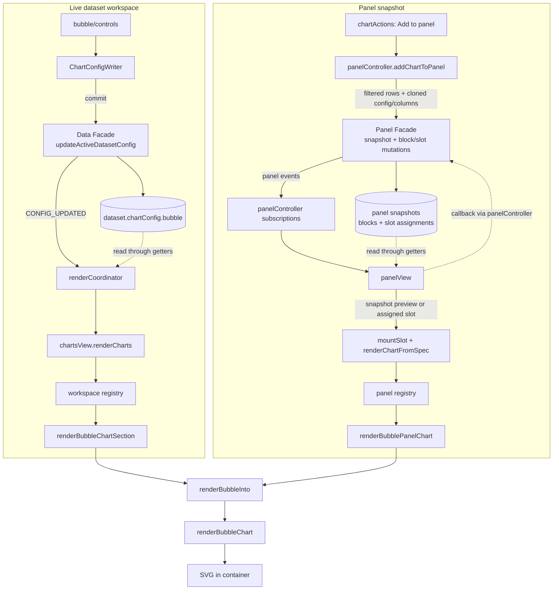

# The Bubble Chart, end to end

This document explains how CHIVE's bubble chart works, from the config a dataset stores,
through the sidebar controls, into the renderer, and out to the panel/export paths. It is
meant to be read top to bottom the first time and used as a reference afterwards. File
links are relative to this document (which lives in `docs/development/charts/`).

Section 2 covers the circle-packing and hierarchy theory the chart rests on, independent of
this codebase; everything from section 3 onward is how CHIVE implements it.

For the high-level "which columns does it need" summary, see the bubble row in
[Chart and data reference](../../user/chart-reference.md). For the shared state/panel/event architecture,
see [Architecture reference](../architecture-reference.md).

Key files:

- SVG renderer: [svg.js](../../../src/charts/bubble/renderers/svg.js)
- Data and hierarchy helpers: [data.js](../../../src/charts/bubble/data.js)
- Sidebar controls: [builder.js](../../../src/charts/bubble/controls/builder.js),
  [listeners.js](../../../src/charts/bubble/controls/listeners.js),
  [defaults.js](../../../src/charts/bubble/controls/defaults.js), and
  [nestingColumns.js](../../../src/charts/bubble/controls/nestingColumns.js)
- Config constants: [charts.js](../../../src/config/charts.js) (`BUBBLE_CHART`, `CHART_COLOR_PALETTES`)
- Per-dataset config defaults: [chartDefaults.js](../../../src/config/chartDefaults.js) (the `bubble` block)
- Shared presentation flow: [presentation.js](../../../src/charts/bubble/presentation.js)
- Dataset-workspace adapter: [workspaceSection.js](../../../src/charts/bubble/workspaceSection.js)
- Panel adapter: [panelAdapter.js](../../../src/charts/bubble/panelAdapter.js)

---

## 1. What a bubble chart is

A bubble chart packs circles into a space, sizing each circle by a measure so the eye reads
relative magnitude as area. In **flat** mode it is one circle per category (a compact
alternative to a bar chart when you care about rough proportion, not precise comparison). In
**grouped** mode it becomes a nested hierarchy: circles inside circles, one ring per nesting
level, with double-click drill-down navigation. It is CHIVE's tool for showing both group size
and hierarchical composition.

---

## 2. Foundations: circle packing and hierarchy

### 2.1 Aggregation and area encoding

Like bar and pie, the bubble chart aggregates: each category is reduced to a measure by
`count`, `sum`, or `mean` of a value column. That measure becomes the circle's **area** (not
its radius), because area is the honest visual encoding of magnitude (the same area-true
reasoning the scatter chart's size encoding uses, see the scatter doc's
[section 2.4](scatter.md)). A circle representing twice the value covers twice the area.

### 2.2 Circle packing

Given a set of sized circles, **circle packing** arranges them so none overlap and the whole
cluster is compact. CHIVE uses D3's `pack` layout, which:

- takes a `hierarchy` whose leaf values are summed up the tree,
- assigns each node a radius from its summed value (leaf area proportional to value), and
- positions the circles with an enclosure algorithm that nests children inside their parent
  and keeps the packing tight.

The result is a space-filling, area-proportional picture, the circular cousin of the
treemap's rectangles (see [treemap.md](treemap.md)).

### 2.3 Flat vs grouped (the hierarchy)

- **flat**: the hierarchy is one level deep (root → leaves), so the chart is a single cluster
  of category bubbles.
- **grouped**: a list of **nesting columns** defines a path for each row
  (`region → forestType → family`, for example). Rows are folded into a tree where each
  nesting level is an intermediate group circle and the category bubbles are the leaves. The
  pack layout then nests level inside level.

### 2.4 Progressive nesting and drill-down

The nesting depth is variable: you add levels one at a time, and a deep hierarchy is hard to
read all at once. So grouped mode supports **drill-down**: double-clicking a parent circle
zooms the view to fill the frame with that subtree and dims everything outside it; clicking
the background pops back up one level. A zoom stack tracks the drill path. This turns a dense
multi-level packing into a navigable tree.

### 2.5 Color by top-level group

Color is qualitative, not quantitative: an ordinal palette assigns one hue per **top-level
group** (the outermost ancestor), and every descendant inherits its group's color. This keeps
a subtree visually coherent as you drill into it. In flat mode each category is its own
"group," so each bubble gets its own palette hue.

---

## 3. The big picture (data flow)

Two integration paths share the same presentation mapping and end at `renderBubbleChart`.



The renderer is **stateless**: each call wipes the container and rebuilds the SVG (and resets
any drill-down). Rows are already global-filtered; aggregation and hierarchy building happen
on top of them. Panel snapshots are frozen `structuredClone`s
(see [Architecture reference](../architecture-reference.md)).

---

## 4. The data model

### 4.1 Where config lives

`chartConfig.bubble` is the bubble slice of each dataset's `chartConfig`, built fresh by
`createDefaultChartConfig()` in
[chartDefaults.js](../../../src/config/chartDefaults.js) and merged by
`mergeChartConfigWithDefaults()` in
[chartConfig.js](../../../src/domain/charts/chartConfig.js). The merge has special
handling for `bubble`: a legacy single `groupColumn` is promoted into a one-element
`nestingColumns` array so pre-multilevel configs keep working.

### 4.2 The `chartConfig.bubble` keys

| Key | Meaning | Default |
|---|---|---|
| `enabled` / `expanded` | Shown at all / sidebar expanded | `false` / `false` |
| `category` | Root category column (the leaves) | `null` |
| `nestingMode` | `'flat'` or `'grouped'` | `'flat'` |
| `nestingColumns` | Ordered hierarchy columns (grouped mode) | `[]` |
| `groupColumn` | Legacy single-group column (migrated to `nestingColumns`) | `null` |
| `measureMode` | `'count'`, `'sum'`, or `'mean'` | `'count'` |
| `valueColumn` | Numeric column for sum/mean | `null` |
| `topN` | Keep N largest categories (0 = all) | `10` |
| `padding` | Gap between packed circles | `3` |
| `labelMode` | `'all'`, `'hover'`, or `'auto'` | `'auto'` |
| `colorScheme` | Ordinal palette name | `'Tableau10'` |
| `customTitle` / `chartHeight` | Title / SVG height (400 to 900) | `''` / `700` |

### 4.3 The constants behind the defaults

[charts.js](../../../src/config/charts.js): `CHART_DIMENSIONS.bubble` is square (700x700) with
small margins; `CHART_HEIGHT_LIMITS.bubble` = `{ min: 400, max: 900 }` (taller floor than
other charts, since packing needs room); `BUBBLE_CHART` holds the measure/label/nesting option
lists, `autoLabelMinRadius` (20) and `parentLabelMinRadius` (40) label thresholds, padding
boosts per depth, and the zoom transition duration. `CHART_COLOR_PALETTES` supplies the
ordinal color palettes (Tableau10, Pastel, Bold, Colorblind-Safe).

---

## 5. The control sidebar

The package's [controls directory](../../../src/charts/bubble/controls/) keeps the standard
`createBubbleChartControls`, `setupBubbleChartControlListeners`, and `computeDefaults` roles
in separate modules, with progressive nesting rules in `nestingColumns.js`.

### 5.1 The three sections

1. **Data** (expanded): root category select, nesting mode (flat/grouped), measure
   (count/sum/mean), value column, the **progressive nesting selects**, and Top-N.
2. **Display** (expanded): title, label mode (all/hover/auto).
3. **Styling** (collapsed): padding slider, color-preset palette.

### 5.2 Progressive nesting controls

`createNestingControls` renders one select per filled nesting level plus one trailing empty
select to add the next level. Each level's options exclude the columns already used at other
levels and the root category column. Picking a value on a level appends the next empty level;
choosing the empty option truncates that level and everything below it. The nesting selects
are disabled unless `nestingMode === 'grouped'`.

### 5.3 Enable/disable and cross-constraints

- Everything is disabled when `!config.enabled`.
- The value-column select is disabled in `count` mode; switching to sum/mean auto-picks the
  first numeric column if none is set.
- Nesting selects are disabled in flat mode.
- The measure listener clears `valueColumn` on count; the nesting listeners keep
  `nestingColumns` and the legacy `groupColumn` mirror in sync.

`computeDefaults` picks the root category and (for sum/mean) a value column.

---

## 6. The render entry chain

### 6.1 Dataset workspace

`renderBubbleChartSection({ config, rows, filterCallbacks })`
([workspaceSection.js](../../../src/charts/bubble/workspaceSection.js))
resolves the block/container, hides+clears when disabled, sets the min-height, maps config
through [presentation.js](../../../src/charts/bubble/presentation.js), and calls
`renderBubbleChart`. On failure it shows distinct messages:
`no-value-column`/`no-numeric` to `chive-chart-empty-bubble-numeric`,
`no-nesting-columns`/`no-group-column` to `chive-chart-empty-bubble-nesting-required`, else
`chive-chart-empty-bubble`.

### 6.2 Panel view

[panelAdapter.js](../../../src/charts/bubble/panelAdapter.js) passes `spec.config` and
`spec.dataSnapshot` through the same presentation flow with empty `filterCallbacks` (no
click-to-filter in panels). The panel registry only dispatches to that adapter.

---

## 7. Inside `renderBubbleChart`

`renderBubbleChart(container, rows, categoryColumn, options = {})` returns a `Result`.

### 7.1 Guard, options, and the nesting guard

Returns `fail()` if container or category is missing. Options are clamped to safe locals
(`measureMode`, `labelMode`, `nestingMode` to their enums; `chartHeight` to 400 to 900; title
to 80 chars). In grouped mode with no nesting columns (and no legacy `groupColumn`) it returns
`fail('no-nesting-columns')`.

### 7.2 Aggregation (`aggregateBubbles`)

[data.js](../../../src/charts/bubble/data.js) reduces
rows to one bubble per category, each carrying its measured value, its top-level group, and
its full nesting path. Sum/mean without a usable value column returns `'no-value-column'`; no
parseable values returns `'no-numeric'`. Bubbles are sorted descending by value (with a stable
tiebreaker) and capped to `topN`. The helper does not filter zero or negative aggregates
before the D3 pack layout, so sum/mean mode is intended for non-negative measures.

### 7.3 Hierarchy and pack layout

In grouped mode `buildMultiLevelHierarchy` folds the bubbles into a tree keyed by nesting
path (intermediate group nodes per level, category bubbles as leaves); in flat mode the tree
is just `{ children: bubbles }`. `hierarchy(...).sum(value)` totals values up the tree, and
`pack().size([w, h]).padding(...)` assigns `(x, y, r)` to every node (the circle packing of
section 2.2). Padding is boosted at shallow depths and tightened deeper so nested rings stay
legible.

### 7.4 Color and rendering

An ordinal `scaleOrdinal` over the palette maps top-level group to color;
`getNodeColor` resolves any node to its top-level ancestor's hue. In grouped mode,
intermediate (parent) circles are drawn first as faint translucent rings (more transparent
the deeper they sit), then the leaf circles on top at 0.7 opacity with a white stroke. Labels
are placed by `renderLeafLabels` / `renderParentLabels` per the label mode and the
apparent-radius thresholds (so tiny circles stay unlabeled, and labels re-evaluate at the
current zoom scale).

### 7.5 Interaction: tooltips, drill-down, filter

- **Hover** shows a leaf tooltip (category, measure, and group when nested) or a parent
  tooltip (group, measure, child count, depth).
- **Click** pins the shared categorical filter-action tooltip (the bar doc's
  [section 7.6](bar.md)); a leaf filters on the category column, a parent filters on the
  nesting column at its depth.
- **Double-click a parent** drills in (`applyZoom`): the viewport transitions to frame that
  subtree and non-descendants are dimmed and made non-interactive. **Clicking the background**
  pops one level off the zoom stack. Each render starts un-zoomed (stateless).

Returns `ok()`.

---

## 8. The color system

Bubble color is **categorical/ordinal**, not a gradient: `scaleOrdinal` over a
`CHART_COLOR_PALETTES` palette (Tableau10 by default), keyed by top-level group so a subtree
shares a hue. There is no value-driven gradient or rank distribution here (that is the bar,
scatter, and TIN approach); a bubble's magnitude is encoded by area, leaving color free to
encode group identity.

---

## 9. Performance notes

The bubble chart emits one `<g>` + `<circle>` per leaf, plus one per intermediate group in
grouped mode. The default Top-N bounds the leaf count at 10; selecting 0 includes every
category, so high-cardinality data can produce substantially more hierarchy, layout, and DOM
work. Row aggregation scales with the input size, while hierarchy construction, packing, and
DOM work scale with the visible leaves and groups. Drill-down uses SVG transforms and opacity
rather than re-rendering the chart.

---

## 10. Live preview and interaction

Bubble controls commit on `change`. Moving the padding slider updates its numeric output on
`input`, but the chart is rendered only after the value is committed. Drill-down zoom, hover
highlighting, and click-to-filter pinned tooltips are the chart's immediate interaction layer,
and they live entirely inside one render without config writes.

---

## 11. SVG and export

Pure SVG: nested `<g class="bubble-parent">` and `<g class="bubble-node">` groups, each with
a `<circle>` and optional `<text>` label, under a single transformable viewport `<g>` (the
drill-down target). Leaf nodes also carry a native `<title>` for an accessible hover summary.
The panel exporter clones the live `<svg>`; there is no separate export path.

---

## 12. Invariants and edge cases

- **No category column** → `fail()`, the adapter shows `chive-chart-empty-bubble` ("Select at
  least one visible categorical column to build the bubble chart.").
- **sum/mean without a numeric value column** (or no parseable values) →
  `fail('no-value-column')` / `fail('no-numeric')`, mapped to
  `chive-chart-empty-bubble-numeric`.
- **grouped mode with no nesting columns** → `fail('no-nesting-columns')`, mapped to
  `chive-chart-empty-bubble-nesting-required` ("Select at least one nesting column for grouped
  mode.").
- **Missing/empty values** normalize to `N/A` groups and categories.
- **Legacy `groupColumn`** is transparently treated as a one-level `nestingColumns`.
- **Non-positive sum/mean aggregates** are not filtered by CHIVE before packing; use
  non-negative value columns for meaningful bubble area.
- **Drill-down resets** on every render (the chart is stateless).
- **Frozen panel snapshots**: panel bubbles carry no filter actions.

Empty-state strings live in [en.json](../../../src/i18n/en.json) (`chive-chart-empty-bubble*`);
Portuguese equivalents in [pt-BR.json](../../../src/i18n/pt-BR.json).

---

## 13. Tests

- [svg.test.js](../../../tests/charts/bubble/renderers/svg.test.js) covers the
  renderer (flat and grouped, packing output, labels).
- [data.test.js](../../../tests/charts/bubble/data.test.js)
  covers the pure helpers: aggregation, multi-level tree building, ancestor/descendant walks
  (no DOM).
- [controls.test.js](../../../tests/charts/bubble/controls.test.js) covers the
  progressive nesting controls and the measure/value cross-constraint.
- [workspaceSection.test.js](../../../tests/charts/bubble/workspaceSection.test.js) covers
  workspace visibility and empty-state mapping.
- [panelAdapter.test.js](../../../tests/charts/bubble/panelAdapter.test.js) covers frozen
  snapshot mapping, localized labels, and failure passthrough.
- [panel.test.js](../../../tests/charts/registries/panel.test.js)
  covers the panel dispatch path.

---

## 14. Quick reference

**Element IDs** ([workspaceDomIds.js](../../../src/charts/workspaceDomIds.js)): container
`chart-bubble-container`, block `chart-block-bubble`. Control IDs are `viz-…-bubble-…`
(e.g. `viz-select-bubble-category`, `viz-select-bubble-nesting-mode`,
`viz-select-bubble-nesting-level-0`, `viz-slider-bubble-padding`).

**DOM structure** of a rendered bubble chart:

```
<svg viewBox>
  <text>                          (optional title)
  <g> viewport (drill-down transform target)
    <g class="bubble-parent"> × M   (grouped mode: intermediate rings + labels)
      <circle> <text>
    <g class="bubble-node"> × N      (leaf bubbles)
      <title> <circle> <text>
```

**Tuning knobs** ([charts.js](../../../src/config/charts.js) `BUBBLE_CHART`): `defaultPadding`,
`autoLabelMinRadius`, `parentLabelMinRadius`, `zoomTransitionDuration`, padding boosts.

**Foundations → implementation map:**

| Concept (section 2) | Implementation |
|---|---|
| Aggregation, area encoding (2.1) | `aggregateBubbles`, `.sum(value)` (7.2, 7.3) |
| Circle packing (2.2) | `hierarchy` + `pack` (7.3) |
| Flat vs grouped tree (2.3) | `buildMultiLevelHierarchy` (7.3) |
| Drill-down (2.4) | `applyZoom` / zoom stack (7.5) |
| Color by top-level group (2.5) | `scaleOrdinal`, `getTopLevelGroup` (7.4, 8) |
