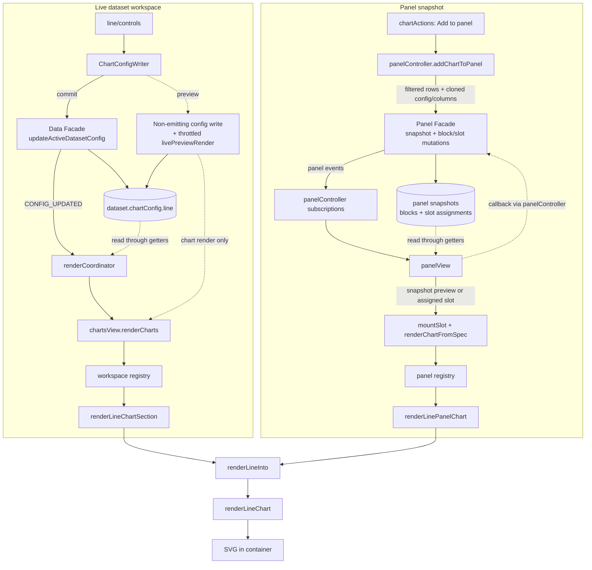

# The Line Chart, end to end

This document explains how CHIVE's line chart works, from the config a dataset stores,
through the sidebar controls, into the renderer, and out to the panel/export paths. It is
meant to be read top to bottom the first time and used as a reference afterwards. File
links are relative to this document (which lives in `docs/development/charts/`).

Section 2 covers the time-series and interpolation theory the chart rests on, independent of
this codebase; everything from section 3 onward is how CHIVE implements it.

For the high-level "which columns does it need" summary, see the line row in
[Chart and data reference](../../user/chart-reference.md). For the shared state/panel/event architecture,
see [Architecture reference](../architecture-reference.md).

Key files:

- SVG renderer: [svg.js](../../../src/charts/line/renderers/svg.js)
- Point building and aggregation: [data.js](../../../src/charts/line/data.js)
- Option normalization: [options.js](../../../src/charts/line/options.js)
- X-scale construction: [scales.js](../../../src/charts/line/scales.js)
- Sidebar controls: [builder.js](../../../src/charts/line/controls/builder.js),
  [listeners.js](../../../src/charts/line/controls/listeners.js), and
  [activationDefaults.js](../../../src/charts/line/controls/activationDefaults.js)
- Config constants: [charts.js](../../../src/config/charts.js) (`LINE_CHART`)
- Per-dataset config defaults: [chartDefaults.js](../../../src/config/chartDefaults.js) (the `line` block)
- Shared presentation flow: [presentation.js](../../../src/charts/line/presentation.js)
- Dataset-workspace adapter: [workspaceSection.js](../../../src/charts/line/workspaceSection.js)
- Panel adapter: [panelAdapter.js](../../../src/charts/line/panelAdapter.js)

---

## 1. What a line chart is

A line chart connects an ordered sequence of `(x, y)` points with a path to show how a numeric
value changes across an ordered dimension, most often time. The connection is the point: a
line implies continuity between samples, so the chart reads as a trend rather than a set of
independent marks (which is the scatter plot's job). CHIVE's line chart accepts a date,
numeric, or categorical X axis, offers seven curve interpolations, optional aggregation when
X values repeat, and three explicit strategies for drawing across missing data.

---

## 2. Foundations: ordered series, scales, curves, and gaps

### 2.1 The ordered series

The X column provides the ordering, the Y column the value. Unlike a scatter plot (an
unordered cloud), a line chart presumes the points have a meaningful sequence so that
"connect them in order" is sensible. Sorting by X (optional but on by default) enforces that
order; without it, the line is drawn in row order, which can zig-zag.

### 2.2 Three kinds of X axis

The X axis is classified from the column's detected type:

- **date**: a UTC time scale (`scaleUtc`), with values parsed to `Date`s and time-aware tick
  spacing. This is the canonical time-series case.
- **numeric**: a linear scale, for an ordered numeric independent variable.
- **categorical**: an ordinal point scale (`scalePoint`), evenly spacing discrete categories
  along the axis.

Y is always numeric on a linear scale. For positive or mixed-positive data, the lower bound
is clamped to include **zero**. All-negative data stays in its negative range because the
renderer only clamps the lower bound, not the upper bound.

### 2.3 Curve interpolation: what happens between points

The data only fixes the points; the curve decides the path between them, and that choice
carries meaning:

- **linear**: straight segments. Honest, no invented shape.
- **monotone**: a smooth curve that does not overshoot between points and preserves the data's
  rises and falls (good for smooth trends without inventing peaks).
- **step / step-before / step-after**: piecewise-constant. The value holds until the next
  sample, which is the correct reading for quantities that change in discrete jumps.
- **basis**: a B-spline. Very smooth, but it does **not** pass through the data points (it
  approximates them), so it is for shape impression, not precise values.
- **cardinal**: a smooth spline that does pass through the points.

### 2.4 Aggregation when X repeats

If several rows share an X value, the chart can either plot them all (`none`) or collapse each
X group to a single Y by `count`, `sum`, or `mean`. Aggregation turns a noisy many-per-x table
into one clean value per x, which is what makes a "monthly total" or "daily average" line.

### 2.5 Missing data: connect, gap, or interpolate

Real series have holes (a missing Y). How a line crosses a hole is a truth-in-charting
decision, so it is explicit:

- **connect**: ignore the gap and draw a continuous line through the defined points. Simplest,
  but it hides that data was missing.
- **gap**: break the line at the missing point, leaving a visible hole. Most honest about
  missingness.
- **interpolate**: break the solid line at the gap (like `gap`) but also draw a dashed
  **ghost** line bridging it, so the reader sees both that data was missing and the implied
  path across it.

---

## 3. The big picture (data flow)

Two integration paths share the same presentation mapping and end at `renderLineChart`.



The renderer is **stateless**: each call wipes the container and rebuilds the SVG. Rows are
already global-filtered; the renderer builds, aggregates, sorts, and draws the series on top of
them. Both paths pass the X column's detected type so the axis kind is consistent (the panel
path reads it from the snapshot's `columnsSnapshot`; see
[Architecture reference](../architecture-reference.md)).

---

## 4. The data model

### 4.1 Where config lives

`chartConfig.line` is the line slice of each dataset's `chartConfig`, built fresh by
`createDefaultChartConfig()` in
[chartDefaults.js](../../../src/config/chartDefaults.js) and merged by
`mergeChartConfigWithDefaults()` in
[chartConfig.js](../../../src/domain/charts/chartConfig.js).

### 4.2 The `chartConfig.line` keys

| Key | Meaning | Default |
|---|---|---|
| `enabled` / `expanded` | Shown at all / sidebar expanded | `false` / `false` |
| `x` | X column (any type) | `null` |
| `y` | Numeric Y column | `null` |
| `curve` | One of the seven curve options | `'linear'` |
| `missingMode` | `'connect'`, `'gap'`, or `'interpolate'` | `'connect'` |
| `aggregateMode` | `'none'`, `'mean'`, `'sum'`, or `'count'` | `'none'` |
| `sortX` | Sort points by X before drawing | `true` |
| `strokeWidth` | Line width in px (UI slider 0.5 to 6; renderer clamps saved/imported values to 0.5 to 8) | `1.5` |
| `color` | Line color | `CHART_COLORS.line` (`#4e79a7`) |
| `ghostStrokeColor` | Dashed bridge color (interpolate mode) | `#cccccc` |
| `showPoints` | Draw a marker per defined point | `false` |
| `customTitle` / `chartHeight` | Title / SVG height (220 to 720) | `''` / `320` |
| `showXAxisLabel` / `showYAxisLabel` | Axis title text | `true` / `true` |

### 4.3 The constants behind the defaults

[charts.js](../../../src/config/charts.js): `CHART_COLORS.line` = `#4e79a7`;
`CHART_HEIGHT_LIMITS.line` = `{ min: 220, max: 720 }`; `LINE_CHART` holds the `curveOptions`
list, `missingModes` (`['connect', 'gap', 'interpolate']`), `aggregateModes`
(`['none', 'mean', 'sum', 'count']`), the default stroke width, `pointRadius` (3), and the
default ghost color.

---

## 5. The control sidebar

The controls package ([builder.js](../../../src/charts/line/controls/builder.js),
[listeners.js](../../../src/charts/line/controls/listeners.js),
[activationDefaults.js](../../../src/charts/line/controls/activationDefaults.js)) builds three sections via the
standard `createLineChartControls` / `setupLineChartControlListeners` / `computeDefaults`
adapters.

### 5.1 The three sections

1. **Data & aggregation** (expanded): X select (any column), Y select (numeric), aggregate
   mode, and the sort-X toggle.
2. **Styling** (expanded): curve select, missing-mode select, stroke-width slider, line color,
   ghost color, and show-points toggle.
3. **Display** (collapsed): x/y axis-label toggles, title.

### 5.2 Enable/disable and wiring

Everything is disabled when `!config.enabled`; the ghost color input is disabled unless
`missingMode === 'interpolate'` (it only matters there). The X and Y selects have custom
listeners that validate against the available columns (X any visible column, Y numeric only);
curve, missing mode, and aggregate use the shared select helper with enum-guarding transforms;
both color inputs use `setupColorInputListener` for live preview. `computeDefaults` prefers a
date column for X (then numeric, then first available) and the first numeric column for Y that
is not also X, which makes a freshly enabled line chart default to a time series when one is
present.

---

## 6. The render entry chain

### 6.1 Dataset workspace

`renderLineChartSection({ config, rows, columnTypeByName, filterCallbacks })`
([workspaceSection.js](../../../src/charts/line/workspaceSection.js)) resolves
the block/container, hides+clears when disabled, sets the min-height, maps config
through [presentation.js](../../../src/charts/line/presentation.js) (forwarding
`axisTypes.x` from `columnTypeByName` so the renderer picks the right X scale), and calls
`renderLineChart`. On failure it maps the reason to a message:
`no-numeric` to `chive-chart-empty-line-numeric`, `no-x-values` to `chive-chart-empty-line-x`,
anything else to `chive-chart-empty-line`.

### 6.2 Panel view

[panelAdapter.js](../../../src/charts/line/panelAdapter.js) passes `spec.config` and
`spec.dataSnapshot` through the same presentation flow, deriving `axisTypes` from the
snapshot's `columnsSnapshot`. The panel registry only dispatches to that adapter. (The
line chart has no click-to-filter tooltips, so the empty filter-callbacks bag is moot here.)

---

## 7. Inside `renderLineChart`

`renderLineChart(container, rows, xColumn, yColumn, options = {})` returns a `Result`. The
pipeline:

### 7.1 Guard and option parsing

Returns `fail('invalid-args')` if container or either column is missing, and `fail()` if there
are no rows. The X axis kind is resolved from `axisTypes.x`; the curve, missing mode, and
aggregate mode collapse to their enums; stroke width clamps to 0.5 to 8; colors validate;
height clamps to 220 to 720; title trims to 80 chars.

### 7.2 Building, aggregating, sorting points

`buildPoints` reads each row into `{ x, y }`, parsing x by axis kind (date to `Date`, numeric
to number, else string) and y to a number (`NaN` when missing). Rows with no usable x are
skipped; if none remain, `fail('no-x-values')`. `aggregatePoints` applies the aggregate mode
(grouping by x for count/sum/mean), then `sortByX` orders the points when `sortX` is on. If no
point has a finite y, `fail('no-numeric')`.

### 7.3 Scales

`buildXScale` returns a `scaleUtc` (date), `scaleLinear` (numeric, with a degenerate-domain
pad), or `scalePoint` (categorical) over the defined points. The y scale is linear over
`[min(0, dataMin), dataMax]`, `.nice()`d and range-inverted so larger y sits higher (the zero
baseline of section 2.2).

### 7.4 The line path(s)

A `d3.line()` with the chosen curve generates the path. The missing mode decides the geometry:

- **connect** draws one path through only the defined points (gaps closed).
- **gap** draws through all points with a `.defined(finite y)` guard, so the path breaks at
  missing points.
- **interpolate** draws the broken (`.defined`-guarded) solid path **and** a dashed ghost path
  through the defined points underneath, bridging the gaps.

Optional point markers (`<circle>`) are drawn at each defined point with hover tooltips
showing the formatted x and y.

### 7.5 Axes

The x axis adapts to its kind: date and numeric get tick counts scaled to the width with the
outer tick removed; categorical ticks are truncated and rotated. The y axis drops its domain
line and clones its ticks into faint full-width gridlines for readability. Optional axis titles
are drawn, and the function returns `ok()`.

---

## 8. Color and scale system

Line color is a single validated hex (no gradient or rank distribution; a line is one series).
The ghost-bridge color is separate and only used in interpolate mode. Scales come straight from
D3: `scaleUtc` / `scaleLinear` / `scalePoint` for X and `scaleLinear` for Y; the curve
interpolators (`curveLinear`, `curveMonotoneX`, the step family, `curveBasis`, `curveCardinal`)
are mapped by key.

---

## 9. Performance notes

The line chart emits one (or two, in interpolate mode) `<path>` elements plus optional point
markers and the axes, so the DOM is tiny regardless of dataset size; the only row-scaled work
is the build/aggregate/sort passes (linear). Color, stroke, and curve edits flow through the
shared throttled live-preview path (TIN doc [section 10](tin.md)).

---

## 10. Live preview and interaction

The color inputs (line and ghost) use the shared live-preview path (non-emitting facade on
`input`, commit on `change`; see TIN doc [section 10](tin.md)) so dragging the picker
updates the line live. Other controls commit on change. Point-marker hover tooltips are the
line chart's only interaction layer; it has no click-to-filter (a line is a continuous series,
not a set of filterable categories).

---

## 11. SVG and export

Pure SVG: one or two `<path>` elements (main line, optional dashed ghost), optional `<circle>`
markers, and `<g>` axes with cloned gridline `<line>`s. The panel exporter clones the live
`<svg>`; there is no separate export path.

---

## 12. Invariants and edge cases

- **Missing X or Y column** → `fail('invalid-args')`, and **no rows** → `fail()`; both show
  `chive-chart-empty-line` ("Select an X column and a numeric Y column to render the line
  chart.").
- **No usable X values** → `fail('no-x-values')`, mapped to `chive-chart-empty-line-x` ("No
  usable X values in the selected column.").
- **No finite Y values** → `fail('no-numeric')`, mapped to `chive-chart-empty-line-numeric`
  ("Select a numeric Y column with finite values to render the line chart.").
- **Invalid dates** are dropped during point building; a degenerate numeric X domain is padded.
- **Zero baseline**: positive or mixed-positive data includes 0; all-negative data keeps a
  negative-only domain.
- **Stateless renders** and **frozen panel snapshots** behave as for every chart.

Empty-state strings live in [en.json](../../../src/i18n/en.json) (`chive-chart-empty-line*`);
Portuguese equivalents in [pt-BR.json](../../../src/i18n/pt-BR.json).

---

## 13. Tests

- [svg.test.js](../../../tests/charts/line/renderers/svg.test.js) covers the
  renderer: axis-kind handling, aggregation, the missing-value modes, and curve selection.
- [data.test.js](../../../tests/charts/line/data.test.js),
  [options.test.js](../../../tests/charts/line/options.test.js), and
  [scales.test.js](../../../tests/charts/line/scales.test.js) cover the pure point
  building, option normalization, and X-scale construction (no DOM).
- [renderEquivalence.test.js](../../../tests/charts/line/renderEquivalence.test.js) pins
  the rendered SVG markup across an option matrix so structural moves stay byte-identical.
- [controls.test.js](../../../tests/charts/line/controls.test.js) covers control
  building and the X/Y validation and ghost-color enable logic.
- [workspaceSection.test.js](../../../tests/charts/line/workspaceSection.test.js) covers
  workspace visibility, axis-type forwarding, and empty-state mapping.
- [panelAdapter.test.js](../../../tests/charts/line/panelAdapter.test.js) covers frozen
  snapshot mapping, axis-type derivation, and failure passthrough.
- [panel.test.js](../../../tests/charts/registries/panel.test.js)
  covers the panel dispatch path.

---

## 14. Quick reference

**Element IDs** ([workspaceDomIds.js](../../../src/charts/workspaceDomIds.js)): container
`chart-line-container`, block `chart-block-line`. Control IDs are `viz-…-line-…`
(e.g. `viz-select-line-x`, `viz-select-line-curve`, `viz-select-line-missing`,
`viz-toggle-line-sort-x`).

**DOM structure** of a rendered line chart:

```
<svg viewBox>
  <text>                      (optional title)
  <g transform=margins>
    <path class="line-path-ghost">  (dashed bridge, interpolate mode only)
    <path class="line-path-main">   (the line)
    <circle class="line-point"> × N (optional markers)
    <g> bottom axis             (date/numeric/categorical)
    <g> left axis + gridlines
    <text> axis titles          (optional)
```

**Tuning knobs** ([charts.js](../../../src/config/charts.js) `LINE_CHART`): `curveOptions`,
`missingModes`, `aggregateModes`, `defaultStrokeWidth`, `pointRadius`.

**Foundations → implementation map:**

| Concept (section 2) | Implementation |
|---|---|
| Ordered series, sort (2.1) | `buildPoints`, `sortByX` (7.2) |
| Date/numeric/categorical X (2.2) | `resolveXAxisKind`, `buildXScale` (7.1, 7.3) |
| Curve interpolation (2.3) | `CURVE_BY_KEY`, `d3.line().curve()` (7.4) |
| Aggregation (2.4) | `aggregatePoints` (7.2) |
| connect / gap / interpolate (2.5) | the missing-mode path branch (7.4) |
