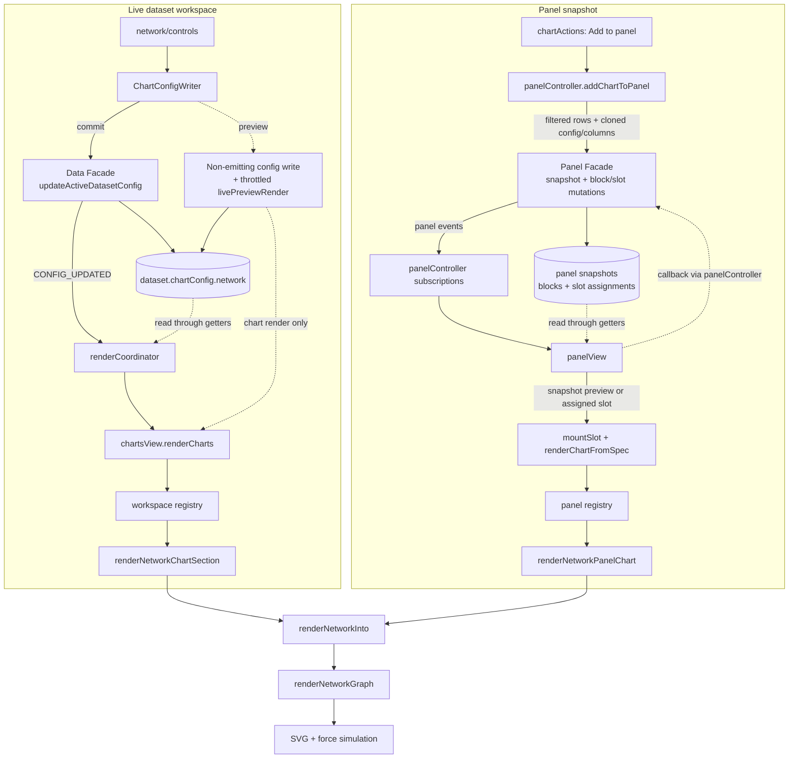

# The Network Graph, end to end

This document explains how CHIVE's network graph works, from the config a dataset stores,
through the sidebar controls, into the renderer, and out to the panel/export paths. It is
meant to be read top to bottom the first time and used as a reference afterwards. File
links are relative to this document (which lives in `docs/development/charts/`).

Section 2 covers the graph and force-simulation theory the chart rests on, independent of
this codebase; everything from section 3 onward is how CHIVE implements it.

For the high-level "which columns does it need" summary, see the network row in
[Chart and data reference](../../user/chart-reference.md). For the shared state/panel/event architecture,
see [Architecture reference](../architecture-reference.md).

The network graph is the one renderer that runs a **live physics simulation** rather than
drawing a single static frame, which makes it the only chart that is not purely stateless.

Key files (the `src/charts/network/` package):

- Renderer: [renderers/svg.js](../../../src/charts/network/renderers/svg.js)
- Graph model derivation: [data.js](../../../src/charts/network/data.js)
- Shared presentation flow: [presentation.js](../../../src/charts/network/presentation.js)
- Workspace section adapter: [workspaceSection.js](../../../src/charts/network/workspaceSection.js)
- Panel adapter (saved snapshots): [panelAdapter.js](../../../src/charts/network/panelAdapter.js)
- Sidebar controls: [controls/builder.js](../../../src/charts/network/controls/builder.js),
  [controls/listeners.js](../../../src/charts/network/controls/listeners.js),
  [controls/activationDefaults.js](../../../src/charts/network/controls/activationDefaults.js)
- Chart definition and constants: [network.js](../../../src/config/charts/definitions/network.js) (`NETWORK_DEFINITION`, `NETWORK_GRAPH`)
- Per-dataset config defaults: [network.js](../../../src/config/charts/definitions/network.js) (the definition's fresh `network` factory)

---

## 1. What a network graph is

A network graph shows relationships between entities: each entity is a **node** (a circle),
each relationship is an **edge** (a line). CHIVE builds the graph from an **edge list**: every
row is one edge, naming a source and a target entity. The nodes are derived automatically as
the union of all the source and target values. A force-directed layout then positions the
nodes so connected ones sit near each other and the whole graph spreads out legibly.

Optional columns add an edge **weight** (thicker lines) and a node **group** (kept on the
node for reference). The graph supports pan/zoom, node drag, and click-to-filter.

---

## 2. Foundations: graphs and force-directed layout

### 2.1 Nodes from edges

The input is a relation, not a table of points: each row says "source relates to target."
The renderer scans the rows, collects every distinct identifier from the source and target
columns into a node set, and keeps each row as an edge between two node ids. So you never list
nodes explicitly; they fall out of the edges. A row with a blank source or target is skipped.

### 2.2 The force-directed layout

There is no inherent x/y for a node, so positions are computed by simulating a small physics
system (D3's `forceSimulation`) and letting it settle. Three forces balance against each
other:

- **Link force** (springs): each edge acts like a spring with a rest length
  (`linkDistance`), pulling its two nodes toward that separation. This clusters connected
  nodes.
- **Many-body charge** (repulsion): every node repels every other (a negative charge), which
  pushes the graph apart so nodes do not pile up. Stronger (more negative) charge spreads the
  graph wider.
- **Centering force**: gently pulls the whole system toward the origin so it stays in frame.

### 2.3 Cooling: alpha and alpha decay

The simulation is iterative. An internal "temperature" called **alpha** starts near 1 and
decays toward 0 over successive ticks; each tick nudges node positions to reduce the system's
energy, and the motion shrinks as alpha cools. **Alpha decay** controls how fast it cools: a
higher decay settles quickly but may freeze in a rougher layout, a lower decay drifts longer
toward a smoother arrangement. When the user drags a node, the simulation is briefly reheated
(alpha target raised) so the rest of the graph reacts, then allowed to cool again.

### 2.4 Encoding weight and direction in color and thickness

- **Edge thickness** encodes weight as `sqrt(weight)` so thickness reads proportionally
  without thick edges overwhelming the view (the same area-true reasoning the scatter and
  bubble size encodings use).
- **Node color** marks a node's role: a node that only ever appears as a source gets the
  source color, target-only gets the target color, and a node that is both (or isolated in
  role) gets the blend of the two.
- **Edge color** is either a uniform gray or a **gradient** along the edge from the source
  node's color to the target node's color, which hints at direction.

---

## 3. The big picture (data flow)

Two draw paths, both mapping config through the package's `renderNetworkInto` and ending at
`renderNetworkGraph`.



Unlike the other charts, the render does not end at a static SVG: it starts a simulation that
keeps ticking and repositioning nodes until it cools. The running simulation is cached on the
container under a private key so the **next** render can stop it before building a fresh
layout, preventing an orphaned simulation from ticking on a replaced DOM. The container
contents are still fully replaced each render. Panel snapshots are frozen `structuredClone`s
(see [Architecture reference](../architecture-reference.md)).

---

## 4. The data model

### 4.1 Where config lives

`chartConfig.network` is the network slice of each dataset's `chartConfig`, built fresh by
`createDefaultChartConfig()` in
[defaults.js](../../../src/config/charts/defaults.js) and merged by
`mergeChartConfigWithDefaults()` in
[chartConfig.js](../../../src/domain/charts/chartConfig.js).

### 4.2 The `chartConfig.network` keys

| Key | Meaning | Default |
|---|---|---|
| `enabled` / `expanded` | Shown at all / sidebar expanded | `false` / `false` |
| `source` / `target` | Columns holding the edge endpoints | `null` |
| `weight` | Numeric column for edge thickness (defaults to 1) | `null` |
| `group` | Categorical column kept on the node | `null` |
| `nodeRadius` | Node circle radius | `5` |
| `linkDistance` | Spring rest length | `46` |
| `chargeStrength` | Many-body charge (negative = repel) | `-80` |
| `linkOpacity` | Edge opacity | `0.45` |
| `alphaDecay` | Cooling rate (0.01 to 0.2) | `0.045` |
| `zoomScale` | Current zoom multiplier | `1` |
| `sourceNodeColor` / `targetNodeColor` | Node role colors | `#e3743d` / `#6b94c9` |
| `edgeColorMode` | `'gradient'` or `'uniform'` | `'gradient'` |
| `colorScheme` | Named palette last applied | `'Colorblind-Safe'` |
| `showNodeLabels` / `showLegend` | Node id labels / legend | `false` / `true` |
| `customTitle` / `chartHeight` | Title / SVG height (220 to 720) | `''` / `420` |

### 4.3 The constants behind the defaults

[network.js](../../../src/config/charts/definitions/network.js): the network height limits are `{ min: 220,
max: 720 }`; `NETWORK_GRAPH` holds the force defaults (`defaultNodeRadius`,
`defaultLinkDistance: 46`, `defaultChargeStrength: -80`, `defaultLinkOpacity`,
`defaultAlphaDecay: 0.045`), the zoom bounds (`minZoomScale: 0.3`, `maxZoomScale: 4`), and the
alpha-decay clamp (`minAlphaDecay: 0.01`, `maxAlphaDecay: 0.2`).

---

## 5. The control sidebar

The controls trio under [controls/](../../../src/charts/network/controls) builds four sections
via the standard `createNetworkGraphControls` (builder.js) /
`setupNetworkGraphControlListeners` (listeners.js) / `computeDefaults` (activationDefaults.js) exports.

### 5.1 The four sections

1. **Data** (expanded): source, target, weight (numeric), and group (categorical) selects.
2. **Display** (expanded): link-distance slider, zoom slider, legend toggle, title, node-label
   toggle, and a Reset Zoom button.
3. **Styling** (collapsed): node radius, link opacity, source/target color inputs, edge color
   mode (gradient/uniform), and the color-preset palette.
4. **Advanced** (collapsed): the physics knobs, charge strength and alpha decay.

### 5.2 Enable/disable and wiring

Everything is disabled when `!config.enabled`. The selects, checkboxes, sliders, color inputs,
title, and presets use the shared helpers. Two custom pieces: the Reset Zoom button resets the
zoom slider DOM and commits `zoomScale` back to its default through the shared
`commitChartConfigPatch` adapter (the package never writes state directly); the color-preset
buttons map `sourceNodeColor` to palette index 0 and `targetNodeColor` to index 1.
`computeDefaults` picks the first two visible columns as source and target.

Because the force defaults (charge, distance, alpha decay) live in the Advanced section,
casual users get a sensible layout without touching physics, while power users can tune it.

---

## 6. The render entry chain

### 6.1 Dataset workspace

`renderNetworkChartSection({ config, rows, filterCallbacks })`
([workspaceSection.js](../../../src/charts/network/workspaceSection.js))
resolves the block/container, hides+clears when disabled, sets the min-height, and delegates
to `renderNetworkInto` in [presentation.js](../../../src/charts/network/presentation.js),
which maps config into the options bag (note `weight`/`group` map to
`weightColumn`/`groupColumn`, and the source/target column names are also passed as
`sourceColumn`/`targetColumn` for the filter tooltips) and calls `renderNetworkGraph`. Any
failure shows the single `chive-chart-empty-network` message.

### 6.2 Panel view

`renderNetworkPanelChart` ([panelAdapter.js](../../../src/charts/network/panelAdapter.js))
routes `spec.config` and `spec.dataSnapshot` through the same `renderNetworkInto` flow,
omitting `filterCallbacks` (no click-to-filter in panels).

---

## 7. Inside `renderNetworkGraph`

`renderNetworkGraph(container, rows, sourceColumn, targetColumn, options = {})` returns a
result. The pipeline:

### 7.1 Guard, options, and graph construction

Returns `fail()` if the container or either endpoint column is missing. Options are clamped to
safe locals (forces and zoom to their `NETWORK_GRAPH` bounds; colors validated; height to 220
to 720; title to 80 chars). `buildNetworkData` scans the rows into a node `Map` (keyed by id,
remembering the first group seen) and a links array (each with a positive weight, defaulting
to 1). If no nodes or links survive, `fail('insufficient-data')`.

### 7.2 SVG, simulation setup, and lifecycle

The container is wiped, any previous simulation is stopped, and a centered `viewBox` SVG is
built. `forceSimulation(nodes)` is configured with the link, charge, and centering forces and
the clamped alpha decay (section 2.2 to 2.3), then cached on the container. Fresh copies of the
node and link objects are used so the simulation mutates its own working set, not the cached
graph.

### 7.3 Edges, nodes, and color

Edges are `<line>` elements: stroke width `sqrt(weight)`, stroke either uniform gray or a
per-edge `<linearGradient>` (defined in `<defs>` and updated each tick to run from source to
target position). Nodes are `<circle>`s colored by role via `getNodeColor` (source / target /
blend, section 2.4). Optional node-id `<text>` labels and a source/target legend are added.

### 7.4 The tick loop

On every simulation tick the renderer updates edge endpoints, node centers, label positions,
and (in gradient mode) each edge gradient's coordinates, and repositions any pinned tooltip.
This is the animation: the graph visibly relaxes from D3's deterministic initial placement
into the settled layout as alpha decays.

### 7.5 Interaction: drag, zoom, hover, filter

- **Drag** a node: it is pinned to the cursor (`fx`/`fy`) and the simulation reheats so the
  neighborhood rearranges; releasing unpins it.
- **Zoom/pan**: a `d3.zoom` behavior transforms the viewport within the scale extent,
  initialized to the saved `zoomScale`; the Reset Zoom control returns it to default.
- **Hover** an edge shows source/target/weight; hover a node shows its id.
- **Click** a node pins the shared categorical filter-action tooltip (the bar doc's
  [section 7.6](bar.md)), offering to filter the source column, the target column, or
  both (a node id can appear in either). The pinned tooltip is anchored to the node's moving
  screen position and follows it as the simulation ticks.

On success the renderer returns `{ ok: true, nodesCount, linksCount }`.

---

## 8. The color system

Network color is **role-based**, not value-driven. `interpolateColor` from
[colorUtils.js](../../../src/utils/colorUtils.js) blends `sourceNodeColor` and `targetNodeColor`
for dual-role nodes and for the per-edge gradient stops. The color-preset palette seeds the
two role colors (indices 0 and 1). There is no per-value gradient or rank distribution here;
the only quantitative encoding is edge thickness.

---

## 9. Performance notes

The network is the heaviest interactive chart because the simulation runs many ticks after
render, each updating every node and edge in the DOM. Cost scales with node and edge count, so
very large edge lists can be sluggish until the layout cools. The simulation-stop-on-rerender
lifecycle prevents multiple simulations from stacking up. Physics, color, and zoom edits flow
through the shared throttled live-preview path (TIN doc [section 10](tin.md)); each edit
re-renders and restarts the layout.

---

## 10. Live preview and interaction

Color, slider, and title edits use the shared live-preview path (non-emitting facade on
`input`, commit on `change`; see TIN doc [section 10](tin.md)). Because a network render
restarts the simulation, dragging a physics slider re-lays-out the graph live. Node drag,
pan/zoom, and the click-to-filter pinned tooltips (anchored to moving nodes) are the network's
own interaction layer on top of that.

---

## 11. SVG and export

Pure SVG: a `<defs>` of per-edge `<linearGradient>`s, a `<g>` of edge `<line>`s, a `<g>` of
node `<circle>`s (drag-enabled), optional `<text>` labels, and a legend, all under a zoomable
viewport `<g>`. The panel exporter clones the live `<svg>` in its current rendered state; it
does not wait for the simulation to settle and has no separate export path. A panel snapshot
captures the data and config, so a re-rendered panel network re-runs its own simulation from
that snapshot.

---

## 12. Invariants and edge cases

- **No source or target column** → `fail()`, and **no usable nodes/edges after parsing** →
  `fail('insufficient-data')`; both show the single `chive-chart-empty-network` message
  ("Select valid source and target columns to render the network graph.").
- **Missing weight** defaults each edge to weight 1; non-positive weights are treated as 1.
- **Blank source/target cells** skip that edge.
- **Re-render lifecycle**: the previous simulation is stopped before a new one starts, so a
  replaced container never keeps ticking.
- **Frozen panel snapshots**: a panel network re-simulates from its snapshot and carries no
  filter actions in tooltips.

The empty-state string lives in [en.json](../../../src/i18n/en.json) (`chive-chart-empty-network`);
the Portuguese equivalent is in [pt-BR.json](../../../src/i18n/pt-BR.json).

---

## 13. Tests

All under [tests/charts/network/](../../../tests/charts/network):

- [renderers/svg.test.js](../../../tests/charts/network/renderers/svg.test.js) covers the
  renderer: node derivation from edges, weight handling, color roles, tooltip pinning, filter
  actions, and the result counts.
- [data.test.js](../../../tests/charts/network/data.test.js) covers `buildNetworkData`, and
  [renderEquivalence.test.js](../../../tests/charts/network/renderEquivalence.test.js) pins
  the stable rendered structure across option combinations.
- [controls.test.js](../../../tests/charts/network/controls.test.js) covers control building,
  the reset-zoom and preset listeners, and the module boundaries.
- [workspaceSection.test.js](../../../tests/charts/network/workspaceSection.test.js) and
  [panelAdapter.test.js](../../../tests/charts/network/panelAdapter.test.js) cover the two
  surface adapters; [panel.test.js](../../../tests/charts/registries/panel.test.js) covers
  the panel dispatch path.

---

## 14. Quick reference

**Element IDs** ([workspaceDomIds.js](../../../src/charts/workspaceDomIds.js)): container
`chart-network-container`, block `chart-block-network`. Control IDs are `viz-…-network-…`
(e.g. `viz-select-network-source`, `viz-slider-network-charge`,
`viz-slider-network-alpha-decay`, `viz-select-network-edge-color-mode`).

**DOM structure** of a rendered network graph:

```
<svg viewBox=centered>
  <text>                       (optional title)
  <g> viewport (zoom/pan target)
    <defs> <linearGradient> × E   (per-edge gradients, gradient mode)
    <g> <line> × E                (edges, width = sqrt(weight))
    <g> <circle> × N              (nodes, drag-enabled, role-colored)
    <g class="network-labels">    (optional node ids)
  <g class="network-legend">      (source/target swatches, optional)
```

**Tuning knobs** ([network.js](../../../src/config/charts/definitions/network.js) `NETWORK_GRAPH`):
`defaultLinkDistance`, `defaultChargeStrength`, `defaultAlphaDecay`, zoom bounds, alpha-decay
clamp.

**Foundations → implementation map:**

| Concept (section 2) | Implementation |
|---|---|
| Nodes from edges (2.1) | `buildNetworkData` (7.1) |
| Force-directed layout (2.2) | `forceSimulation` + link/charge/center forces (7.2) |
| Alpha cooling, drag reheat (2.3) | `alphaDecay`, drag handlers (7.2, 7.5) |
| Weight thickness, role/edge color (2.4) | `sqrt(weight)`, `getNodeColor`, edge gradients (7.3) |
