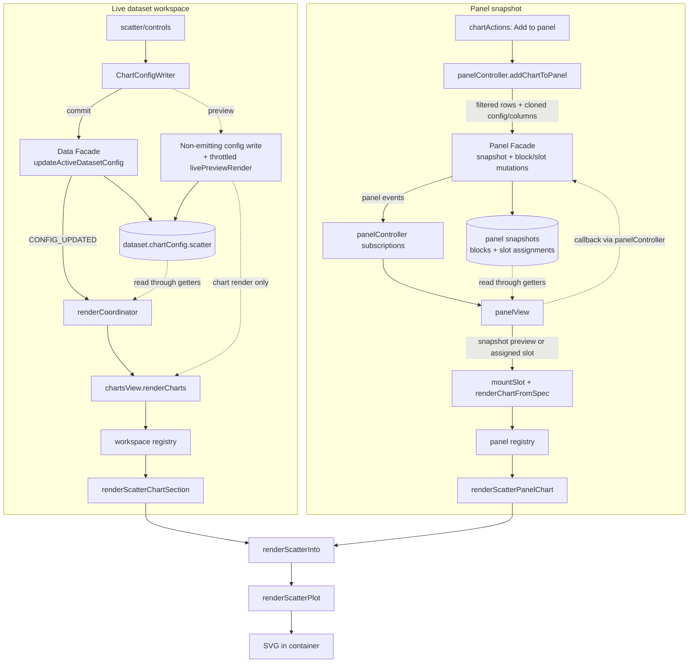

# The Scatter Plot, end to end

This document explains how CHIVE's scatter plot works, from the config a dataset stores,
through the sidebar controls, into the renderer, and out to the panel/export paths. It is
meant to be read top to bottom the first time and used as a reference afterwards. File
links are relative to this document (which lives in `docs/development/charts/`).

Section 2 covers the statistical and visual-encoding theory the chart rests on (axis types,
log scales, size/color encodings, and ordinary-least-squares regression), independent of
this codebase; everything from section 3 onward is how CHIVE implements it.

For the high-level "which columns does it need" summary, see the scatter row in
[Chart and data reference](../../user/chart-reference.md). For the shared state/panel/event architecture,
see [Architecture reference](../architecture-reference.md).

It is the most analytically dense renderer in the app: it adapts to numeric or categorical
axes, supports linear and log scales, encodes a third and fourth variable through point size
and color, and can fit an OLS regression line with a confidence band, overall or per
category.

Key files (the per-chart package under [src/charts/scatter/](../../../src/charts/scatter)):

- Renderer / orchestrator: [renderers/svg.js](../../../src/charts/scatter/renderers/svg.js)
- Option normalization: [options.js](../../../src/charts/scatter/options.js)
- Point preparation (map / infer / filter / aggregate): [data.js](../../../src/charts/scatter/data.js)
- Scale + position accessors: [scales.js](../../../src/charts/scatter/scales.js)
- Size/color encoding: [encoding.js](../../../src/charts/scatter/encoding.js)
- Palettes: [palettes.js](../../../src/charts/scatter/palettes.js)
- Tooltip + filter interactions: [interactions.js](../../../src/charts/scatter/interactions.js)
- Regression render layer (band / line / annotation): [regressionLayer.js](../../../src/charts/scatter/regressionLayer.js)
- Axis helpers (type inference, jitter, margins, aggregation): [axisHelpers.js](../../../src/charts/scatter/axisHelpers.js)
- Regression math (OLS + CI band): [regression.js](../../../src/charts/scatter/regression.js)
- Sidebar controls: [controls/builder.js](../../../src/charts/scatter/controls/builder.js),
  [controls/listeners.js](../../../src/charts/scatter/controls/listeners.js),
  [controls/defaults.js](../../../src/charts/scatter/controls/defaults.js)
- Shared presentation flow: [presentation.js](../../../src/charts/scatter/presentation.js)
- Config constants: [charts.js](../../../src/config/charts.js) (`SCATTER_PLOT`)
- Per-dataset config defaults: [chartDefaults.js](../../../src/config/chartDefaults.js) (the `scatter` block)
- Section adapter (dataset workspace): [workspaceSection.js](../../../src/charts/scatter/workspaceSection.js)
- Panel adapter (saved snapshots): [panelAdapter.js](../../../src/charts/scatter/panelAdapter.js)

---

## 1. What a scatter plot is

A scatter plot places one dot per row at `(x, y)`, where x and y are two chosen columns. The
cloud of dots reveals relationships: correlation (do high x values go with high y?), shape
(linear, curved, clustered), and outliers. Unlike the aggregating charts (bar, pie,
treemap), the scatter plot is **row-level**: every qualifying row is its own mark, nothing is
summed.

On top of the dots it can encode two more variables (point radius and point color), draw a
fitted trend line with a confidence band, and handle the awkward cases where an axis is
categorical rather than numeric.

---

## 2. Foundations: axes, encodings, and regression

### 2.1 The point cloud and what it shows

Each row maps to a point. With both axes numeric, position is the encoding and the eye reads
covariation directly. The chart deliberately does not connect points. It usually shows the raw
joint distribution of two variables, except for the explicit two-categorical-axis aggregate
mode described in section 2.7.

### 2.2 Axis types: numeric vs categorical

CHIVE's scatter does not assume both axes are numbers. Each axis is classified as **numeric**
or **categorical**:

- An explicit type (from the dataset's column-type detection) is trusted when present.
- Otherwise a value-based heuristic decides: if at least **80%** of the non-empty values
  parse as finite numbers, the axis is numeric, else categorical. This 80% threshold matches
  the column-type detection in the data service, so a mostly-numeric column with a few stray
  labels still reads as numeric.
- Date columns currently classify as categorical on a scatter axis.

A numeric axis uses a continuous scale; a categorical axis uses a point scale (discrete
positions). The two axes are independent, so all four combinations are possible
(numeric/numeric, numeric/categorical, categorical/categorical).

### 2.3 Linear vs log scales

A numeric axis can be **linear** (equal value steps map to equal pixel steps) or
**logarithmic** (equal *ratios* map to equal pixel steps). Log scales are the right tool when
a variable spans orders of magnitude or when multiplicative relationships should look
straight.

The mathematical catch: `log(v)` is undefined for `v <= 0`. So when an axis is log, the
renderer **drops every point whose value on that axis is not strictly positive**. If that
leaves nothing to plot, the chart reports a specific "not enough positive values" empty
state rather than a blank canvas. A log scale is only offered when the axis column is
numeric; a categorical axis is always linear/point.

### 2.4 Size as a third variable (area-true scaling)

Point radius can encode a third numeric column. The subtle correctness issue: human
perception reads a circle's **area**, not its radius, as "how big." So mapping value linearly
to radius would exaggerate large values quadratically. The chart instead uses a
**square-root scale** (`scaleSqrt`) for size, so value maps to area, and a value twice as
large draws a circle with twice the area, which is what the eye expects.

### 2.5 Color as a fourth variable

Color is a separate optional encoding with three modes:

- **uniform**: one color for all points.
- **numeric**: a two-color gradient driven by a numeric column, in either value
  (equal-interval) or rank (quantile) distribution, the same classification idea the bar and
  TIN charts use.
- **category**: a categorical column maps to a qualitative palette, one distinct hue per
  category.

### 2.6 Ordinary least squares regression

The optional trend line is an **ordinary least squares (OLS)** fit: the line
`y = slope·x + intercept` that minimizes the sum of squared vertical residuals. The closed
form the code computes:

```
slope     = Sxy / Sxx
intercept = ymean - slope·xmean
```

where `Sxx = Σ(xi - xmean)²` and `Sxy = Σ(xi - xmean)(yi - ymean)`. Goodness of fit is the
**coefficient of determination**:

```
R² = 1 - SSres / SStot
```

the fraction of y's variance the line explains (1 = perfect, 0 = no better than the mean).

The shaded **95% confidence band** around the line is the interval for the *mean response*
at each x:

```
half-width(x) = t* · s · sqrt( 1/n + (x - xmean)² / Sxx )
```

where `s` is the residual standard error `sqrt(SSres / (n - 2))` and `t*` is the critical
t-value for `n - 2` degrees of freedom at 95% (a small lookup table for df 1 to 30, falling
back to 1.96 for larger samples). The band is narrowest at `xmean` and flares toward the data
edges, which is the classic regression-confidence shape. It is only drawn when `n >= 3` (you
need a residual variance to estimate) and the residual error is finite and positive.

**Log-space fitting.** When an axis is log, the regression is fit in `log(x)` and/or `log(y)`
space and the sample line/band are exponentiated back, so a power-law or exponential
relationship fits as a straight line. The displayed equation reflects this
(`log(y) = …·log(x) …`).

**Per-category regression.** When color is in category mode, the fit can be split into one
regression per category (each drawn in its category color) instead of a single overall line.

### 2.7 Two categorical axes: jitter vs aggregate

When both axes are categorical, every row would otherwise land on the exact same grid
intersection as its peers, hiding overlap. Two strategies resolve this:

- **jitter**: nudge each point by a small, *deterministic* random offset around its grid
  cell so the local density becomes visible. Determinism (a hash of the point index) matters:
  the cloud must not reshuffle on every re-render.
- **aggregate**: collapse all rows sharing an `(x-category, y-category)` pair into one bubble
  whose radius encodes the count. This trades individual points for a clean density grid.

---

## 3. The big picture (data flow)

Two integration paths share the same presentation mapping and end at `renderScatterPlot`.



The renderer is **stateless**: each call wipes the container and rebuilds the SVG. The rows
are already global-filtered; the renderer derives points, axis types, scales, and the
regression from them. Both paths pass the columns' detected types so axis classification is
consistent (the panel path reads them from the snapshot's `columnsSnapshot`; see
[Architecture reference](../architecture-reference.md) for the snapshot lifecycle).

---

## 4. The data model

### 4.1 Where config lives

`chartConfig.scatter` is the scatter slice of each dataset's `chartConfig`. The fresh shape
comes from `createDefaultChartConfig()` in
[chartDefaults.js](../../../src/config/chartDefaults.js); saved configs are deep-merged onto the
defaults by `mergeChartConfigWithDefaults()` in
[chartConfig.js](../../../src/domain/charts/chartConfig.js), which handles the nested
`regression` block explicitly.

### 4.2 The `chartConfig.scatter` keys

| Key | Meaning | Default |
|---|---|---|
| `enabled` / `expanded` | Shown at all / sidebar expanded | `false` / `false` |
| `x`, `y` | Column names bound to the axes | `null` |
| `xScale`, `yScale` | `'linear'` or `'log'` (numeric axes only) | `'linear'` |
| `radius` | Base point radius in px | `3` |
| `opacity` | Point opacity 0 to 1 | `0.7` |
| `sizeMode` | `'uniform'` or `'numeric'` | `'uniform'` |
| `sizeField` | Numeric column for size (numeric mode) | `null` |
| `sizeMin` / `sizeMax` | Radius range for the size scale | `2` / `12` |
| `categoricalPairMode` | `'jitter'` or `'aggregate'` (both axes categorical) | `'jitter'` |
| `color` | Uniform point color | `CHART_COLORS.scatter` (`#1a472a`) |
| `colorMode` | `'uniform'`, `'numeric'`, or `'category'` | `'uniform'` |
| `colorField` / `colorFieldType` | Column driving color, and its type | `null` / `null` |
| `gradientMinColor` / `gradientMaxColor` | Numeric-color gradient endpoints | `#1a472a` / `#ffffff` |
| `gradientDistribution` | `'value'` or `'rank'` (numeric color) | `'value'` |
| `colorScheme` | Qualitative palette name (category color) | `'Colorblind-Safe'` |
| `regression` | Nested OLS config (below) | see 4.3 |
| `customTitle` / `chartHeight` | Title text / SVG height (220 to 720) | `''` / `320` |
| `showXAxisLabel` / `showYAxisLabel` | Axis title text | `true` / `true` |

### 4.3 The `regression` sub-block

| Key | Meaning | Default |
|---|---|---|
| `enabled` | Draw the fit at all | `false` |
| `mode` | `'overall'` or `'perCategory'` | `'overall'` |
| `showLine` / `showCI` | Draw the line / the 95% band | `true` / `true` |
| `showEquation` / `showR2` | Annotate the equation / R² (overall mode) | `true` / `true` |
| `lineWidth` / `lineOpacity` / `bandOpacity` | Line and band styling | `2` / `0.9` / `0.18` |
| `overallColor` | Line color in overall mode (`#RRGGBB` only) | `null` (falls back to `#3f3a33`) |

### 4.4 The constants behind the defaults

[charts.js](../../../src/config/charts.js): `CHART_COLORS.scatter` = `#1a472a`;
`CHART_DIMENSIONS.scatter` = `{ width: 700, height: 320, margins: { top:12, right:12,
bottom:44, left:52 } }` (grown adaptively for categorical axes, section 7.4);
`CHART_HEIGHT_LIMITS.scatter` = `{ min: 220, max: 720 }`; `SCATTER_PLOT` holds the tick count
(8) and the radius / opacity / scale option lists with their defaults.

---

## 5. The control sidebar

The controls package ([builder.js](../../../src/charts/scatter/controls/builder.js),
[listeners.js](../../../src/charts/scatter/controls/listeners.js),
[defaults.js](../../../src/charts/scatter/controls/defaults.js)) is the largest control
surface because of the axis/scale cross-constraints, the size and color field mappings, and
the regression section. It exposes the standard three adapters
(`createScatterPlotControls`, `setupScatterPlotControlListeners`, `computeDefaults`).

### 5.1 The four sections

1. **Data & aggregation** (expanded): X and Y selects (any visible column), X/Y scale
   selects (linear/log), and the categorical-pair-mode select (jitter/aggregate).
2. **Display** (expanded): x/y axis-label toggles, custom title.
3. **Analytics** (collapsed): regression enable, mode (overall / per category), and the
   show-CI / show-equation / show-R² toggles.
4. **Styling** (collapsed): radius, opacity, size mode + size field + min/max, color mode +
   color field, uniform color, gradient min/max, gradient distribution (numeric color),
   color scheme (category color), and the color-preset palette.

### 5.2 Enable/disable cascade

- Everything is disabled when `!config.enabled`.
- A scale select is disabled unless that axis's column is numeric (a categorical axis cannot
  be log).
- The categorical-pair-mode select is disabled unless **both** axes are categorical.
- Size field and the size min/max sliders are disabled unless `sizeMode === 'numeric'`.
- The color field is disabled when `colorMode === 'uniform'`; the uniform color input is
  disabled unless uniform; the gradient min/max are disabled when uniform.
- The gradient-distribution select renders only in numeric color mode; the color-scheme
  select renders only in category color mode.
- Regression enable is disabled unless both axes are numeric; the mode select is disabled
  unless regression is enabled and the dataset has categorical columns; the CI/equation/R²
  toggles are disabled unless regression is enabled.

### 5.3 Listener wiring and cross-constraints

Most controls use the shared helpers in
[listenerBindings.js](../../../src/charts/shared/controls/listenerBindings.js). The
interesting custom listeners encode the cross-constraints:

- **Axis selects**: picking a non-numeric column for an axis forces that axis's scale back to
  `'linear'` (so a categorical axis can never be left on log).
- **Color mode**: switching mode re-chooses a sensible `colorField` (first categorical for
  category mode, first numeric for numeric mode, `null` for uniform) and stamps
  `colorFieldType`; switching away from category resets the regression mode to overall.
- **Uniform color input**: has its own live-preview handler that also forces
  `colorMode: 'uniform'` and clears `colorField` (picking a single color implies uniform
  mode). It previews through `previewChartConfigPatch` on `input` (non-emitting write plus
  live repaint) and commits through `commitChartConfigPatch` on `change`.
- **Regression mode → perCategory**: if the user asks for per-category fits while not already
  in category color mode, the listener switches color to category on the first categorical
  column so the split is meaningful.

`computeDefaults` picks X as the first numeric column (or first column) and Y as the second
numeric column that is not X, each scale defaulting to linear unless its column is numeric.

---

## 6. The render entry chain

### 6.1 Dataset workspace

`renderScatterChartSection({ config, rows, columnTypeByName, filterCallbacks })`
([workspaceSection.js](../../../src/charts/scatter/workspaceSection.js))
resolves the block/container, hides+clears when disabled, sets the container min-height, and
delegates to `renderScatterInto` ([presentation.js](../../../src/charts/scatter/presentation.js)),
which maps config into the options bag (including `axisTypes` taken from `columnTypeByName`
so detection is consistent) and calls `renderScatterPlot`. On failure the section shows
`chive-chart-empty-scatter-log` for `log-no-positive`, else `chive-chart-empty-scatter`.

### 6.2 Panel view

`renderScatterPanelChart()` ([panelAdapter.js](../../../src/charts/scatter/panelAdapter.js))
derives `axisTypes` from the snapshot's `columnsSnapshot` and calls the same
`renderScatterInto` flow against `spec.dataSnapshot` with empty `filterCallbacks` (no
click-to-filter in panels).

---

## 7. Inside `renderScatterPlot`

`renderScatterPlot(container, rows, xColumn, yColumn, options = {})` returns a `Result`. The
function is an **orchestrator**: each pipeline phase below lives in its own peer module and
is wired together here. The mapping:

| Phase (subsection) | Module | Entry point |
|---|---|---|
| Option parsing (7.1) | `scatter/options.js` | `normalizeScatterOptions` |
| Point extraction / filter / aggregate (7.2, 7.3) | `scatter/data.js` | `buildScatterPoints` |
| Scales + jitter accessors (7.4, 7.5 jitter) | `scatter/scales.js` | `buildScatterScales` |
| Size + color resolvers (7.5) | `scatter/encoding.js` | `buildRadiusAccessor`, `buildColorAccessor` |
| Regression overlay (7.6) | `scatter/regressionLayer.js` | `renderRegressionLayer`, `renderRegressionAnnotation` |
| Tooltips + pinned filter actions (7.7) | `scatter/interactions.js` | `createScatterInteractions` |

The SVG/axis scaffolding (container reset, sized svg, title, translated group, bottom/left
axes, axis labels) comes from the shared [scaffold.js](../../../src/charts/shared/svg/scaffold.js).
The orchestrator owns only the layout math, the circle draw and its event wiring (the
`pinnedIndex` state), and the order in which the phases run. That order is load-bearing: the
regression **layer** is drawn before the circles (so it sits behind them) and the regression
**annotation** after the axes (see the DOM diagram in section 14).

The pipeline:

### 7.1 Guard and option parsing

Returns `fail()` if the container or either column is missing. Every option is clamped to a
safe local: scales collapse to linear unless `'log'`; `radius`/`opacity`/`sizeMin`/`sizeMax`
fall back to defaults (`sizeMax` is floored at `sizeMin`); colors validate through
`isValidHexColor`; `colorMode` and `categoricalPairMode` collapse to their enums;
`chartHeight` clamps to 220 to 720; title trims to 80 chars.

### 7.2 Point extraction and axis inference

Each row becomes a point carrying both numeric (`x`, `y`) and normalized categorical
(`xCategory`, `yCategory`) readings, plus its index and raw row. `inferAxisType` then
classifies each axis (explicit type or the 80% heuristic, section 2.2). The effective scale
type is the configured one only if the axis is numeric.

### 7.3 Filtering and aggregation

Numeric axes drop non-finite points; log axes additionally drop non-positive points
(section 2.3). When both axes are categorical and the mode is aggregate,
`aggregateCategoricalPairs` buckets points by `(xCategory, yCategory)` into counted bubbles.
If nothing survives, `fail('log-no-positive')` when a log axis was responsible, else
`fail()`.

### 7.4 Layout, scales, and adaptive margins

`computeAdaptiveMargins` grows the left/bottom margins when an axis is categorical so long
labels are not clipped. Numeric axes get `scaleLinear`/`scaleLog` over a `normalizeDomain`
extent (`.nice()`d); categorical axes get `scalePoint` over the unique values. Numeric y is
range-inverted so larger y sits higher.

### 7.5 Jitter, size, and color resolvers

- **Jitter** (categorical, non-aggregate): `buildCategoryJitterScale` returns a deterministic
  per-point offset sized to 24% of the band step (capped at 16px). X and Y use different
  seeds so points scatter in 2D.
- **Size**: in numeric size mode, a `scaleSqrt` from the size column's extent to
  `[sizeMin, sizeMax]` (area-true, section 2.4); aggregate bubbles instead size by count.
- **Color**: uniform returns the base color; numeric builds a value- or rank-driven gradient
  via `interpolateColor` and `buildRankMap`; category assigns palette hues per distinct
  category (aggregate points use their most-frequent category).

### 7.6 Regression layer

If regression is enabled and both axes are numeric with at least 2 points,
`renderRegressionLayer` calls `computeRegression` (overall, or grouped by category when in
per-category mode). Each successful fit yields a sample line and, when `n >= 3`, a CI band.
The layer is clipped to the plot area; bands are drawn as filled `<path>` areas under dashed
line `<path>`s, each in its group color. Hovering a line shows a tooltip with slope,
intercept, R², and n. For overall mode, an equation and R² annotation are drawn in the
top-right corner.

### 7.7 Points, interaction, and axes

One `<circle>` per point, positioned/sized/colored by the resolvers, at the configured
opacity. Hover shows an x/y (and index or count) tooltip; click pins a tooltip that, for
categorical axes, carries the shared categorical filter actions (the same subsystem the bar
chart documents in its [section 7.6](bar.md)). Numeric axes use 8-tick
`axisBottom`/`axisLeft`; categorical x-axis labels are truncated and rotated. Optional axis
titles are drawn, and the function returns `ok()`.

---

## 8. The color and scale system

- **Scales**: `scaleLinear` / `scaleLog` (numeric), `scalePoint` (categorical), `scaleSqrt`
  (size). `normalizeDomain` guards against degenerate (single-value or non-finite) extents.
- **Color**: `interpolateColor` (clamped RGB lerp) for numeric gradients, with value or rank
  (`buildRankMap`) distribution, both from [colorUtils.js](../../../src/utils/colorUtils.js); a
  fixed qualitative palette for category color. The palettes are owned by
  [palettes.js](../../../src/charts/scatter/palettes.js) as a frozen
  constant, reached through `getScatterPalette(scheme)` /
  `resolveScatterColorScheme(scheme)` (both fall back to `Bold`) so callers cannot mutate
  them.

---

## 9. Performance notes

The scatter plot emits one `<circle>` per surviving point, so the DOM cost scales with row
count (unlike the aggregating charts). Aggregate mode and the global filter are the levers
that bound it. The regression and stats passes are linear scans plus a fixed-size sample
line (80 points), so they are cheap relative to point rendering. There is no quantization
layer like the TIN chart; for very large row counts the practical mitigation is filtering or
switching to aggregate mode. Color/size edits flow through the shared throttled live-preview
path (TIN doc [section 10](tin.md)).

---

## 10. Live preview and interaction

Color, size, and title edits use the shared live-preview path (write through a non-emitting
facade on `input`, commit on `change`; see TIN doc [section 10](tin.md)). The scatter
chart adds one wrinkle: the **uniform color input has its own handler** that, on every
`input`, both writes the color and forces `colorMode: 'uniform'` (clearing `colorField`)
through `previewChartConfigPatch`, which repaints the chart live. This keeps the live
preview consistent when a user grabs the single-color picker while in a gradient/category
mode.

Click-to-filter pinned tooltips (categorical axes) and regression-line hover tooltips are the
scatter chart's interaction layer on top of that.

---

## 11. SVG and export

Pure SVG throughout: `<circle>` points, `<path>` regression line and band (inside a
`<clipPath>` so they never spill past the plot area), `<g>` axes, and `<text>` annotations. A
counter in [regressionLayer.js](../../../src/charts/scatter/regressionLayer.js)
gives each regression clip-path a unique id so multiple scatter charts on one page (results
view plus panel slots) do not collide. The panel exporter clones the live `<svg>`; there is
no separate export path.

---

## 12. Invariants and edge cases

- **Missing X or Y column** → `fail()`, the adapter shows `chive-chart-empty-scatter`
  ("Select two visible columns to build the scatter plot.").
- **Log axis with no positive values** → `fail('log-no-positive')`, mapped to
  `chive-chart-empty-scatter-log` ("Not enough positive numeric values for log scale on
  selected axes.").
- **Non-numeric axis** is auto-classified categorical; its scale is forced linear/point and
  log is unavailable.
- **Single-value or non-finite extent** is padded by `normalizeDomain` so scales never
  collapse.
- **Regression** needs both axes numeric and `>= 2` points for a line, `>= 3` for a CI band;
  a zero-variance x (all equal) yields no fit. `regression.overallColor` must be a strict
  `#RRGGBB` color; invalid strings fall back to `#3f3a33`.
- **Deterministic jitter**: the categorical cloud is stable across re-renders.
- **Stateless renders** and **frozen panel snapshots** behave as for every chart (panel
  tooltips carry no filter actions).

Empty-state strings live in [en.json](../../../src/i18n/en.json) (`chive-chart-empty-scatter*`);
Portuguese equivalents in [pt-BR.json](../../../src/i18n/pt-BR.json).

---

## 13. Tests

Package tests live under [tests/charts/scatter/](../../../tests/charts/scatter):

- [regression.test.js](../../../tests/charts/scatter/regression.test.js)
  covers the OLS math, R², the CI band, and log-space fitting (pure, no DOM).
- [axisHelpers.test.js](../../../tests/charts/scatter/axisHelpers.test.js)
  covers axis-type inference, jitter determinism, adaptive margins, aggregation, and domain
  normalization.
- The pipeline modules each have a focused unit test (pure, no DOM):
  [options.test.js](../../../tests/charts/scatter/options.test.js)
  (option semantics and fallbacks),
  [data.test.js](../../../tests/charts/scatter/data.test.js)
  (point prep, filtering, aggregation),
  [scales.test.js](../../../tests/charts/scatter/scales.test.js)
  (scale mapping and jitter), and
  [encoding.test.js](../../../tests/charts/scatter/encoding.test.js)
  (size/color accessors and the frozen palettes).
- [renderers/svg.test.js](../../../tests/charts/scatter/renderers/svg.test.js)
  is the behavior guard for the orchestrator, interactions, regression overlay (incl. DOM
  stacking order and clip-id uniqueness), log scale, aggregation, and the
  renderer's color options.
- [renderers/svg.axes.test.js](../../../tests/charts/scatter/renderers/svg.axes.test.js)
  covers axis rendering behavior.
- [controls.test.js](../../../tests/charts/scatter/controls.test.js) covers
  the control building and the axis/scale and color-mode cross-constraints.
- [workspaceSection.test.js](../../../tests/charts/scatter/workspaceSection.test.js),
  [panelAdapter.test.js](../../../tests/charts/scatter/panelAdapter.test.js), and
  [panel.test.js](../../../tests/charts/registries/panel.test.js)
  cover the workspace and panel paths.

---

## 14. Quick reference

**Element IDs** ([workspaceDomIds.js](../../../src/charts/workspaceDomIds.js)): container
`chart-scatter-container`, block `chart-block-scatter`. Control IDs are `viz-…` or
`viz-…-scatter-…` (e.g. `viz-select-x`, `viz-select-y`, `viz-select-scatter-xscale`,
`viz-select-scatter-color-mode`, `viz-toggle-scatter-regression-enabled`).

**DOM structure** of a rendered scatter plot:

```
<svg>
  <text>                                 (optional title)
  <g transform=margins>
    <defs><clipPath></clipPath></defs>   (regression clip, when fitted)
    <g class="scatter-regression-layer"> (band <path> + dashed line <path>, optional)
    <circle> × N                         (one per point)
    <g> bottom axis   <g> left axis
    <text> axis titles                   (optional)
    <g class="scatter-regression-annotation">  (equation + R², overall mode)
```

**Tuning knobs** ([charts.js](../../../src/config/charts.js) `SCATTER_PLOT`): `ticks`,
`defaultRadius`, `defaultOpacity`, `defaultScale`.

**Foundations → implementation map:**

| Concept (section 2) | Implementation |
|---|---|
| Point cloud (2.1) | `<circle>` per point (7.7) |
| Axis-type inference, 80% rule (2.2) | `inferAxisType` (7.2) |
| Linear/log, dropping <= 0 (2.3) | scale construction + filter (7.3, 7.4) |
| Area-true size (2.4) | `scaleSqrt` size scale (7.5) |
| Color encodings (2.5) | color resolvers (7.5, 8) |
| OLS + R² + CI band (2.6) | `fitLinearRegression`, `computeRegression` (7.6) |
| Jitter vs aggregate (2.7) | `buildCategoryJitterScale`, `aggregateCategoricalPairs` (7.3, 7.5) |
