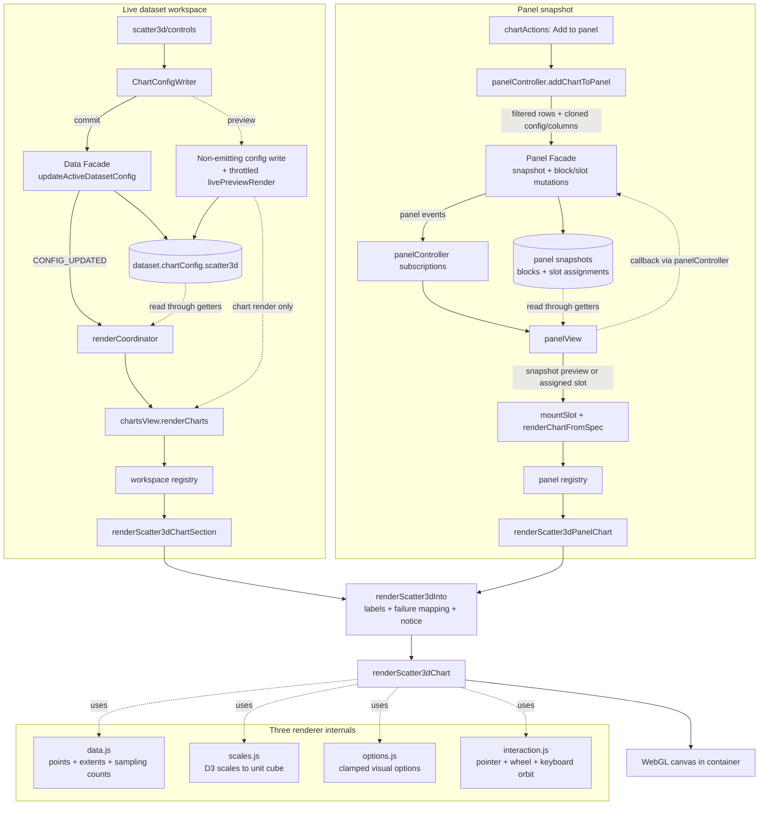

# 3D scatter deep dive

The 3D scatter renders three numeric columns as a rotatable WebGL point
cloud. It is also the pilot of the per-chart package layout: everything the
chart owns lives under [src/charts/scatter3d/](../../../src/charts/scatter3d),
and later chart migrations copy this shape.

| Field | Value |
|---|---|
| Audience | Contributors changing the 3D scatter or building the next per-chart package. |
| Source of truth | `src/charts/scatter3d/` implementation, its boundary lint, and `tests/charts/scatter3d/`. |
| Update when | The package layout, renderer lifecycle, sampling policy, or export posture changes. |

## 1. What the chart is

Three numeric columns map to the X, Y, and Z axes of a unit cube; every row
with finite values in all three becomes one point. Data Z is the vertical
axis (the TIN chart's "Z is height" convention); data Y is scene depth. The
camera orbits the cube center: drag rotates, the wheel zooms, arrow keys
rotate, `+`/`-` zoom, `Home` resets.

## 2. Foundations

- **D3 as math engine, Three.js as renderer.** D3 computes the per-axis
  linear scales from data extents; Three.js only draws. The contract is
  rows/config -> chart model -> D3 math -> Three renderer, and the lint
  enforces it (see section 12).
- **Spherical camera orbit.** The camera position is spherical state
  `(theta, phi, distance)` around the origin, converted to Cartesian on
  every input. Phi is clamped away from the poles; distance is clamped to
  the configured range.
- **Deterministic sampling.** WebGL can draw far more points than SVG, but
  not unbounded: above `SCATTER3D_CHART.maxPoints` the chart samples. The
  rows carrying each axis min/max are force-included (de-duped by row
  position), the rest of the budget is filled by even stride across the
  whole valid set, so sorted datasets are not biased toward one end.
  Extents always come from ALL valid rows, so the cube never shifts because
  an outlier was sampled out.

## 3. The big picture (data flow)

## 4. The data model

`chartConfig.scatter3d` (defaults in
[scatter3d.js](../../../src/config/charts/definitions/scatter3d.js)): `enabled`,
`expanded`, `x`, `y`, `z` (numeric column names or `null`), `customTitle`,
`chartHeight` (460 default), `pointSize`, `opacity`, `color`.

`SCATTER3D_CHART` in [scatter3d.js](../../../src/config/charts/definitions/scatter3d.js) holds the
point size/opacity limits, `maxPoints` (50k render budget),
`maxDevicePixelRatio` (2, caps the WebGL backing-store cost on high-DPR
screens), and the `camera` constants (fov, initial angles/distance, zoom
clamps, rotate/zoom speeds, keyboard steps).

## 5. The control sidebar

[controls/](../../../src/charts/scatter3d/controls) mirrors
`charts/tin/controls/`: `builder.js` (Data: X/Y/Z numeric selects;
Display: title, point size, opacity; Styling: color), `listeners.js` (via
the shared `listenerBindings.js`, which remains the config-write
adapter; selects clamp to the numeric column list), and `activationDefaults.js`
(first three distinct numeric columns via the tin `pickPreferred`
semantics, preserving still-valid user picks). The registry entry lives in
[charts/registries/controls.js](../../../src/charts/registries/controls.js),
which `chartControlsController.js` consumes.

## 6. The render entry chain

### 6.1 Dataset workspace

`chartsView.js` passes the shared context to the
[workspace registry](../../../src/charts/registries/workspace.js), whose
`scatter3d` entry dispatches to the package's
[workspaceSection.js](../../../src/charts/scatter3d/workspaceSection.js),
which owns the static block's visibility and delegates to
[presentation.js](../../../src/charts/scatter3d/presentation.js): build the
renderer options with the localized `labels`, map fail reasons onto i18n
keys (`no-valid-points` and `webgl-unavailable` have their own keys;
`render-error` and bare failures use the generic one), then apply the
post-render extras that need the ok payload: the accurate aria-label
(rendered point count) and the sampling notice when `truncated`.

### 6.2 Panel

[renderChartFromSpec.js](../../../src/features/panel/slots/renderChartFromSpec.js)
validates the request, then the
[panel registry](../../../src/charts/registries/panel.js) routes `scatter3d`
specs to the package's
[panelAdapter.js](../../../src/charts/scatter3d/panelAdapter.js), which maps
the frozen snapshot onto the same presentation flow. Panel slot containers
have no DOM id; the renderer generates a unique `aria-describedby` id in
that case.

## 7. Inside the renderer

[renderers/three.js](../../../src/charts/scatter3d/renderers/three.js), in
order:

1. Guards: missing container/columns -> `fail()`; no valid points ->
   `fail('no-valid-points')`.
2. **Dispose-first**: `clearChartContainer(container)` runs any previous
   mount's dispose hook. Browsers cap live WebGL contexts (~8-16), and the
   workspace re-renders sections on every broad refresh, so this bounds
   the chart to one context per container.
3. `new THREE.WebGLRenderer` inside try/catch ->
   `fail('webgl-unavailable')` when the environment has no WebGL.
4. Sizing: `width = max(container.clientWidth || default, 320)`, height
   from the clamped `chartHeight`, then
   `setPixelRatio(min(devicePixelRatio, maxDevicePixelRatio))` and
   `setSize(width, height, false)` (CSS keeps display-size control; the
   stylesheet gives the canvas explicit nonzero `width/height: 100%`).
5. Scene: one `THREE.Points` with a `Float32Array` position buffer fed by
   the D3 scales, a wireframe unit-cube boundary, and axis-name label
   sprites drawn on canvas-2D textures. The sprite helper skips labels when
   no 2D context is available (jsdom, exotic environments), which keeps the
   chart usable and the tests hermetic.
6. Accessibility: the canvas gets `tabindex="0"`, `role="img"`,
   `aria-keyshortcuts`, the pre-localized `labels.ariaLabel` when provided,
   and `aria-describedby` pointing at a `.visually-hidden` instructions
   element filled with `labels.controlsInstructions`. Handled keys call
   `preventDefault()`; the canvas has a visible focus style.
7. **Partial-build safety**: every GPU-holding object registers a disposer
   right after creation; a throw between context creation and hook stashing
   runs them all, then `fail('render-error')`. No leaked context.
8. On success the composite disposer (listeners, geometry, materials,
   textures, `renderer.dispose()`, `forceContextLoss()`) is stashed under
   `CHART_DISPOSE_HOOK` from
   [containerLifecycle.js](../../../src/charts/shared/containerLifecycle.js).
   Only that helper ever runs or deletes the hook; the renderer only
   assigns it. The ok payload carries
   `{ renderedCount, validCount, totalCount, truncated }`.

The renderer is i18n-free by lint: all localized strings arrive through
`options.labels`. `customTitle` is user text, rendered as an HTML heading
above the canvas (`.chart-canvas-title`).

## 8. The color / scale system

One uniform point color (config `color`) with `opacity` on a transparent
`PointsMaterial`; `sizeAttenuation` keeps nearer points larger. Controls provide
hex colors, and imported/manual config should still provide a valid Three.js
color string. Column encodings (color/size by column) are deliberately out of scope for the
pilot. The positional scales are plain `scaleLinear` per axis onto
`[-1, 1]`; zero-span (constant) columns are padded so positions stay
finite.

## 9. Performance notes

- Render-on-demand: exactly one `renderer.render` per input event, no
  persistent `requestAnimationFrame` loop.
- The 50k point budget with stride sampling keeps the buffer upload and
  draw call bounded; the honest notice tells the user what they see.
- The pixel-ratio cap (2) stops 3x/4x DPR screens from quadrupling the
  framebuffer.
- Height drags re-create the renderer per throttled frame; dispose-first
  bounds that to one live context. Renderer-instance reuse is a possible
  later optimization.

## 10. Live preview and interaction

Live preview is the generic config-change path (no per-type work).
Interaction lives in
[interaction.js](../../../src/charts/scatter3d/interaction.js): pointer
drag rotates using `setPointerCapture` (drags survive leaving the canvas),
the wheel listener is registered non-passive so `preventDefault()` stops
page scroll, and the canvas has `touch-action: none` so touch drags do not
fight scrolling. Touch pinch-zoom is a documented pilot gap; hover
tooltips (raycaster hit-testing) are deferred.

## 11. Export behavior

There is none yet, deliberately. The chart block ships without a download
button, and the panel exporter counts canvas slots in `omittedChartCount`
instead of silently dropping them (a canvas-only panel fails with
`no-exportable-charts`). A raster (PNG) export path is a later tranche.

## 12. Invariants and edge cases

- Boundary lint (`eslint.config.js` blocks B3/B4): `data.js`, `options.js`,
  `scales.js`, `interaction.js`, and `renderers/**` import only config,
  utils, and vendor modules; `workspaceSection.js`, `panelAdapter.js`,
  `presentation.js`, and `controls/**` may not import state, panel
  internals, or workspace components.
- Coercion matches the other charts: `Number(value)` then
  `Number.isFinite` (numeric strings survive; `null` coerces to 0).
- Constant columns render (padded domain), single points render, and a
  throwing stale dispose hook cannot poison later renders (the lifecycle
  helper swallows it).
- WebGL-less environments degrade to a localized empty state, never a
  crash.

## 13. Tests

`tests/charts/scatter3d/` mirrors the package: `data.test.js` (coercion,
extents-before-sampling, extrema force-include and de-dupe, stride spread,
cap), `scales.test.js` (unit-cube mapping, zero-span padding),
`options.test.js` (clamps), `renderers/three.test.js` (vendored three
mocked with fakes: sizing calls, a11y wiring, dispose hook contract,
partial-build disposal, render-on-demand), `workspaceSection.test.js` /
`panelAdapter.test.js` (label pass-through, fail-key mapping, sampling
notice), and `controls.test.js`. Panel export omission is covered in
`tests/features/panel/export/svgExporter.test.js`.

## 14. Quick reference

- Block/container ids: `chart-block-scatter3d`, `chart-scatter3d-container`
  (in `charts/workspaceDomIds.js`; static DOM in `index.html`).
- Control ids: `viz-select-scatter3d-{x,y,z}`,
  `viz-slider-scatter3d-{point-size,opacity}`, `viz-input-scatter3d-title`,
  `viz-input-scatter3d-color`.
- CSS: `.chart-canvas-3d` (canvas layout + `touch-action`),
  `.chart-canvas-title`, `.chart-sampling-notice`, `.visually-hidden`
  (all in `chart-output.css`); `.panel-slot-svg canvas` in `panel.css`.
- Tuning knobs: `SCATTER3D_CHART` in `config/charts/definitions/scatter3d.js` (`maxPoints`,
  `maxDevicePixelRatio`, camera speeds/clamps, size/opacity limits).
