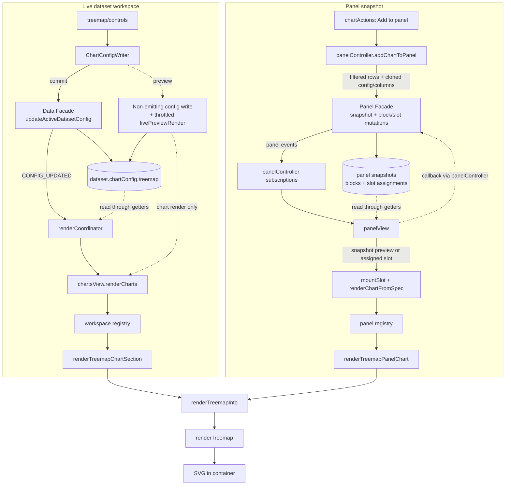

# The Treemap, end to end

This document explains how CHIVE's treemap works, from the config a dataset stores, through
the sidebar controls, into the renderer, and out to the panel/export paths. It is meant to be
read top to bottom the first time and used as a reference afterwards. File links are relative
to this document (which lives in `docs/development/charts/`).

Section 2 covers the space-filling and squarified-tiling theory the chart rests on,
independent of this codebase; everything from section 3 onward is how CHIVE implements it.

For the high-level "which columns does it need" summary, see the treemap row in
[Chart and data reference](../../user/chart-reference.md). For the shared state/panel/event architecture,
see [Architecture reference](../architecture-reference.md).

Key files:

- SVG renderer: [svg.js](../../../src/charts/treemap/renderers/svg.js)
- Data and option helpers: [data.js](../../../src/charts/treemap/data.js) and
  [options.js](../../../src/charts/treemap/options.js)
- Sidebar controls: [builder.js](../../../src/charts/treemap/controls/builder.js),
  [listeners.js](../../../src/charts/treemap/controls/listeners.js), and
  [activationDefaults.js](../../../src/charts/treemap/controls/activationDefaults.js)
- Config constants: [charts.js](../../../src/config/charts.js) (`TREEMAP_CHART`)
- Per-dataset config defaults: [chartDefaults.js](../../../src/config/chartDefaults.js) (the `treemap` block)
- Shared presentation flow: [presentation.js](../../../src/charts/treemap/presentation.js)
- Dataset-workspace adapter: [workspaceSection.js](../../../src/charts/treemap/workspaceSection.js)
- Panel adapter: [panelAdapter.js](../../../src/charts/treemap/panelAdapter.js)

---

## 1. What a treemap is

A treemap fills a rectangle with smaller rectangles, one per category, sized so each cell's
**area** is proportional to that category's measure. It is a part-to-whole chart like the pie,
but area is easier to compare across many items than pie angle, so a treemap stays readable
with far more categories. CHIVE's treemap is **single-level** (a flat partition of the frame,
one tile per category), sized by count or sum, colored by a palette or a single color, with
the shared click-to-filter tooltips.

---

## 2. Foundations: area encoding and squarified tiling

### 2.1 Aggregation and area

Like bar and pie, the treemap aggregates: the category column partitions the rows, and each
group is reduced to a number by `count` or `sum` of a value column (missing categories
collapse to `N/A`). That number becomes the tile's **area**. Because the tiles tile the whole
frame without gaps, the picture reads as "this category is this fraction of the total."

### 2.2 The tiling problem and squarify

The hard part is the geometry: how do you cut a rectangle into sub-rectangles of given areas?
There are infinitely many ways, and naive slicing produces long, thin slivers that are hard to
compare and label. The **squarified** algorithm (D3's `treemapSquarify`) chooses cuts that
keep each tile's **aspect ratio as close to 1 (square) as possible**. Square-ish tiles are
easier to size-compare by eye and leave room for labels, so squarify is the standard default
tiling.

### 2.3 Why flat (single level) here

A treemap can represent a hierarchy (nested tiles), but CHIVE's treemap is deliberately
**flat**: one level of category tiles. Hierarchical, nested composition is the bubble chart's
job (see [bubble.md](bubble.md), which nests circles); the treemap here is the
rectangular, area-accurate counterpart to a single-level pie or bar. Internally it still uses
D3's `hierarchy`, but the tree is just root plus one row of leaves.

### 2.4 Top-N, padding, and color

- **Top-N** keeps only the largest N categories, bounding tile count so cells stay big enough
  to read.
- **Padding** insets each tile slightly, drawing visible gutters between cells.
- **Color** is a second, qualitative encoding: either a palette hue per tile (`scheme`) or one
  uniform color for all tiles. It does not encode magnitude (area already does that).

---

## 3. The big picture (data flow)

Two integration paths share the same presentation mapping and end at `renderTreemap`.



The renderer is **stateless**: each call wipes the container and rebuilds the SVG. Rows are
already global-filtered; aggregation happens on top of them. Panel snapshots are frozen
`structuredClone`s (see [Architecture reference](../architecture-reference.md)).

---

## 4. The data model

### 4.1 Where config lives

`chartConfig.treemap` is the treemap slice of each dataset's `chartConfig`, built fresh by
`createDefaultChartConfig()` in
[chartDefaults.js](../../../src/config/chartDefaults.js) and merged by
`mergeChartConfigWithDefaults()` in
[chartConfig.js](../../../src/domain/charts/chartConfig.js).

### 4.2 The `chartConfig.treemap` keys

| Key | Meaning | Default |
|---|---|---|
| `enabled` / `expanded` | Shown at all / sidebar expanded | `false` / `false` |
| `category` | Categorical column bound to the tiles | `null` |
| `measureMode` | `'count'` or `'sum'` | `'count'` |
| `valueColumn` | Numeric column summed in sum mode | `null` |
| `topN` | Keep N largest categories (0 = all) | `20` |
| `padding` | Gutter between tiles, 1 to 6 | `2` |
| `colorMode` | `'scheme'` (palette) or `'uniform'` | `'scheme'` |
| `color` | Uniform-mode tile color | `CHART_COLORS.treemap` (`#5a7d99`) |
| `colorScheme` | Named palette for scheme mode | `'Colorblind-Safe'` |
| `showLabels` / `showValues` | Tile label / value text | `true` / `true` |
| `customTitle` / `chartHeight` | Title / SVG height (220 to 720) | `''` / `380` |

### 4.3 The constants behind the defaults

[charts.js](../../../src/config/charts.js): `CHART_COLORS.treemap` = `#5a7d99`;
`CHART_HEIGHT_LIMITS.treemap` = `{ min: 220, max: 720 }`; `TREEMAP_CHART` holds the measure
modes, `defaultTopN: 20`, and the padding options (`[1, 2, 4]`, default 2). The scheme palettes
are defined in the renderer (`COLOR_PALETTE`: Bold, Pastel, Colorblind-Safe).

---

## 5. The control sidebar

The package's [controls directory](../../../src/charts/treemap/controls/) exposes the standard
`createTreemapControls`, `setupTreemapControlListeners`, and `computeDefaults` roles through
separate modules.

### 5.1 The four sections

1. **Data** (expanded): category select, measure (count/sum), value-column select, Top-N.
2. **Display** (expanded): title, padding slider, show-labels toggle, show-values toggle.
3. **Styling** (collapsed): color-mode select (scheme/uniform) and the uniform color input.
4. **Advanced** (collapsed): the color-preset palette buttons.

### 5.2 Enable/disable and wiring

Everything is disabled when `!config.enabled`; the value-column select is disabled in `count`
mode; the uniform color input is disabled unless `colorMode === 'uniform'`. Standard select,
text, slider, checkbox, color, and preset controls use the shared chart-control listener
adapters. Measure and value-column changes retain small custom handlers because they enforce a
cross-field constraint: switching to count clears `valueColumn`, while sum mode preserves only
a valid numeric selection. The color presets set the uniform `color` to the palette's first
swatch. `computeDefaults` picks the category column.

---

## 6. The render entry chain

### 6.1 Dataset workspace

`renderTreemapChartSection({ config, rows, filterCallbacks })`
([workspaceSection.js](../../../src/charts/treemap/workspaceSection.js))
resolves the block/container, hides+clears when disabled, sets the min-height, maps config
through [presentation.js](../../../src/charts/treemap/presentation.js), and calls
`renderTreemap`. On failure it shows
`chive-chart-empty-treemap-numeric` for `no-value-column`, else `chive-chart-empty-treemap`.

### 6.2 Panel view

[panelAdapter.js](../../../src/charts/treemap/panelAdapter.js) passes `spec.config` and
`spec.dataSnapshot` through the same presentation flow with empty `filterCallbacks` (no
click-to-filter in panels). The panel registry only dispatches to that adapter.

---

## 7. Inside `renderTreemap`

`renderTreemap(container, rows, categoryColumn, options = {})`. Unlike most renderers it does
not use the `ok()`/`fail()` factories; it returns a plain `{ ok }` object (with a `reason` on
the value-column failure) that the section adapter inspects.

### 7.1 Guard, options, aggregation

Returns `{ ok: false }` if container or category is missing. Options are clamped (`measureMode`
to its enum, `padding` to 1 to 6, height to 220 to 720, title to 80 chars). Sum mode without a
usable value column returns `{ ok: false, reason: 'no-value-column' }`. A `Map` aggregates
count or sum per category (sum skips non-finite values). Empty result returns `{ ok: false }`.

### 7.2 Sort, Top-N, layout

Entries are filtered to positive values, sorted descending (with a `compareStrings`
tiebreaker), and sliced to `topN`. A one-level `hierarchy({ root, children: entries })`
`.sum(value)` feeds `treemap().tile(treemapSquarify).size([w, h]).padding(p).round(true)`,
which assigns each leaf its `(x0, y0, x1, y1)` rectangle (the squarified tiling of section
2.2). `round(true)` snaps coordinates to whole pixels for crisp edges.

### 7.3 Tiles, color, labels

One `<g>` + `<rect>` per leaf, positioned by the layout, filled by `getColor` (a palette hue
by index in `scheme` mode, or the uniform color), with a light stroke and slight transparency.
Labels and values are drawn centered, but only when the tile is large enough (small tiles are
left blank rather than overflowing), with font sizes scaled to the tile and the name truncated
to fit.

### 7.4 Interaction

Hover shows a category/value/percentage tooltip; click pins the shared categorical
filter-action tooltip (the bar doc's [section 7.6](bar.md)) for the category column;
clicking the background dismisses it.

---

## 8. The color system

Treemap color is **categorical**, not value-driven: a palette hue per tile by index
(`scheme` mode) or one uniform color (`uniform` mode). The palettes live in the renderer's
`COLOR_PALETTE`; the preset buttons also seed the uniform `color`. Area, not color, carries
magnitude, so there is no gradient or rank distribution here.

---

## 9. Performance notes

The treemap emits one `<g>`/`<rect>` (plus up to two label `<text>`s) per visible tile. The
default Top-N bounds the tile count at 20; selecting 0 includes every category, so high-cardinality
data can produce substantially more layout and DOM work. Row-scaled work is one aggregation
pass, followed by tiling and DOM work proportional to the visible tile count. Only the color
input uses the shared throttled live-preview path; padding and the other controls commit on
change (TIN doc [section 10](tin.md)).

---

## 10. Live preview and interaction

The color input uses the shared live-preview path (non-emitting facade on `input`, commit on
`change`; see TIN doc [section 10](tin.md)) so dragging the picker updates the tiles
live. Other controls commit on change. The click-to-filter pinned tooltips are the treemap's
interaction layer on top of that.

---

## 11. SVG and export

Pure SVG: a `<g>` of per-tile `<g>` groups, each holding a `<rect>` and optional `<text>`
labels. The panel exporter clones the live `<svg>`; there is no separate export path.

---

## 12. Invariants and edge cases

- **No category column** → `{ ok: false }`, the adapter shows `chive-chart-empty-treemap`
  ("Select at least one visible categorical column to build the treemap.").
- **sum mode without a numeric value column** → `{ ok: false, reason: 'no-value-column' }`,
  mapped to `chive-chart-empty-treemap-numeric` ("Select a numeric column to render the treemap
  in sum mode.").
- **Missing/empty categories** collapse into a single `N/A` tile.
- **Non-positive aggregates** are filtered out (a treemap tile needs positive area).
- **Tiles too small** to fit text are left unlabeled.
- **Stateless renders** and **frozen panel snapshots** behave as for every chart (panel tiles
  carry no filter actions).

Empty-state strings live in [en.json](../../../src/i18n/en.json) (`chive-chart-empty-treemap*`);
Portuguese equivalents in [pt-BR.json](../../../src/i18n/pt-BR.json).

---

## 13. Tests

- [controls.test.js](../../../tests/charts/treemap/controls.test.js) covers
  control building and the measure/value and color-mode logic.
- [workspaceSection.test.js](../../../tests/charts/treemap/workspaceSection.test.js)
  covers the section adapter, including the empty-state message selection.
- [panelAdapter.test.js](../../../tests/charts/treemap/panelAdapter.test.js) covers the frozen
  snapshot mapping and failure passthrough.
- [svg.test.js](../../../tests/charts/treemap/renderers/svg.test.js),
  [data.test.js](../../../tests/charts/treemap/data.test.js), and
  [options.test.js](../../../tests/charts/treemap/options.test.js) cover renderer behavior and
  its pure helpers.
- [panel.test.js](../../../tests/charts/registries/panel.test.js)
  covers the panel dispatch path.

---

## 14. Quick reference

**Element IDs** ([workspaceDomIds.js](../../../src/charts/workspaceDomIds.js)): container
`chart-treemap-container`, block `chart-block-treemap`. Control IDs are `viz-…-treemap-…`
(e.g. `viz-select-treemap-category`, `viz-select-treemap-measure`,
`viz-slider-treemap-padding`, `viz-select-treemap-color-mode`).

**DOM structure** of a rendered treemap:

```
<svg>
  <text>                    (optional title)
  <g transform=titleOffset>
    <g transform=cell> × N  (one per tile)
      <rect>                (area ∝ value)
      <text> <text>         (optional label + value)
```

**Tuning knobs** ([charts.js](../../../src/config/charts.js) `TREEMAP_CHART`): `defaultTopN`,
`paddingOptions`, `measureModes`.

**Foundations → implementation map:**

| Concept (section 2) | Implementation |
|---|---|
| Aggregation, area encoding (2.1) | the `Map` build, `.sum(value)` (7.1, 7.2) |
| Squarified tiling (2.2) | `treemap().tile(treemapSquarify)` (7.2) |
| Flat single level (2.3) | one-level `hierarchy` (7.2) |
| Top-N / padding / color (2.4) | slice, `.padding`, `getColor` (7.2, 7.3) |
